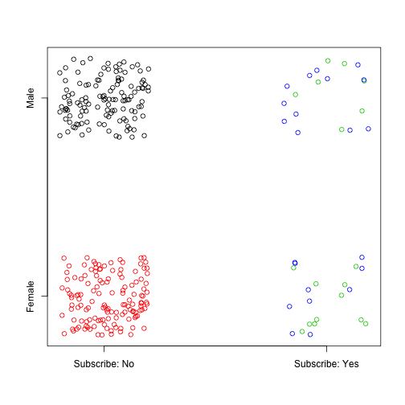

R for Marketing Research and Analytics
========================================================
Author: Chris Chapman and Elea McDonnell Feit
Date: September 2016
css: ../chapman-feit-slides.css
width: 1024
height: 768

**Chapter 11: Segmentation - Clustering and Classification**

Website for all data files:  
[http://r-marketing.r-forge.r-project.org/data.html](http://r-marketing.r-forge.r-project.org/data.html)


Segmentation as Clustering & Classification
===============================================
Segmentation is a process of finding groups of customers who are **similar to one another**, are **different from other groups**, and exhibit differences that are **important for the business**.

There is **no magic method** to solve all three of those requirements simultaneously. 

Segmentation requires trying **multiple methods** and evaluating the results
to determine whether they are useful for the business question. 

It often occurs that the statistically "best" segmentation is difficult to understand in 
the business context. A model that is statistically "not as strong" -- but is clear and 
actionable -- may be a preferable result.

In this chapter, we give an overview of methods to demonstrate some common approaches.


Clustering vs Classification
=================================
Clustering is the process of _finding_ groups inside data. Key problems include:
* Determining which variables to use
* Finding the right number of clusters
* Ensuring the groups differ in interesting ways

Classification is the process of _assigning_ observations (e.g., customers) to known categories
(segments, clusters). Some important concerns are:
* Predicting better than chance
* Optimizing for positive vs. negative prediction
* Generalizing to new data sets


Example data
=====

```r
seg.raw <- read.csv("http://goo.gl/qw303p")
seg.df  <- seg.raw[ , -7]     # remove the known segment assignments

summary(seg.df)
```

```
      age           gender        income            kids        ownHome   
 Min.   :19.26   Female:157   Min.   : -5183   Min.   :0.00   ownNo :159  
 1st Qu.:33.01   Male  :143   1st Qu.: 39656   1st Qu.:0.00   ownYes:141  
 Median :39.49                Median : 52014   Median :1.00               
 Mean   :41.20                Mean   : 50937   Mean   :1.27               
 3rd Qu.:47.90                3rd Qu.: 61403   3rd Qu.:2.00               
 Max.   :80.49                Max.   :114278   Max.   :7.00               
  subscribe  
 subNo :260  
 subYes: 40  
             
             
             
             
```


Group differences
====
We create a simple function to look at mean values by group. (This is a placeholder for a more
complex evaluation of an interpretable business outcome.)

```r
seg.summ <- function(data, groups) {
  aggregate(data, list(groups), function(x) mean(as.numeric(x)))  
}

seg.summ(seg.df, seg.raw$Segment)
```

```
     Group.1      age gender   income     kids  ownHome subscribe
1  Moving up 36.33114   1.30 53090.97 1.914286 1.328571     1.200
2 Suburb mix 39.92815   1.52 55033.82 1.920000 1.480000     1.060
3  Travelers 57.87088   1.50 62213.94 0.000000 1.750000     1.125
4  Urban hip 23.88459   1.60 21681.93 1.100000 1.200000     1.200
```


Distance
=====
Clustering methods work by looking at some measure of the _distance_ between observations. They try to
find groups whose members are close to one another (and far from others).

A common metric is _Euclidian_ distance, the root square of differences. Manually we could compute:


```r
c(1,2,3) - c(2,3,2)
```

```
[1] -1 -1  1
```

```r
sum((c(1,2,3) - c(2,3,2))^2)
```

```
[1] 3
```

```r
sqrt(sum((c(1,2,3) - c(2,3,2))^2))
```

```
[1] 1.732051
```

Note that distance is between _observations_, and the result is a matrix of distances between all pairs (in this case, just one pair).


dist()
=====
```dist()``` computes Euclidian distance:

```r
sqrt(sum((c(1,2,3) - c(2,3,2))^2))
```

```
[1] 1.732051
```

```r
dist(rbind(c(1,2,3), c(2,3,2)))
```

```
         1
2 1.732051
```

In case of mixed data types (e.g., continuous, binary, ordinal), ```dist()``` may not be appropriate because of the huge implied scale differences. ```daisy()``` is an alternative that automatically rescales.


```r
library(cluster)                  
seg.dist <- daisy(seg.df)       # daisy works with mixed data types
as.matrix(seg.dist)[1:4, 1:4]   # distances of first 4 observations
```

```
          1         2         3         4
1 0.0000000 0.2532815 0.2329028 0.2617250
2 0.2532815 0.0000000 0.0679978 0.4129493
3 0.2329028 0.0679978 0.0000000 0.4246012
4 0.2617250 0.4129493 0.4246012 0.0000000
```


Hierarchical Clustering
=====
Hierarchical clustering combines closest neighbors (defined in various ways) into progressively larger groups. In R, we first compute distances (previous slide) and then cluster those:


```r
seg.hc <- hclust(seg.dist, method="complete")
```

Plot the result to see a tree of the solution:

```r
plot(seg.hc)
```


Examining Similarities
=====
We can cut the tree at a particular height and plot above or below. In this case, we cut at a height of ```0.5```. Then we plot the first (```$lower[[1]]```) of the resulting trees below that:

```r
plot(cut(as.dendrogram(seg.hc), h=0.5)$lower[[1]])
```


Comparing observations in branches
=====
From the previous tree, we select observations from close and far branches:

```r
seg.df[c(101, 107), ]  # similar
```

```
         age gender   income kids ownHome subscribe
101 24.73796   Male 18457.85    1   ownNo    subYes
107 23.19013   Male 17510.28    1   ownNo    subYes
```

```r
seg.df[c(278, 294), ]  # similar
```

```
         age gender   income kids ownHome subscribe
278 36.23860 Female 46540.88    1   ownNo    subYes
294 35.79961 Female 52352.69    1   ownNo    subYes
```

```r
seg.df[c(173, 141), ]  # less similar
```

```
         age gender   income kids ownHome subscribe
173 64.70641   Male 45517.15    0   ownNo    subYes
141 25.17703 Female 20125.80    2   ownNo    subYes
```


Comparing the dendrogram to the distance matrix
=====
The cophenetic correlation coefficient is a measure of how well the clustering model 
(expressed in the dendrogram) reflects the distance matrix.


```r
cor(cophenetic(seg.hc), seg.dist)
```

```
[1] 0.7682436
```


Getting K groups from the tree
=====
To get K groups, read from the top of the dendrogram until there are K branches.

```rect.hclust()``` shows where the tree would be cut for K groups:

```r
plot(seg.hc)
rect.hclust(seg.hc, k=4, border="red")
```


Getting segment membership from hclust
=====
Get a vector of class (cluster) assignment:

```r
seg.hc.segment <- cutree(seg.hc, k=4)     # membership vector for 4 groups
table(seg.hc.segment)
```

```
seg.hc.segment
  1   2   3   4 
124 136  18  22 
```

Compare them with our quick function:

```r
seg.summ(seg.df, seg.hc.segment)
```

```
  Group.1      age   gender   income     kids  ownHome subscribe
1       1 40.78456 2.000000 49454.08 1.314516 1.467742         1
2       2 42.03492 1.000000 53759.62 1.235294 1.477941         1
3       3 44.31194 1.388889 52628.42 1.388889 2.000000         2
4       4 35.82935 1.545455 40456.14 1.136364 1.000000         2
```


Is the result interesting?
=====

```r
plot(jitter(as.numeric(seg.df$gender)) ~ 
     jitter(as.numeric(seg.df$subscribe)), 
       col=seg.hc.segment, yaxt="n", xaxt="n", ylab="", xlab="")
axis(1, at=c(1, 2), labels=c("Subscribe: No", "Subscribe: Yes"))
axis(2, at=c(1, 2), labels=levels(seg.df$gender))
```



Not really ... subscribers are men and women. Time to iterate!


K-means clustering
=====
K-means attempts to find K groups, such that the sum of squared distances for points within clusters are
minimized with respect to the cluster center.

To compute this, K-means requires _numeric_ input and a specified number of clusters. We first convert
our factor variables to numeric (arguably OK because they're binary):

```r
seg.df.num <- seg.df
seg.df.num$gender    <- ifelse(seg.df$gender=="Male", 0, 1)
seg.df.num$ownHome   <- ifelse(seg.df$ownHome=="ownNo", 0, 1)
seg.df.num$subscribe <- ifelse(seg.df$subscribe=="subNo", 0, 1)
summary(seg.df.num)
```

```
      age            gender           income            kids     
 Min.   :19.26   Min.   :0.0000   Min.   : -5183   Min.   :0.00  
 1st Qu.:33.01   1st Qu.:0.0000   1st Qu.: 39656   1st Qu.:0.00  
 Median :39.49   Median :1.0000   Median : 52014   Median :1.00  
 Mean   :41.20   Mean   :0.5233   Mean   : 50937   Mean   :1.27  
 3rd Qu.:47.90   3rd Qu.:1.0000   3rd Qu.: 61403   3rd Qu.:2.00  
 Max.   :80.49   Max.   :1.0000   Max.   :114278   Max.   :7.00  
    ownHome       subscribe     
 Min.   :0.00   Min.   :0.0000  
 1st Qu.:0.00   1st Qu.:0.0000  
 Median :0.00   Median :0.0000  
 Mean   :0.47   Mean   :0.1333  
 3rd Qu.:1.00   3rd Qu.:0.0000  
 Max.   :1.00   Max.   :1.0000  
```

Find the K-means groups
=====
We try K=4 groups:

```r
set.seed(96743)        # because starting assignments are random
seg.k <- kmeans(seg.df.num, centers=4)
```

And examine the quick comparison:

```r
seg.summ(seg.df, seg.k$cluster)
```

```
  Group.1      age   gender   income      kids  ownHome subscribe
1       1 56.37245 1.428571 92287.07 0.4285714 1.857143  1.142857
2       2 29.58704 1.571429 21631.79 1.0634921 1.301587  1.158730
3       3 44.42051 1.452632 64703.76 1.2947368 1.421053  1.073684
4       4 42.08381 1.454545 48208.86 1.5041322 1.528926  1.165289
```
It appears potentially more interesting than the ```hclust``` "men and women" solution we saw previously.


Comparing groups on 1 variable
=====
In the model object, ```...$cluster``` holds the class assignments. We can use that as the IV for plotting:

```r
boxplot(seg.df.num$income ~ seg.k$cluster, 
        xlab="Income", ylab="Segment", horizontal=TRUE)
```


Visualizing the overall clusters
=====
A ```clusplot``` plots the observations vs. first 2 principal components, grouped by cluster:

```r
library(cluster)
clusplot(seg.df, seg.k$cluster, color=TRUE, shade=TRUE, 
         labels=4, lines=0, main="K-means cluster plot")
```


Model-based clustering
=====
Model-based clustering (_mixture_ modeling) assumes that observations are mixed from populations with 
different distributions of the basis variables (i.e., different means and variances).

```mclust``` is one package to find such models (```flexmix``` is another). The data must be numeric. Unlike ```hclust``` and ```kmeans```, ```mclust``` suggests the number of groups, based on fit statistics.


```r
library(mclust)
seg.mc <- Mclust(seg.df.num)   # use all defaults
summary(seg.mc)
```

```
----------------------------------------------------
Gaussian finite mixture model fitted by EM algorithm 
----------------------------------------------------

Mclust EVE (ellipsoidal, equal volume and orientation) model with 2 components:

 log.likelihood   n df       BIC       ICL
      -5197.499 300 39 -10617.45 -10636.59

Clustering table:
  1   2 
247  53 
```


Mclust for 4 groups
=====
We can force ```mclust``` to find other numbers of clusters:

```r
seg.mc4 <- Mclust(seg.df.num, G=4)  # 4 clusters
summary(seg.mc4)
```

```
----------------------------------------------------
Gaussian finite mixture model fitted by EM algorithm 
----------------------------------------------------

Mclust EVE (ellipsoidal, equal volume and orientation) model with 4 components:

 log.likelihood   n df       BIC       ICL
      -5325.941 300 63 -11011.22 -11127.95

Clustering table:
  1   2   3   4 
 64  54 163  19 
```

Compare the 2-cluster and 4-cluster solutions:

```r
BIC(seg.mc, seg.mc4)
```

```
        df     BIC
seg.mc  39 1281140
seg.mc4 63 1281276
```


Quick take on the better model
=====

```r
seg.summ(seg.df, seg.mc$class)
```

```
  Group.1      age   gender   income      kids  ownHome subscribe
1       1 40.17283 1.485830 52653.51 1.3400810 1.449393  1.000000
2       2 45.98504 1.433962 42934.79 0.9433962 1.566038  1.754717
```

A primary differentiator appears to be subscription status. Group 1 is non-subscribers, with lower average age and higher income. They might be good targets for a campaign, depending on the business goal.

(_Note: Mclust results tend to change from version to version. The results here differ from older versions shown
in the textbook. There is no absolute "right" answer for many questions of this kind!_)


Plot for Mclust model
=====


```r
library(cluster)
clusplot(seg.df, seg.mc$class, color=TRUE, shade=TRUE, 
         labels=4, lines=0, main="Model-based cluster plot")
```


Polytomous analysis
=====
Polytomous latent class analysis attempts to find mixture membership 
(latent classes) using only categorical data.

To illustrate, we create a data frame with sliced versions of continuous variables
converted to factors:


```r
seg.df.cut        <- seg.df
seg.df.cut$age    <- factor(ifelse(seg.df$age < median(seg.df$age), 
                                   "LessAge", "MoreAge"))
seg.df.cut$income <- factor(ifelse(seg.df$income < median(seg.df$income),
                                   "LessInc", "MoreInc"))
seg.df.cut$kids   <- factor(ifelse(seg.df$kids < median(seg.df$kids), 
                                   "FewKids", "MoreKids"))
summary(seg.df.cut)
```

```
      age         gender        income          kids       ownHome   
 LessAge:150   Female:157   LessInc:150   FewKids :121   ownNo :159  
 MoreAge:150   Male  :143   MoreInc:150   MoreKids:179   ownYes:141  
  subscribe  
 subNo :260  
 subYes: 40  
```
Note factor level alphabetization; consider ordinal levels if relevent.


Fit 3- and 4-group models
=====
For simplicity, we create a reusable model formula:


```r
seg.f <- with(seg.df.cut, 
              cbind(age, gender, income, kids, ownHome, subscribe)~1)
```

Then fit 3- and 4-group models:

```r
library(poLCA)
set.seed(02807)
seg.LCA3 <- poLCA(seg.f, data=seg.df.cut, nclass=3)
seg.LCA4 <- poLCA(seg.f, data=seg.df.cut, nclass=4)
```
Check the model fits:


```r
seg.LCA4$bic
```

```
[1] 2330.043
```

```r
seg.LCA3$bic
```

```
[1] 2298.767
```
The 3-group model had stronger fit. But is it more useful?


Examine the 3-group model
=====
The 3 groups are relatively well differentiated:

```r
seg.summ(seg.df, seg.LCA3$predclass)
```

```
  Group.1      age   gender   income      kids  ownHome subscribe
1       1 28.22385 1.685714 30075.32 1.1285714 1.285714  1.271429
2       2 54.44407 1.576923 60082.47 0.3846154 1.769231  1.105769
3       3 37.47652 1.277778 54977.08 2.0793651 1.325397  1.079365
```

```r
clusplot(seg.df, seg.LCA3$predclass, color=TRUE, shade=TRUE, 
         labels=4, lines=0, main="LCA plot (K=3)")
```


# examine the solutions
# 3 clusters

Examine the 4-group model
=====
The 4 group solution is less clear, with one group showing complete overlap on first 2 components:

```r
seg.summ(seg.df, seg.LCA4$predclass)
```

```
  Group.1      age   gender   income      kids  ownHome subscribe
1       1 36.62554 1.349593 52080.13 2.1951220 1.349593  1.113821
2       2 53.64073 1.535714 60534.17 0.5178571 1.785714  1.098214
3       3 30.22575 1.050000 41361.81 0.0000000 1.350000  1.000000
4       4 27.61506 1.866667 28178.70 1.1777778 1.066667  1.333333
```

```r
clusplot(seg.df, seg.LCA4$predclass, color=TRUE, shade=TRUE, 
         labels=4, lines=0, main="LCA plot (K=4)")
```


Comparing Cluster solutions
=====
Given two assignment vectors, it's not obvious which categories should match to one another. Function ```mapClass``` finds the highest correspondence:

```r
library(mclust)
mapClass(seg.LCA3$predclass, seg.LCA4$predclass)
```

```
$aTOb
$aTOb$`1`
[1] 4

$aTOb$`2`
[1] 2

$aTOb$`3`
[1] 1


$bTOa
$bTOa$`1`
[1] 3

$bTOa$`2`
[1] 2

$bTOa$`3`
[1] 1

$bTOa$`4`
[1] 1
```

"Correlation" for cluster assignments
=====
The adjusted Rand index is the degree of agreement between two class assignment vectors, where 1.0
indicates perfect agreement:


```r
adjustedRandIndex(seg.LCA3$predclass, seg.LCA4$predclass)
```

```
[1] 0.7288822
```

We could compare this to purely random assignment:

```r
set.seed(11021)
random.data <- sample(4, length(seg.LCA4$predclass), replace=TRUE)
adjustedRandIndex(random.data, seg.LCA4$predclass)
```

```
[1] 0.002292031
```

... and to known segments from the original data:

```r
adjustedRandIndex(seg.raw$Segment, seg.LCA4$predclass)
```

```
[1] 0.3513031
```


Classification
=====
type: alert

Next we'll examine classification methods. Whereas clustering has a lot 
of "art" in determining when a solution is useful, classification tends 
to emphasize the "science" of predicting and generalizing.


General concepts
=====
Classification concerns assigning observations to a predefined set of groups. 
For example, we might wish to assign potential customers to higher- or 
lower-value prospects ... or more generally, assign members of the overall 
population to a set of customer segments.

Classification can also assign customers to categories reflecting observed 
behavior, such as "purchasers." It is one form of predictive modeling.

General steps in classification are:

1. Collect data with predictors & outcome  
2. Divide the observations into training and test cases  
3. Use training cases to fit a model predicting the outcomes  
4. Confirm that the model works well for test cases  
5. Apply the model to new data to obtain predictions  


Naive Bayes classification
=====
The naive Bayes method is simple yet powerful. It uses Bayes's Rule to find 
the odds of class membership based on the conditional probabilities of 
predictor variables (assumed to be independent, thus "naive").

More specifically, it computes conditional probabilities in the _training_ 
data. The resulting model can then predict group membership probabilities 
for new observations (given the same predictors).

First we divide data into training and test cases:

```r
set.seed(04625)          # make it repeatable
train.prop   <- 0.65     # train on 65% of data. Hold 35% for testing
train.cases  <- sample(nrow(seg.raw), nrow(seg.raw)*train.prop)
seg.df.train <- seg.raw[ train.cases, ]
seg.df.test  <- seg.raw[-train.cases, ]
```

Naive Bayes model
=====
We fit the model to training data:

```r
library(e1071)
seg.nb <- naiveBayes(Segment ~ ., data=seg.df.train)
```

... and predict membership expected in the test (holdout) data:

```r
seg.nb.class <- predict(seg.nb, seg.df.test)

prop.table(table(seg.nb.class))
```

```
seg.nb.class
 Moving up Suburb mix  Travelers  Urban hip 
 0.2285714  0.3047619  0.3428571  0.1238095 
```


Plot the predicted classes
=====

```r
clusplot(seg.df.test[, -7], seg.nb.class, color=TRUE, shade=TRUE, 
         labels=4, lines=0, 
         main="Naive Bayes classification, holdout data")
```


How well did we do in the test data?
=====
We could compare the proportion of correct assignments:

```r
mean(seg.df.test$Segment==seg.nb.class)   # raw correct proportion
```

```
[1] 0.8
```

... but better is to assess vs. chance assignment. (If one group is very large, 
we can't say a model is good just because it mostly predicts that group.)


```r
library(mclust)
adjustedRandIndex(seg.nb.class, seg.df.test$Segment)
```

```
[1] 0.5626787
```

Even better would be a weighted payoff matrix, taking into account the value
of correct positive and negative predictions. That depends on the business 
application (such as cost of targeting vs. margin from a success).


Random Forests
=====
Another way to do classification is with a decision tree: find an optimal decision 
path to predict the outcomes. A random forest model generalizes this to use many 
trees -- fitting different predictors and observations -- that "vote" on 
classification. 

Like naive Bayes classifiers, Random forests are simple and easy to use, 
yet often perform well.

We fit a random forest with 3000 individual trees, on the _training_ data:

```r
library(randomForest)
set.seed(98040)
seg.rf <- randomForest(Segment ~ ., data=seg.df.train, ntree=3000)
```


Random forest model
=====
A simple inspection of the model shows key results:

```r
seg.rf
```

```

Call:
 randomForest(formula = Segment ~ ., data = seg.df.train, ntree = 3000) 
               Type of random forest: classification
                     Number of trees: 3000
No. of variables tried at each split: 2

        OOB estimate of  error rate: 24.1%
Confusion matrix:
           Moving up Suburb mix Travelers Urban hip class.error
Moving up         29         19         0         1  0.40816327
Suburb mix        20         35         3         1  0.40677966
Travelers          0          3        48         0  0.05882353
Urban hip          0          0         0        36  0.00000000
```
It includes initial performance tests on holout data (from the _training_ data), 
and was correct 76% of the time. It was best for Urban hip, with more error for 
Moving up & Suburb mix.

Concern about error rates depends on interest in the segments.


#### random forest

Make predictions for the test data
=====
Apply the random forest to the test data:

```r
seg.rf.class <- predict(seg.rf, seg.df.test)

library(cluster)
clusplot(seg.df.test[, -7], seg.rf.class, color=TRUE, shade=TRUE, 
         labels=4, lines=0, main="Random Forest classes, test data")
```


Individual prediction probabilities
=====
The predictions optionally include odds for each observation:

```r
seg.rf.class.all <- predict(seg.rf, seg.df.test, predict.all=TRUE)

# odds for first five test cases (divide votes by 3000 trees)
apply(seg.rf.class.all$individual[1:5, ], 1, table) / 3000
```

```
                    2           3         4         6     7
Moving up  0.42066667 0.076333333 0.1886667 0.1223333 0.217
Suburb mix 0.47266667 0.485000000 0.6930000 0.8526667 0.340
Travelers  0.02966667 0.436333333 0.1173333 0.0240000 0.050
Urban hip  0.07700000 0.002333333 0.0010000 0.0010000 0.393
```
Suppose you are interested to target one segment. If targeting cost is high, you might target
only the subset with the highest odds.

OTOH, if targeting cost is low (relative to payoff), you might target customers 
assigned to _other_ 
segments, who have some chance of being in the target segment. For example, if 
you're targeting Moving up, 
you might want to target respondent #2, even though she is slightly more likely to 
be Suburb mix.


Variable importance
=====
Random forests can cleverly assess importance of predictors: randomize (permute) a 
predictor's data and see whether predictions get worse.


```r
set.seed(98040)
seg.rf <- randomForest(Segment ~ ., data=seg.df.train, 
                       ntree=3000, importance=TRUE)
# importance(seg.rf)   # omitted: the actual metrics
varImpPlot(seg.rf, main="Variable importance by segment")
```


A heatmap for variable importance
=====
Importance might be used (e.g.) to determine which variables are "must collect" for a project:

```r
library(gplots)
library(RColorBrewer)
heatmap.2(t(importance(seg.rf)[ , 1:4]), key=FALSE,
          col=brewer.pal(9, "Blues"), 
          dend="none", trace="none", margins=c(10, 10),
          main="Var. importance by segment" )
```


Predicting subscription status
=====
Who is most likely to subscribe to our service? Can we predict that, given 
other information? Can we find out which individuals are best to target?

Procedure:

1. Use random forests to predict subscription in training data  
2. See how well the model performs in test data  
3. Examine individual respondents' likelihoods (whom should we target?)  

In real application, you would do #3 with new data. For demonstration 
purposes we'll use the holdout test data.


Setting up
=====
We form training and test (holdout) data sets:

```r
set.seed(92118)
train.prop  <- 0.65
train.cases <- sample(nrow(seg.df), nrow(seg.df)*train.prop)
sub.df.train <- seg.raw[ train.cases, ]
sub.df.test  <- seg.raw[-train.cases, ]

summary(sub.df.train)
```

```
      age           gender        income            kids      
 Min.   :20.71   Female:105   Min.   : -5183   Min.   :0.000  
 1st Qu.:33.16   Male  : 90   1st Qu.: 40556   1st Qu.:0.000  
 Median :39.09                Median : 51413   Median :1.000  
 Mean   :41.40                Mean   : 50322   Mean   :1.308  
 3rd Qu.:47.55                3rd Qu.: 60974   3rd Qu.:2.000  
 Max.   :80.49                Max.   :106430   Max.   :7.000  
   ownHome     subscribe         Segment  
 ownNo :103   subNo :170   Moving up :51  
 ownYes: 92   subYes: 25   Suburb mix:62  
                           Travelers :54  
                           Urban hip :28  
                                          
                                          
```


Are subscribers differentiated?
=====
Subscribers are not well differentiated (by first 2 principal components). This suggests our problem may be difficult.


```r
clusplot(sub.df.train[, -6], sub.df.train$subscribe, color=TRUE, 
         shade=TRUE, labels=4, lines=0, main="Status, training data")
```


Fit the training data
=====


```r
library(randomForest)
set.seed(11954)
(sub.rf <- randomForest(subscribe ~ ., data=sub.df.train, ntree=3000))
```

```

Call:
 randomForest(formula = subscribe ~ ., data = sub.df.train, ntree = 3000) 
               Type of random forest: classification
                     Number of trees: 3000
No. of variables tried at each split: 2

        OOB estimate of  error rate: 14.87%
Confusion matrix:
       subNo subYes class.error
subNo    166      4  0.02352941
subYes    25      0  1.00000000
```

Error rate is low ... but looking at the confusion matrix, 
no _subscribers_ were correctly identified! 

So, for our business question, this may not be a useful model (it predicts 
almost all "won't subscribe").


Class imbalance problem
=====
With few subscribers in the training data, the algorithm achieves low error
rates simply by predicting "non-subscriber". This is known as the 
_class imbalance_ problem.

We can force balanced classes by explicitly setting per-tree sample sizes for classes. Overall error goes up, but goes down for subscribers:

```r
set.seed(11954)
(sub.rf <- randomForest(subscribe ~ ., data=sub.df.train, ntree=3000, 
                       sampsize=c(25, 25)) )   # balanced classes
```

```

Call:
 randomForest(formula = subscribe ~ ., data = sub.df.train, ntree = 3000,      sampsize = c(25, 25)) 
               Type of random forest: classification
                     Number of trees: 3000
No. of variables tried at each split: 2

        OOB estimate of  error rate: 30.77%
Confusion matrix:
       subNo subYes class.error
subNo    127     43   0.2529412
subYes    17      8   0.6800000
```


Predict the holdout data
=====
We get predictions for both classes using ``` predict.all```:

```r
sub.rf.sub <- predict(sub.rf, sub.df.test, predict.all=TRUE)

# Not in book: 
#   Get the proportion within respondent for the two classes,
#     using table and prop.table apply()'d to each respondents.
#   Then get just the row with predictons for subscribers ("subYes")

sub.ind.p  <- apply(sub.rf.sub$individual, 1, 
                    function(x) prop.table(table(x)))["subYes", ]
summary(sub.ind.p)
```

```
   Min. 1st Qu.  Median    Mean 3rd Qu.    Max. 
 0.1253  0.3050  0.4043  0.3928  0.4553  0.7853 
```

Predicted subscription likelihoods
=====
We can plot the likelihood of subscribing:

```r
plot(sub.ind.p, xlab="Holdout respondent", ylab="Likelihood")
```


We can target respondents by likelihood, relative to value of subscribing.


Conclusion: A Few Key Points
=====
Segmentation is not a method, but a _process_ that must focus clearly on 
the business need and question. Sometimes a "better" model is less useful.

_Clustering_ can help identify potentially interesting groups in the data. 
Appropriateness of a solutions depends on both statistical criteria (fit) 
and business utility (clarity, ability to target, etc.)

If specific groups are known (e.g., segments or behaviors), _classification_ 
methods find rules to predict membership in those groups. We saw how to predict
likelihood-to-subscribe. Depending on cost & margin, one might target more or 
fewer customers based on likelihood.

Important considerations for classification include performance on holdout data,
generalization to new data sets, and avoiding class imbalance problems.


Suggested Readings
============================
James, Witten, Hastie, & Tibshirani (2013). _An Introduction to Statistical Learning, with Applications in R_. New York: Springer.
* An excellent overview of a wide variety of statistical approaches to learning and classification.

Kuhn & Johnson (2013). _Applied Predictive Modeling_. New York: Springer.
* A detailed examination of how to build regression and classification models that generalize. It is focused on practical application and overcoming many typical problems of such projects. There is a superb related package ("caret").

Wedel & Kamakura (2000). _Market Segmentation: Conceptual and Methodological
Foundations_. New York: Springer.
* Discusses a wide variety of approaches to segmentation for marketing applications (not specific to R).


Notes
=====================================================
<small>
This presentation is based on Chapter 11 of Chapman and Feit, *R for Marketing Research and Analytics* &copy; 2015 Springer.    
   
All code in the presentation is licensed under the Apache License, Version 2.0 (the "License"); you may not use this file except in compliance with the License.  You may obtain a copy of the License at http://www.apache.org/licenses/LICENSE-2.0\ Unless required by applicable law or agreed to in writing, software distributed under the License is distributed on an "AS IS" BASIS, WITHOUT WARRANTIES OR CONDITIONS OF ANY KIND, either express or implied. See the License for the specific language governing permissions and limitations under the License.  
</small>


