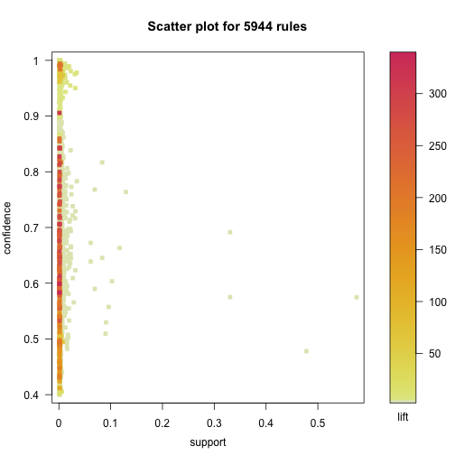

R for Marketing Research and Analytics
========================================================
Author: Chris Chapman and Elea McDonnell Feit
Date: February 2016
css: ../chapman-feit-slides.css
width: 1024
height: 768

**Chapter 12: Association Rules**

Website for all data files:  
[http://r-marketing.r-forge.r-project.org/data.html](http://r-marketing.r-forge.r-project.org/data.html)


Brief introduction
=====
_Association rule mining_ looks for associations among events and data points, 
especially in data where absolute frequencies are low. 

Some examples include:
- Associations between items sold (where any given transaction usually purchases 0 of any specific item)
- Associations between individuals and items
- Associations between demographic characteristics and other behaviors such as purchase
- Associations between interventions (where there is a large set) and behaviors
- Recommendation engines deriving recommendations from any of the above

In shopping contexts, this is often known as _market basket analysis_.


Fundamental concepts
=====
A **transaction** is a set of discrete data points (e.g., an item sold) that go together. For example, a transaction might be _{hot dog, mustard, relish, cola}_.

A **rule** is the conditional relationship of item sets. E.g.,: _{hog dog, mustard}_ $\rightarrow$ _{relish, cola}_. It only implies _relationship_, not causation.

The goal is to find rules where the association is higher than predicted by 
independent frequencies ... in other words, **lift**. This involves:

**support(SET)**: the proportion of transactions that contain SET. For example,
_support(hot dog, relish)=0.05_.

**confidence(RULE)**: the proportion of times that items on the right hand side
of a rule occur, relative to the left hand side. For example: _confidence(relish $\rightarrow$ hot dog)=0.50._ {hot dog} appears in 50% of the transactions 
where {relish} appears.


Lift
=====

**lift(RULE)** is the _support_ for a joint RULE relative to the multiplied 
support of its parts taken separately. For example, suppose:

- **_support(relish)_ = 0.01**  (relish sold in 1% of transactions)
- **_support(hot dog)_ = 0.01**  (hot dog sold in 1% of transactions)
- **_support(relish, hot dog)_ = 0.005**  (relish + hot dog sold in 0.5% of transactions)

Then:  
- **_lift(relish $\rightarrow$ hot dog)_ = 0.005 / (0.01 * 0.01) = 50**

This says the odds of seeing a transaction containg a hot dog alongside relish 
is 50x greater that one would expect if the two items were independent.


Grocery example
=====
Data at a category level for 169 categories and 9835 transactions.

```r
# install.packages(c("arules", "arulesViz"))
library(arules)
data("Groceries")       # data included with arules package
summary(Groceries)
```

```
transactions as itemMatrix in sparse format with
 9835 rows (elements/itemsets/transactions) and
 169 columns (items) and a density of 0.02609146 

most frequent items:
      whole milk other vegetables       rolls/buns             soda 
            2513             1903             1809             1715 
          yogurt          (Other) 
            1372            34055 

element (itemset/transaction) length distribution:
sizes
   1    2    3    4    5    6    7    8    9   10   11   12   13   14   15 
2159 1643 1299 1005  855  645  545  438  350  246  182  117   78   77   55 
  16   17   18   19   20   21   22   23   24   26   27   28   29   32 
  46   29   14   14    9   11    4    6    1    1    1    1    3    1 

   Min. 1st Qu.  Median    Mean 3rd Qu.    Max. 
  1.000   2.000   3.000   4.409   6.000  32.000 

includes extended item information - examples:
       labels  level2           level1
1 frankfurter sausage meet and sausage
2     sausage sausage meet and sausage
3  liver loaf sausage meet and sausage
```


The structure of transactions
=====

```r
inspect(head(Groceries))
```

```
  items                     
1 {citrus fruit,            
   semi-finished bread,     
   margarine,               
   ready soups}             
2 {tropical fruit,          
   yogurt,                  
   coffee}                  
3 {whole milk}              
4 {pip fruit,               
   yogurt,                  
   cream cheese ,           
   meat spreads}            
5 {other vegetables,        
   whole milk,              
   condensed milk,          
   long life bakery product}
6 {whole milk,              
   butter,                  
   yogurt,                  
   rice,                    
   abrasive cleaner}        
```

Finding rules
=====
The _apriori_ algorithm (see the book) is implemented in very fast C++ code,
and searches for rules with specified levels of support and confidence.


```r
groc.rules <- apriori(Groceries, parameter=list(supp=0.01, conf=0.3, 
                                                target="rules"))
```

```
Apriori

Parameter specification:
 confidence minval smax arem  aval originalSupport support minlen maxlen
        0.3    0.1    1 none FALSE            TRUE    0.01      1     10
 target   ext
  rules FALSE

Algorithmic control:
 filter tree heap memopt load sort verbose
    0.1 TRUE TRUE  FALSE TRUE    2    TRUE

Absolute minimum support count: 98 

set item appearances ...[0 item(s)] done [0.00s].
set transactions ...[169 item(s), 9835 transaction(s)] done [0.01s].
sorting and recoding items ... [88 item(s)] done [0.00s].
creating transaction tree ... done [0.00s].
checking subsets of size 1 2 3 4 done [0.00s].
writing ... [125 rule(s)] done [0.00s].
creating S4 object  ... done [0.00s].
```

Inspecting the rules
=====
Use `inspect()` to show the actual rules, filtering as desired:

```r
inspect(subset(groc.rules, lift > 3))
```

```
  lhs                   rhs                   support confidence     lift
1 {beef}             => {root vegetables}  0.01738688  0.3313953 3.040367
2 {citrus fruit,                                                         
   root vegetables}  => {other vegetables} 0.01037112  0.5862069 3.029608
3 {citrus fruit,                                                         
   other vegetables} => {root vegetables}  0.01037112  0.3591549 3.295045
4 {tropical fruit,                                                       
   root vegetables}  => {other vegetables} 0.01230300  0.5845411 3.020999
5 {tropical fruit,                                                       
   other vegetables} => {root vegetables}  0.01230300  0.3427762 3.144780
```
For example, if a transaction has beef, it is 3x more likely to
have root vegetables (onions?) than expected from independent frequencies.


A larger data set
=====
Brijs et al (1999) have provided real data from a supermarket chain (item 
labels replaced by sequential numbers).

Get the raw data:


```r
retail.raw <- readLines("http://goo.gl/FfjDAO")  # takes a while
summary(retail.raw)
```

```
   Length     Class      Mode 
    88162 character character 
```

```r
head(retail.raw, 5)
```

```
[1] "0 1 2 3 4 5 6 7 8 9 10 11 12 13 14 15 16 17 18 19 20 21 22 23 24 25 26 27 28 29 "
[2] "30 31 32 "                                                                       
[3] "33 34 35 "                                                                       
[4] "36 37 38 39 40 41 42 43 44 45 46 "                                               
[5] "38 39 47 48 "                                                                    
```

```r
tail(retail.raw, 3)
```

```
[1] "2310 4267 "          "39 48 2528 "         "32 39 205 242 1393 "
```

Convert lines to item sets
=====
We split the lines at spaces, and number the resulting transaction vectors:

```r
retail.list <- strsplit(retail.raw, " ")
names(retail.list) <- paste("Trans", 1:length(retail.list), sep="")

str(retail.list)
```

```
List of 88162
 $ Trans1    : chr [1:30] "0" "1" "2" "3" ...
 $ Trans2    : chr [1:3] "30" "31" "32"
 $ Trans3    : chr [1:3] "33" "34" "35"
 $ Trans4    : chr [1:11] "36" "37" "38" "39" ...
 $ Trans5    : chr [1:4] "38" "39" "47" "48"
 $ Trans6    : chr [1:13] "38" "39" "48" "49" ...
 $ Trans7    : chr [1:6] "32" "41" "59" "60" ...
 $ Trans8    : chr [1:3] "3" "39" "48"
 $ Trans9    : chr [1:6] "63" "64" "65" "66" ...
 $ Trans10   : chr [1:2] "32" "69"
 $ Trans11   : chr [1:4] "48" "70" "71" "72"
 $ Trans12   : chr [1:8] "39" "73" "74" "75" ...
 $ Trans13   : chr [1:8] "36" "38" "39" "41" ...
 $ Trans14   : chr [1:3] "82" "83" "84"
 $ Trans15   : chr [1:5] "41" "85" "86" "87" ...
 $ Trans16   : chr [1:15] "39" "48" "89" "90" ...
 $ Trans17   : chr [1:5] "36" "38" "39" "48" ...
 $ Trans18   : chr [1:9] "39" "41" "102" "103" ...
 $ Trans19   : chr [1:5] "38" "39" "41" "109" ...
 $ Trans20   : chr [1:9] "39" "111" "112" "113" ...
 $ Trans21   : chr [1:15] "119" "120" "121" "122" ...
 $ Trans22   : chr [1:4] "48" "134" "135" "136"
 $ Trans23   : chr [1:15] "39" "48" "137" "138" ...
 $ Trans24   : chr [1:4] "39" "150" "151" "152"
 $ Trans25   : chr [1:6] "38" "39" "56" "153" ...
 $ Trans26   : chr [1:6] "48" "156" "157" "158" ...
 $ Trans27   : chr [1:3] "39" "41" "48"
 $ Trans28   : chr [1:7] "161" "162" "163" "164" ...
 $ Trans29   : chr [1:9] "38" "39" "48" "168" ...
 $ Trans30   : chr [1:9] "32" "39" "41" "48" ...
 $ Trans31   : chr [1:10] "32" "38" "39" "47" ...
 $ Trans32   : chr [1:4] "39" "184" "185" "186"
 $ Trans33   : chr [1:7] "36" "38" "41" "48" ...
 $ Trans34   : chr [1:15] "39" "48" "186" "189" ...
 $ Trans35   : chr [1:10] "39" "201" "202" "203" ...
 $ Trans36   : chr [1:9] "39" "65" "193" "210" ...
 $ Trans37   : chr [1:10] "179" "216" "217" "218" ...
 $ Trans38   : chr [1:3] "225" "226" "227"
 $ Trans39   : chr [1:7] "39" "41" "48" "228" ...
 $ Trans40   : chr [1:14] "36" "38" "39" "232" ...
 $ Trans41   : chr [1:4] "39" "243" "244" "245"
 $ Trans42   : chr [1:8] "39" "41" "48" "246" ...
 $ Trans43   : chr [1:6] "39" "48" "65" "251" ...
 $ Trans44   : chr [1:3] "48" "230" "254"
 $ Trans45   : chr [1:12] "39" "48" "66" "78" ...
 $ Trans46   : chr [1:3] "39" "48" "262"
 $ Trans47   : chr [1:9] "36" "38" "39" "225" ...
 $ Trans48   : chr [1:6] "39" "242" "268" "269" ...
 $ Trans49   : chr [1:8] "39" "48" "79" "146" ...
 $ Trans50   : chr "274"
 $ Trans51   : chr [1:13] "32" "38" "39" "48" ...
 $ Trans52   : chr [1:3] "39" "48" "68"
 $ Trans53   : chr [1:10] "38" "39" "48" "95" ...
 $ Trans54   : chr [1:16] "39" "41" "48" "212" ...
 $ Trans55   : chr [1:3] "300" "301" "302"
 $ Trans56   : chr [1:23] "36" "38" "39" "105" ...
 $ Trans57   : chr [1:7] "10" "322" "323" "324" ...
 $ Trans58   : chr [1:5] "39" "48" "152" "161" ...
 $ Trans59   : chr [1:3] "39" "329" "330"
 $ Trans60   : chr [1:10] "48" "331" "332" "333" ...
 $ Trans61   : chr [1:14] "18" "37" "38" "41" ...
 $ Trans62   : chr [1:7] "32" "39" "41" "48" ...
 $ Trans63   : chr [1:15] "48" "351" "352" "353" ...
 $ Trans64   : chr [1:2] "365" "366"
 $ Trans65   : chr [1:14] "38" "39" "41" "48" ...
 $ Trans66   : chr [1:17] "1" "11" "39" "41" ...
 $ Trans67   : chr [1:4] "386" "387" "388" "389"
 $ Trans68   : chr [1:3] "38" "41" "390"
 $ Trans69   : chr [1:3] "38" "55" "391"
 $ Trans70   : chr [1:15] "32" "43" "151" "152" ...
 $ Trans71   : chr [1:6] "338" "400" "401" "402" ...
 $ Trans72   : chr [1:4] "39" "405" "406" "407"
 $ Trans73   : chr [1:22] "48" "89" "101" "179" ...
 $ Trans74   : chr [1:8] "39" "45" "48" "248" ...
 $ Trans75   : chr [1:7] "141" "344" "427" "428" ...
 $ Trans76   : chr [1:4] "39" "432" "433" "434"
 $ Trans77   : chr [1:7] "39" "48" "65" "435" ...
 $ Trans78   : chr [1:23] "15" "23" "36" "38" ...
 $ Trans79   : chr [1:11] "48" "451" "452" "453" ...
 $ Trans80   : chr [1:16] "37" "38" "48" "147" ...
 $ Trans81   : chr [1:6] "39" "48" "472" "473" ...
 $ Trans82   : chr [1:3] "39" "41" "476"
 $ Trans83   : chr [1:3] "477" "478" "479"
 $ Trans84   : chr [1:9] "39" "161" "480" "481" ...
 $ Trans85   : chr [1:7] "32" "39" "41" "48" ...
 $ Trans86   : chr [1:6] "38" "39" "41" "105" ...
 $ Trans87   : chr [1:2] "60" "381"
 $ Trans88   : chr [1:17] "11" "39" "48" "255" ...
 $ Trans89   : chr "39"
 $ Trans90   : chr [1:3] "41" "110" "501"
 $ Trans91   : chr [1:8] "32" "38" "39" "48" ...
 $ Trans92   : chr [1:3] "38" "41" "504"
 $ Trans93   : chr [1:14] "225" "232" "347" "505" ...
 $ Trans94   : chr [1:9] "38" "39" "41" "48" ...
 $ Trans95   : chr [1:2] "39" "48"
 $ Trans96   : chr [1:4] "38" "39" "281" "517"
 $ Trans97   : chr [1:4] "2" "518" "519" "520"
 $ Trans98   : chr [1:3] "310" "521" "522"
 $ Trans99   : chr [1:3] "41" "523" "524"
  [list output truncated]
```


Now convert to transaction sets
=====
We convert those vectors to the `transactions` class from `arules`:

```r
retail.trans <- as(retail.list, "transactions")
summary(retail.trans)
```

```
transactions as itemMatrix in sparse format with
 88162 rows (elements/itemsets/transactions) and
 16470 columns (items) and a density of 0.0006257289 

most frequent items:
     39      48      38      32      41 (Other) 
  50675   42135   15596   15167   14945  770058 

element (itemset/transaction) length distribution:
sizes
   1    2    3    4    5    6    7    8    9   10   11   12   13   14   15 
3016 5516 6919 7210 6814 6163 5746 5143 4660 4086 3751 3285 2866 2620 2310 
  16   17   18   19   20   21   22   23   24   25   26   27   28   29   30 
2115 1874 1645 1469 1290 1205  981  887  819  684  586  582  472  480  355 
  31   32   33   34   35   36   37   38   39   40   41   42   43   44   45 
 310  303  272  234  194  136  153  123  115  112   76   66   71   60   50 
  46   47   48   49   50   51   52   53   54   55   56   57   58   59   60 
  44   37   37   33   22   24   21   21   10   11   10    9   11    4    9 
  61   62   63   64   65   66   67   68   71   73   74   76 
   7    4    5    2    2    5    3    3    1    1    1    1 

   Min. 1st Qu.  Median    Mean 3rd Qu.    Max. 
   1.00    4.00    8.00   10.31   14.00   76.00 

includes extended item information - examples:
  labels
1      0
2      1
3     10

includes extended transaction information - examples:
  transactionID
1        Trans1
2        Trans2
3        Trans3
```

```r
rm(retail.raw, retail.list)     # clean up memory
```

Find the association rules
=====
We ask for rules where the items appear in at least 0.1% of transactions 
(_support_), and associations co-occur with conditional odds of 40% or more 
(_confidence_). This yields >5000 rules in these data.

```r
retail.rules <- apriori(retail.trans, 
                        parameter=list(supp=0.001, conf=0.4))
```

```
Apriori

Parameter specification:
 confidence minval smax arem  aval originalSupport support minlen maxlen
        0.4    0.1    1 none FALSE            TRUE   0.001      1     10
 target   ext
  rules FALSE

Algorithmic control:
 filter tree heap memopt load sort verbose
    0.1 TRUE TRUE  FALSE TRUE    2    TRUE

Absolute minimum support count: 88 

set item appearances ...[0 item(s)] done [0.00s].
set transactions ...[16470 item(s), 88162 transaction(s)] done [0.16s].
sorting and recoding items ... [2117 item(s)] done [0.02s].
creating transaction tree ... done [0.06s].
checking subsets of size 1 2 3 4 5 6 done [0.11s].
writing ... [5944 rule(s)] done [0.01s].
creating S4 object  ... done [0.03s].
```


Visualizing Rules
=====
A default visualization for rules shows _confidence_ (association strength) vs. 
_support_ (frequency of occurrence):

```r
library(arulesViz)    # install if needed
plot(retail.rules)
```



Interactive visualization
=====
Try it yourself: add **`interactive=TRUE`**:

```r
plot(retail.rules, interactive=TRUE)
```
This allows you to zoom into regions and click on rules to inspect them.


Rule subsets
=====
Most commonly we would want to find top rules, e.g., by lift:

```r
retail.hi <- head(sort(retail.rules, by="lift"), 50)  # top 50
inspect(retail.hi)
```

```
     lhs                 rhs    support     confidence lift    
99   {696}            => {699}  0.001032191 0.5833333  338.3410
98   {699}            => {696}  0.001032191 0.5986842  338.3410
5097 {1818,3311,795}  => {1819} 0.001088905 0.9056604  318.1069
193  {3402}           => {3535} 0.001417844 0.7062147  305.2024
194  {3535}           => {3402} 0.001417844 0.6127451  305.2024
5099 {1818,1819,795}  => {3311} 0.001088905 0.8275862  302.7455
5100 {1819,3311,795}  => {1818} 0.001088905 0.7741935  302.0108
2856 {3311,795}       => {1819} 0.001406502 0.8435374  296.2866
5098 {1818,1819,3311} => {795}  0.001088905 0.8421053  295.7836
2481 {3537,39}        => {3535} 0.001043533 0.6764706  292.3480
2482 {3535,39}        => {3537} 0.001043533 0.6571429  288.2340
2833 {1818,1819}      => {3311} 0.001293074 0.7862069  287.6082
2832 {1818,3311}      => {1819} 0.001293074 0.8142857  286.0122
2831 {3311,795}       => {1818} 0.001202332 0.7210884  281.2947
2839 {1818,1819}      => {795}  0.001315760 0.8000000  280.9944
453  {3537}           => {3535} 0.001474558 0.6467662  279.5108
454  {3535}           => {3537} 0.001474558 0.6372549  279.5108
2838 {1818,795}       => {1819} 0.001315760 0.7733333  271.6279
2858 {1819,795}       => {3311} 0.001406502 0.7425150  271.6249
2840 {1819,795}       => {1818} 0.001315760 0.6946108  270.9658
2866 {3311,39}        => {1819} 0.001304417 0.7615894  267.5030
2829 {1818,3311}      => {795}  0.001202332 0.7571429  265.9411
191  {3402}           => {3537} 0.001213675 0.6045198  265.1526
192  {3537}           => {3402} 0.001213675 0.5323383  265.1526
1211 {1819}           => {3311} 0.002041696 0.7171315  262.3392
1210 {3311}           => {1819} 0.002041696 0.7468880  262.3392
2830 {1818,795}       => {3311} 0.001202332 0.7066667  258.5110
2867 {1819,39}        => {3311} 0.001304417 0.7055215  258.0920
3360 {1379,309}       => {1378} 0.001327102 0.7048193  254.6651
3356 {1080,1378}      => {1379} 0.001077562 0.8119658  252.9489
2863 {3311,48}        => {1819} 0.001213675 0.7181208  252.2349
3351 {1269,1379}      => {1378} 0.001009505 0.6953125  251.2301
2864 {1819,48}        => {3311} 0.001213675 0.6858974  250.9132
2834 {1819,3311}      => {1818} 0.001293074 0.6333333  247.0617
3047 {1080,309}       => {1380} 0.001043533 0.5786164  244.0764
3357 {1080,1379}      => {1378} 0.001077562 0.6737589  243.4423
2998 {1819,48}        => {795}  0.001225018 0.6923077  243.1683
3000 {39,795}         => {1819} 0.001225018 0.6923077  243.1683
2857 {1819,3311}      => {795}  0.001406502 0.6888889  241.9674
3359 {1378,309}       => {1379} 0.001327102 0.7748344  241.3815
2997 {48,795}         => {1819} 0.001225018 0.6835443  240.0902
2837 {3311,39}        => {1818} 0.001043533 0.6092715  237.6752
2846 {39,795}         => {1818} 0.001077562 0.6089744  237.5593
3042 {1379,1380}      => {309}  0.001043533 0.8214286  234.3650
3044 {1379,309}       => {1380} 0.001043533 0.5542169  233.7841
1354 {795}            => {1819} 0.001894240 0.6653386  233.6956
1355 {1819}           => {795}  0.001894240 0.6653386  233.6956
1199 {795}            => {1818} 0.001701413 0.5976096  233.1259
1198 {1818}           => {795}  0.001701413 0.6637168  233.1259
3001 {1819,39}        => {795}  0.001225018 0.6625767  232.7254
```

Graph plot
=====
A graph plot shows a network with nodes comprising item sets. Each connection 
is a rule. For the top 50 rules by lift:

```r
plot(retail.hi, method="graph", control=list(type="items"))
```


Margin, revenue, etc. by association
=====

Assume that we have margin per item in `retail.margin`:


```r
library(car)
some(retail.margin, 5)
```

```
           margin
12336  0.18504274
13678  0.47677608
1506   0.68192909
1683   0.35093588
7104  -0.09544371
```

We can use vector indexing to find the  margin for a basket (quantity 1):

```r
retail.margin[c("39", "48", "1080"), ]
```

```
[1]  0.1217833 -0.2125105  0.3041887
```

```r
sum(retail.margin[c("39", "48", "1080"), ])
```

```
[1] 0.2134614
```

Margin for a transaction
=====
If we take a transaction and convert it to a list of items:

```r
(basket.items <- as(retail.trans[33], "list")[[1]])
```

```
[1] "140" "187" "188" "36"  "38"  "41"  "48" 
```

... then we can find its margin:

```r
round(retail.margin[basket.items, ], 2)
```

```
[1]  0.44 -0.06 -0.02 -0.07  0.51 -0.02 -0.21
```

```r
sum(retail.margin[basket.items, ])
```

```
[1] 0.5550056
```
This allows us to score the association rules for margin. We could then segment
those by other information such as respondent data.  

For more info, including how to build out a more robust and realistic margin 
function, see the book, **Section 12.3.3**.


Non-basket data
=====
Association rules can work with arbitrary data. One interesting use is to 
explore demographic & behavioral associations in segmentation-related data.

We'll get consumer segmentation data from Chapter 5 (subscription status with
demographics):

```r
seg.df <- read.csv("http://goo.gl/qw303p")
summary(seg.df)
```

```
      age           gender        income            kids        ownHome   
 Min.   :19.26   Female:157   Min.   : -5183   Min.   :0.00   ownNo :159  
 1st Qu.:33.01   Male  :143   1st Qu.: 39656   1st Qu.:0.00   ownYes:141  
 Median :39.49                Median : 52014   Median :1.00               
 Mean   :41.20                Mean   : 50937   Mean   :1.27               
 3rd Qu.:47.90                3rd Qu.: 61403   3rd Qu.:2.00               
 Max.   :80.49                Max.   :114278   Max.   :7.00               
  subscribe         Segment   
 subNo :260   Moving up : 70  
 subYes: 40   Suburb mix:100  
              Travelers : 80  
              Urban hip : 50  
                              
                              
```


Cutting data into factors
=====
To make associations, we need nominal "items" to associate. For continuous 
data, we might recode into factors using `cut()`:


```r
seg.fac <- seg.df
seg.fac$age <- cut(seg.fac$age, 
                   breaks=c( 0,       25,      35,      55,   65, 100), 
                   labels=c("19-24", "25-34", "35-54", "55-64", "65+"), 
                   right=FALSE, ordered_result=TRUE)
seg.fac$income <- cut(seg.fac$income, 
                      breaks=c(-100000, 40000,   70000, 1000000),
                      labels=c( "Low", "Medium", "High"),
                      right=FALSE, ordered_result=TRUE)
seg.fac$kids <- cut(seg.fac$kids, 
                      breaks=c( 0,         1,       2,        3, 100),
                      labels=c("No kids", "1 kid", "2 kids", "3+ kids"),
                      right=FALSE, ordered_result=TRUE)
summary(seg.fac)
```

```
    age         gender       income         kids       ownHome   
 19-24: 38   Female:157   Low   : 77   No kids:121   ownNo :159  
 25-34: 58   Male  :143   Medium:183   1 kid  : 70   ownYes:141  
 35-54:152                High  : 40   2 kids : 51               
 55-64: 38                             3+ kids: 58               
 65+  : 14                                                       
  subscribe         Segment   
 subNo :260   Moving up : 70  
 subYes: 40   Suburb mix:100  
              Travelers : 80  
              Urban hip : 50  
                              
```


Rules in the segmentation data
=====
The association rule process is exactly the same:

```r
seg.trans <- as(seg.fac, "transactions")    # code as transactions
seg.rules <- apriori(seg.trans, parameter=list(support=0.1, conf=0.4, 
                                               target="rules"))
```

```
Apriori

Parameter specification:
 confidence minval smax arem  aval originalSupport support minlen maxlen
        0.4    0.1    1 none FALSE            TRUE     0.1      1     10
 target   ext
  rules FALSE

Algorithmic control:
 filter tree heap memopt load sort verbose
    0.1 TRUE TRUE  FALSE TRUE    2    TRUE

Absolute minimum support count: 30 

set item appearances ...[0 item(s)] done [0.00s].
set transactions ...[22 item(s), 300 transaction(s)] done [0.00s].
sorting and recoding items ... [21 item(s)] done [0.00s].
creating transaction tree ... done [0.00s].
checking subsets of size 1 2 3 4 5 done [0.00s].
writing ... [579 rule(s)] done [0.00s].
creating S4 object  ... done [0.00s].
```

High-lift rules
=====

```r
seg.hi <- head(sort(seg.rules, by="lift"), 35)
inspect(seg.hi)
```

```
   lhs                    rhs                   support confidence     lift
1  {age=19-24}         => {Segment=Urban hip} 0.1266667  1.0000000 6.000000
2  {Segment=Urban hip} => {age=19-24}         0.1266667  0.7600000 6.000000
3  {age=19-24,                                                             
    income=Low}        => {Segment=Urban hip} 0.1266667  1.0000000 6.000000
4  {income=Low,                                                            
    Segment=Urban hip} => {age=19-24}         0.1266667  0.7600000 6.000000
5  {age=19-24,                                                             
    ownHome=ownNo}     => {Segment=Urban hip} 0.1000000  1.0000000 6.000000
6  {age=19-24,                                                             
    subscribe=subNo}   => {Segment=Urban hip} 0.1000000  1.0000000 6.000000
7  {age=19-24,                                                             
    income=Low,                                                            
    ownHome=ownNo}     => {Segment=Urban hip} 0.1000000  1.0000000 6.000000
8  {age=19-24,                                                             
    income=Low,                                                            
    subscribe=subNo}   => {Segment=Urban hip} 0.1000000  1.0000000 6.000000
9  {ownHome=ownNo,                                                         
    Segment=Urban hip} => {age=19-24}         0.1000000  0.7500000 5.921053
10 {subscribe=subNo,                                                       
    Segment=Urban hip} => {age=19-24}         0.1000000  0.7500000 5.921053
11 {income=Low,                                                            
    ownHome=ownNo,                                                         
    Segment=Urban hip} => {age=19-24}         0.1000000  0.7500000 5.921053
12 {income=Low,                                                            
    subscribe=subNo,                                                       
    Segment=Urban hip} => {age=19-24}         0.1000000  0.7500000 5.921053
13 {income=Low,                                                            
    ownHome=ownNo}     => {Segment=Urban hip} 0.1333333  0.7843137 4.705882
14 {income=Low,                                                            
    ownHome=ownNo,                                                         
    subscribe=subNo}   => {Segment=Urban hip} 0.1066667  0.7804878 4.682927
15 {income=Low,                                                            
    ownHome=ownNo}     => {age=19-24}         0.1000000  0.5882353 4.643963
16 {gender=Male,                                                           
    income=Low}        => {Segment=Urban hip} 0.1000000  0.6818182 4.090909
17 {income=Low}        => {Segment=Urban hip} 0.1666667  0.6493506 3.896104
18 {age=19-24}         => {income=Low}        0.1266667  1.0000000 3.896104
19 {income=Low}        => {age=19-24}         0.1266667  0.4935065 3.896104
20 {Segment=Urban hip} => {income=Low}        0.1666667  1.0000000 3.896104
21 {age=19-24,                                                             
    Segment=Urban hip} => {income=Low}        0.1266667  1.0000000 3.896104
22 {age=19-24,                                                             
    ownHome=ownNo}     => {income=Low}        0.1000000  1.0000000 3.896104
23 {age=19-24,                                                             
    subscribe=subNo}   => {income=Low}        0.1000000  1.0000000 3.896104
24 {gender=Male,                                                           
    Segment=Urban hip} => {income=Low}        0.1000000  1.0000000 3.896104
25 {ownHome=ownNo,                                                         
    Segment=Urban hip} => {income=Low}        0.1333333  1.0000000 3.896104
26 {subscribe=subNo,                                                       
    Segment=Urban hip} => {income=Low}        0.1333333  1.0000000 3.896104
27 {age=19-24,                                                             
    ownHome=ownNo,                                                         
    Segment=Urban hip} => {income=Low}        0.1000000  1.0000000 3.896104
28 {age=19-24,                                                             
    subscribe=subNo,                                                       
    Segment=Urban hip} => {income=Low}        0.1000000  1.0000000 3.896104
29 {ownHome=ownNo,                                                         
    subscribe=subNo,                                                       
    Segment=Urban hip} => {income=Low}        0.1066667  1.0000000 3.896104
30 {age=55-64}         => {Segment=Travelers} 0.1266667  1.0000000 3.750000
31 {Segment=Travelers} => {age=55-64}         0.1266667  0.4750000 3.750000
32 {age=55-64,                                                             
    kids=No kids}      => {Segment=Travelers} 0.1266667  1.0000000 3.750000
33 {kids=No kids,                                                          
    Segment=Travelers} => {age=55-64}         0.1266667  0.4750000 3.750000
34 {age=55-64,                                                             
    subscribe=subNo}   => {Segment=Travelers} 0.1100000  1.0000000 3.750000
35 {age=55-64,                                                             
    kids=No kids,                                                          
    subscribe=subNo}   => {Segment=Travelers} 0.1100000  1.0000000 3.750000
```


Visualize high-lift rules
=====

```r
plot(seg.hi, method="graph", control=list(type="items"))
```


Discussion
=====
Association rules are perhaps best viewed as an **_exploratory_** method. They 
generally do not express:
- Confidence intervals needed for inference
- Causation (although can be easily misunderstood as such)

Metrics such as _lift_ are prone to overfitting in single samples. So, if you 
want to draw inferences from association rules, consider careful 
iteration and model testing with multiple samples (e.g., in-store
test).

Meanwhile, they can be quite useful to generate hypotheses and to view 
data relationships in new ways.


=====
type: section

# Q&A and a break!


Notes
========
<small>
This presentation is based on Chapter 12 of Chapman and Feit, *R for Marketing Research and Analytics* &copy; 2015 Springer.

All code in the presentation is licensed under the Apache License, Version 2.0 (the "License"); you may not use this file except in compliance with the License.  You may obtain a copy of the License at http://www.apache.org/licenses/LICENSE-2.0\ Unless required by applicable law or agreed to in writing, software distributed under the License is distributed on an "AS IS" BASIS, WITHOUT WARRANTIES OR CONDITIONS OF ANY KIND, either express or implied. See the License for the specific language governing permissions and limitations under the License.  

**Reference for supermarket data**, used with permission:

Brijs, T., Swinnen, G., Vanhoof, K., & Wets, G. (1999). "Using association
rules for product assortment decisions: A case study." In _Proceedings of the
Fifth ACM SIGKDD International Conference on Knowledge Discovery and
Data Mining_ (pp. 254–260), Association for Computing Machinery.
   
</small>
