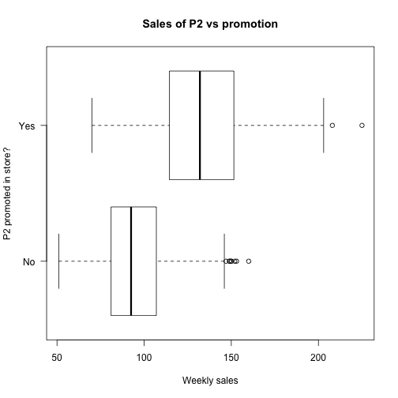

R for Marketing Research and Analytics
========================================================
Author: Chris Chapman and Elea McDonnell Feit
Date: January 2016
css: ../chapman-feit-slides.css
width: 1024
height: 768

**Chapter 3: Describing Data (Descriptive Statistics)**  

Website for all data files:  
[http://r-marketing.r-forge.r-project.org/data.html](http://r-marketing.r-forge.r-project.org/data.html)


Load the data
========
The book walks through **simulation** of nearly all the data sets ... 
check that out, as there is much more about R in those sections.

For today, we'll just load the data from the website:

```r
store.df <- read.csv("http://goo.gl/QPDdMl")
summary(store.df)
```

```
    storeNum          Year          Week          p1sales   
 Min.   :101.0   Min.   :1.0   Min.   : 1.00   Min.   : 73  
 1st Qu.:105.8   1st Qu.:1.0   1st Qu.:13.75   1st Qu.:113  
 Median :110.5   Median :1.5   Median :26.50   Median :129  
 Mean   :110.5   Mean   :1.5   Mean   :26.50   Mean   :133  
 3rd Qu.:115.2   3rd Qu.:2.0   3rd Qu.:39.25   3rd Qu.:150  
 Max.   :120.0   Max.   :2.0   Max.   :52.00   Max.   :263  
                                                            
    p2sales         p1price         p2price         p1prom   
 Min.   : 51.0   Min.   :2.190   Min.   :2.29   Min.   :0.0  
 1st Qu.: 84.0   1st Qu.:2.290   1st Qu.:2.49   1st Qu.:0.0  
 Median : 96.0   Median :2.490   Median :2.59   Median :0.0  
 Mean   :100.2   Mean   :2.544   Mean   :2.70   Mean   :0.1  
 3rd Qu.:113.0   3rd Qu.:2.790   3rd Qu.:2.99   3rd Qu.:0.0  
 Max.   :225.0   Max.   :2.990   Max.   :3.19   Max.   :1.0  
                                                             
     p2prom       country 
 Min.   :0.0000   AU:104  
 1st Qu.:0.0000   BR:208  
 Median :0.0000   CN:208  
 Mean   :0.1385   DE:520  
 3rd Qu.:0.0000   GB:312  
 Max.   :1.0000   JP:416  
                  US:312  
```


Descriptives 1
========
table() for categorical variable

```r
table(store.df$p1price)
```

```

2.19 2.29 2.49 2.79 2.99 
 395  444  423  443  375 
```
The counts can be converted to proportions with prop.table()

```r
prop.table(table(store.df$p1price))
```

```

     2.19      2.29      2.49      2.79      2.99 
0.1899038 0.2134615 0.2033654 0.2129808 0.1802885 
```

Table as an object
========
Tables are objects that can be assigned and indexed:

```r
p1.table <- table(store.df$p1price)
p1.table
```

```

2.19 2.29 2.49 2.79 2.99 
 395  444  423  443  375 
```

```r
p1.table[3]
```

```
2.49 
 423 
```

```r
str(p1.table)
```

```
 'table' int [1:5(1d)] 395 444 423 443 375
 - attr(*, "dimnames")=List of 1
  ..$ : chr [1:5] "2.19" "2.29" "2.49" "2.79" ...
```

Plotting a table (basic)
========

```r
plot(p1.table)
```


We'll see better plots later!

Two-way tables
========

```r
table(store.df$p1price, store.df$p1prom)
```

```
      
         0   1
  2.19 354  41
  2.29 398  46
  2.49 381  42
  2.79 396  47
  2.99 343  32
```
Note that tables index [row, column] like most things in R!


Core Descriptive Functions
========

```r
min(store.df$p1sales)
```

```
[1] 73
```

```r
max(store.df$p2sales)
```

```
[1] 225
```

```r
mean(store.df$p1prom)
```

```
[1] 0.1
```

```r
median(store.df$p2sales)
```

```
[1] 96
```
***

```r
var(store.df$p1sales)
```

```
[1] 805.0044
```

```r
sd(store.df$p1sales)
```

```
[1] 28.3726
```

```r
IQR(store.df$p1sales)
```

```
[1] 37
```

```r
mad(store.df$p1sales)
```

```
[1] 26.6868
```

Percentile (Quantile) function
========

```r
quantile(store.df$p1sales)   # default = 0:4*0.25
```

```
  0%  25%  50%  75% 100% 
  73  113  129  150  263 
```

```r
quantile(store.df$p1sales, probs=c(0.25, 0.75)) # Interquartile
```

```
25% 75% 
113 150 
```

```r
quantile(store.df$p1sales, probs=c(0.025, 0.975)) # central 95%
```

```
 2.5% 97.5% 
   88   199 
```

```r
quantile(store.df$p1sales, probs=1:10/10)  # shortcut
```

```
  10%   20%   30%   40%   50%   60%   70%   80%   90%  100% 
100.0 109.0 117.0 122.6 129.0 136.0 145.0 156.0 171.0 263.0 
```


Summary of data frame
========

```r
summary(store.df)
```

```
    storeNum          Year          Week          p1sales   
 Min.   :101.0   Min.   :1.0   Min.   : 1.00   Min.   : 73  
 1st Qu.:105.8   1st Qu.:1.0   1st Qu.:13.75   1st Qu.:113  
 Median :110.5   Median :1.5   Median :26.50   Median :129  
 Mean   :110.5   Mean   :1.5   Mean   :26.50   Mean   :133  
 3rd Qu.:115.2   3rd Qu.:2.0   3rd Qu.:39.25   3rd Qu.:150  
 Max.   :120.0   Max.   :2.0   Max.   :52.00   Max.   :263  
                                                            
    p2sales         p1price         p2price         p1prom   
 Min.   : 51.0   Min.   :2.190   Min.   :2.29   Min.   :0.0  
 1st Qu.: 84.0   1st Qu.:2.290   1st Qu.:2.49   1st Qu.:0.0  
 Median : 96.0   Median :2.490   Median :2.59   Median :0.0  
 Mean   :100.2   Mean   :2.544   Mean   :2.70   Mean   :0.1  
 3rd Qu.:113.0   3rd Qu.:2.790   3rd Qu.:2.99   3rd Qu.:0.0  
 Max.   :225.0   Max.   :2.990   Max.   :3.19   Max.   :1.0  
                                                             
     p2prom       country 
 Min.   :0.0000   AU:104  
 1st Qu.:0.0000   BR:208  
 Median :0.0000   CN:208  
 Mean   :0.1385   DE:520  
 3rd Qu.:0.0000   GB:312  
 Max.   :1.0000   JP:416  
                  US:312  
```

Summary of data frame elements
========

```r
summary(store.df$p1sales)
```

```
   Min. 1st Qu.  Median    Mean 3rd Qu.    Max. 
     73     113     129     133     150     263 
```

```r
summary(store.df$p1sales, digits=2)  # round output
```

```
   Min. 1st Qu.  Median    Mean 3rd Qu.    Max. 
     73     110     130     130     150     260 
```


Visualization: Steps to Prettify (1)
========
hist() for basic plot

```r
hist(store.df$p1sales)
```


Improve it with labels
========

```r
hist(store.df$p1sales, 
     main="Product 1 Weekly Sales Frequencies, All Stores",
     xlab="Product 1 Sales (Units)",
     ylab="Count" )           
```


Make it more granular and colorful
========

```r
hist(store.df$p1sales, 
     main="Product 1 Weekly Sales Frequencies, All Stores",
     xlab="Product 1 Sales (Units)",
     ylab="Count",
     breaks=30,             # more columns 
     col="lightblue")       # color the bars
```


Change counts to proportions
========

```r
hist(store.df$p1sales, 
     main="Product 1 Weekly Sales Frequencies, All Stores",
     xlab="Product 1 Sales (Units)",
     ylab="Relative frequency", # changed
     breaks=30, 
     col="lightblue", 
     freq=FALSE )                # freq=FALSE for density
```


Add density curve
========

```r
hist(store.df$p1sales, 
     main="Product 1 Weekly Sales Frequencies, All Stores",
     xlab="Product 1 Sales", ylab="Relative frequency",
     breaks=30, col="lightblue", freq=FALSE)

lines(density(store.df$p1sales, bw=10),  # bw = smoothing
      type="l", col="darkred", lwd=2)    # lwd = line width
```


# boxplots and stripcharts

## boxplot
Boxplot 
========
Basic boxplot is good for data exploration:

```r
boxplot(store.df$p2sales, xlab="Weekly sales", ylab="P2",
        main="Weekly sales of P2, All stores", horizontal=TRUE)
```


Boxplot broken out by factor
========
Plot **DV ~ IV** to condition on a factor:

```r
boxplot(store.df$p2sales ~ store.df$storeNum, horizontal=TRUE,
     ylab="Store", xlab="Weekly unit sales", las=1,
     main="Weekly Sales of P2 by Store")
```


Boxplot with data and axes
========
Use **data=** to specify df, and **axis** to label axes better:

```r
boxplot(p2sales ~ p2prom, data=store.df, horizontal=TRUE, 
        yaxt="n", ylab="P2 promoted in store?", 
        xlab="Weekly sales", main="Sales of P2 vs promotion")
axis(side=2, at=c(1,2), labels=c("No", "Yes"), las=1)
```




See the book for more
========
type: alert

1. QQ plots to check distribution
2. QQ plots for raw vs. transformed data
3. Cumulative distribution plots, such as:


by()
========
**`by()`** is one way to split data by a factor and apply a function to each group:

```r
by(store.df$p1sales, store.df$storeNum, mean)
```

```
store.df$storeNum: 101
[1] 130.5385
-------------------------------------------------------- 
store.df$storeNum: 102
[1] 134.7404
-------------------------------------------------------- 
store.df$storeNum: 103
[1] 136.0385
-------------------------------------------------------- 
store.df$storeNum: 104
[1] 131.4423
-------------------------------------------------------- 
store.df$storeNum: 105
[1] 129.5288
-------------------------------------------------------- 
store.df$storeNum: 106
[1] 133.7981
-------------------------------------------------------- 
store.df$storeNum: 107
[1] 133.8077
-------------------------------------------------------- 
store.df$storeNum: 108
[1] 133.6923
-------------------------------------------------------- 
store.df$storeNum: 109
[1] 131.5481
-------------------------------------------------------- 
store.df$storeNum: 110
[1] 132.0962
-------------------------------------------------------- 
store.df$storeNum: 111
[1] 130.4519
-------------------------------------------------------- 
store.df$storeNum: 112
[1] 129.8846
-------------------------------------------------------- 
store.df$storeNum: 113
[1] 137.7692
-------------------------------------------------------- 
store.df$storeNum: 114
[1] 132.1923
-------------------------------------------------------- 
store.df$storeNum: 115
[1] 129.5288
-------------------------------------------------------- 
store.df$storeNum: 116
[1] 135.75
-------------------------------------------------------- 
store.df$storeNum: 117
[1] 135.0385
-------------------------------------------------------- 
store.df$storeNum: 118
[1] 139.8462
-------------------------------------------------------- 
store.df$storeNum: 119
[1] 133.7308
-------------------------------------------------------- 
store.df$storeNum: 120
[1] 129.5481
```

by(store.df$p1sales, list(store.df$storeNum, store.df$Year), mean)


aggregate()
========
`aggregate()` collects results similar to `by()` into an object:

```r
storeMean <- aggregate(store.df$p1sales, 
                       by=list(store=store.df$storeNum), mean)
storeMean
```

```
   store        x
1    101 130.5385
2    102 134.7404
3    103 136.0385
4    104 131.4423
5    105 129.5288
6    106 133.7981
7    107 133.8077
8    108 133.6923
9    109 131.5481
10   110 132.0962
11   111 130.4519
12   112 129.8846
13   113 137.7692
14   114 132.1923
15   115 129.5288
16   116 135.7500
17   117 135.0385
18   118 139.8462
19   119 133.7308
20   120 129.5481
```


Exercise!
=======
Access the `Salaries` data set:

```r
library(car)    # install.packages("car") if needed
data(Salaries)
```
1. What are the counts of men and women by rank? The proportions?
2. Draw a histogram for years of service.  Add a density line in red. (Hint: plot proportions, not frequency.)
3. Draw a box plot for salary.
4. Draw a box plot for salary by rank. Make it horizontal.


Answers (1)
=======
What are the counts of men and women by rank? The proportions?

```r
table(Salaries$rank, Salaries$sex)
```

```
           
            Female Male
  AsstProf      11   56
  AssocProf     10   54
  Prof          18  248
```

```r
prop.table(table(Salaries$rank, Salaries$sex))
```

```
           
                Female       Male
  AsstProf  0.02770781 0.14105793
  AssocProf 0.02518892 0.13602015
  Prof      0.04534005 0.62468514
```

```r
prop.table(table(Salaries$rank, Salaries$sex), margin=2)
```

```
           
               Female      Male
  AsstProf  0.2820513 0.1564246
  AssocProf 0.2564103 0.1508380
  Prof      0.4615385 0.6927374
```

Answers (2)
=======
Draw a histogram for years of service. Add a density line in red.

```r
hist(Salaries$yrs.service, freq=FALSE)
lines(density(Salaries$yrs.service), col="red")
```


Answers (3)
=======
Draw a box plot for salary

```r
boxplot(Salaries$salary)
```


Answers (4)
=======
Draw a box plot for salary by rank. Make it horizontal.

```r
boxplot(Salaries$salary ~ Salaries$rank, horizontal=TRUE)
```


Optional Slides
=====
type: section

- Indexing with tables
- Using `describe()` esp. for survey data
- Easy choropleth world map
 


Indexing with tables
========

```r
table(store.df$p1price, store.df$p1prom)
```

```
      
         0   1
  2.19 354  41
  2.29 398  46
  2.49 381  42
  2.79 396  47
  2.99 343  32
```
Note that tables index [row, column] like most things in R!

Two-way tables are also assignable \& indexable:

```r
p1.table2 <- table(store.df$p1price, store.df$p1prom)
p1.table2[, 2] / (p1.table2[, 1] + p1.table2[, 2])
```

```
      2.19       2.29       2.49       2.79       2.99 
0.10379747 0.10360360 0.09929078 0.10609481 0.08533333 
```


Describe (psych package)
========
**`describe()`** is especially useful for survey data.

```r
library(psych)   # must install first
describe(store.df)
```

```
         vars    n   mean    sd median trimmed   mad    min    max range
storeNum    1 2080 110.50  5.77 110.50  110.50  7.41 101.00 120.00  19.0
Year        2 2080   1.50  0.50   1.50    1.50  0.74   1.00   2.00   1.0
Week        3 2080  26.50 15.01  26.50   26.50 19.27   1.00  52.00  51.0
p1sales     4 2080 133.05 28.37 129.00  131.08 26.69  73.00 263.00 190.0
p2sales     5 2080 100.16 24.42  96.00   98.05 22.24  51.00 225.00 174.0
p1price     6 2080   2.54  0.29   2.49    2.53  0.44   2.19   2.99   0.8
p2price     7 2080   2.70  0.33   2.59    2.69  0.44   2.29   3.19   0.9
p1prom      8 2080   0.10  0.30   0.00    0.00  0.00   0.00   1.00   1.0
p2prom      9 2080   0.14  0.35   0.00    0.05  0.00   0.00   1.00   1.0
country*   10 2080   4.55  1.72   4.50    4.62  2.22   1.00   7.00   6.0
          skew kurtosis   se
storeNum  0.00    -1.21 0.13
Year      0.00    -2.00 0.01
Week      0.00    -1.20 0.33
p1sales   0.74     0.66 0.62
p2sales   0.99     1.51 0.54
p1price   0.28    -1.44 0.01
p2price   0.32    -1.40 0.01
p1prom    2.66     5.10 0.01
p2prom    2.09     2.38 0.01
country* -0.29    -0.81 0.04
```


Aggregate sales by country
========

```r
p1sales.sum <- aggregate(store.df$p1sales, 
                         by=list(country=store.df$country), sum)
p1sales.sum
```

```
  country     x
1      AU 14544
2      BR 27836
3      CN 27381
4      DE 68876
5      GB 40986
6      JP 55381
7      US 41737
```


Plot sales by country with rworldmap()
========
First we load the packages, and set up a map.

In our aggregated data, we use the **country** column to tell the map where to put the  **p1sales.sum** aggregated mean.

```r
library(rworldmap)    # must be installed
library(RColorBrewer) # must be installed

p1sales.map <- joinCountryData2Map(p1sales.sum, 
                                   joinCode = "ISO2", 
                                   nameJoinColumn = "country")
```

```
7 codes from your data successfully matched countries in the map
0 codes from your data failed to match with a country code in the map
235 codes from the map weren't represented in your data
```


Draw the map
========
Once the data is "mapped" to the locations, we can draw the visualization:

```r
mapCountryData(p1sales.map, nameColumnToPlot="x", 
               mapTitle="Total P1 sales by Country",
               colourPalette=brewer.pal(7, "Greens"), 
               catMethod="fixedWidth", addLegend=FALSE)
```


That's all for Chapter 3!
=========
type: section

# Break time


Notes
========
<small>
This presentation is based on Chapter 6 of Chapman and Feit, *R for Marketing Research and Analytics* &copy; 2015 Springer. http://r-marketing.r-forge.r-project.org/

Exercises here use the `Salaries` data set from the `car` package, John Fox and Sanford Weisberg (2011). *An R Companion to Applied Regression*, Second Edition. Thousand Oaks CA: Sage. http://socserv.socsci.mcmaster.ca/jfox/Books/Companion

All code in the presentation is licensed under the Apache License, Version 2.0 (the "License"); you may not use this file except in compliance with the License.  You may obtain a copy of the License at http://www.apache.org/licenses/LICENSE-2.0\ Unless required by applicable law or agreed to in writing, software distributed under the License is distributed on an "AS IS" BASIS, WITHOUT WARRANTIES OR CONDITIONS OF ANY KIND, either express or implied. See the License for the specific language governing permissions and limitations under the License.  
</small>


