R for Marketing Research and Analytics
========================================================
Author: Chris Chapman and Elea McDonnell Feit
Date: January 2016
css: ../chapman-feit-slides.css
width: 1024
height: 768

**Chapter 4: Relationships between Variables (Bivariate Statistics)**  

Website for all data files:  
[http://r-marketing.r-forge.r-project.org/data.html](http://r-marketing.r-forge.r-project.org/data.html)


Load CRM data
========
As always, see the book for details about data simulation. Meanwhile, we'll load it.
This is example data with data on customers' visits, transactions, and spending for online 
and retail purchases:

```r
cust.df <- read.csv("http://goo.gl/PmPkaG")
str(cust.df)
```

```
'data.frame':	1000 obs. of  12 variables:
 $ cust.id          : int  1 2 3 4 5 6 7 8 9 10 ...
 $ age              : num  22.9 28 35.9 30.5 38.7 ...
 $ credit.score     : num  631 749 733 830 734 ...
 $ email            : Factor w/ 2 levels "no","yes": 2 2 2 2 1 2 2 2 1 1 ...
 $ distance.to.store: num  2.58 48.18 1.29 5.25 25.04 ...
 $ online.visits    : int  20 121 39 1 35 1 1 48 0 14 ...
 $ online.trans     : int  3 39 14 0 11 1 1 13 0 6 ...
 $ online.spend     : num  58.4 756.9 250.3 0 204.7 ...
 $ store.trans      : int  4 0 0 2 0 0 2 4 0 3 ...
 $ store.spend      : num  140.3 0 0 95.9 0 ...
 $ sat.service      : int  3 3 NA 4 1 NA 3 2 4 3 ...
 $ sat.selection    : int  3 3 NA 2 1 NA 3 3 2 2 ...
```


Converting data to factors
========
Text data is automatically converted to factors when reading CSVs. However, sometimes data that appears to be numeric is really not.

The factor() function will convert data to nominal factors:


```r
str(cust.df$cust.id)
```

```
 int [1:1000] 1 2 3 4 5 6 7 8 9 10 ...
```

```r
cust.df$cust.id <- factor(cust.df$cust.id)

str(cust.df$cust.id)
```

```
 Factor w/ 1000 levels "1","2","3","4",..: 1 2 3 4 5 6 7 8 9 10 ...
```

Option: ordered=TRUE (or ordered() function) creates ordinal factors.


Basic scatterplot
========
Let's look at scatterplots. How does age relate to credit score?

```r
plot(x=cust.df$age, y=cust.df$credit.score)
```

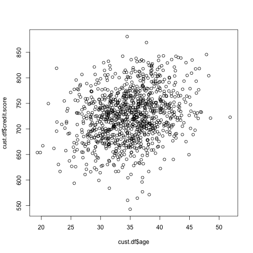


A better plot
========
Add color, labels, and adjust the axis limits:

```r
plot(cust.df$age, cust.df$credit.score, 
     col="blue",
     xlim=c(15, 55), ylim=c(500, 900), 
     main="Active Customers as of June 2014",
     xlab="Customer Age (years)", ylab="Credit Score ")
```

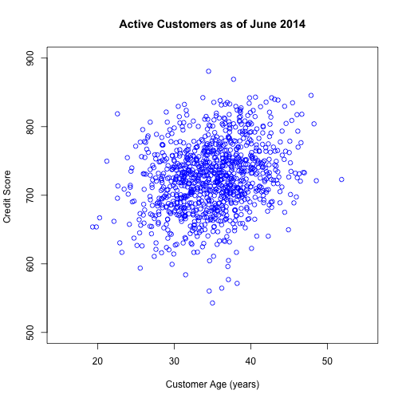

Add a regression line
========
abline() adds a regression line from a linear model (we'll
discuss regression in depth later)


```r
plot(cust.df$age, cust.df$credit.score, 
     col="blue", xlim=c(15, 55), ylim=c(500, 900), 
     xlab="Customer Age (years)", ylab="Credit Score ")

abline(lm(cust.df$credit.score ~ cust.df$age))
```

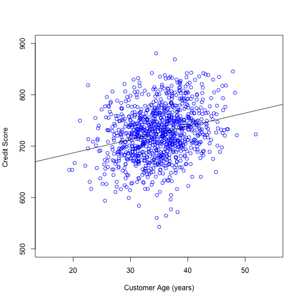


Zero-inflated and skewed data
========

Question: how do online sales relate to in-store sales? Does online decrease or increase online sales?

Before starting on this, note that customer data often has two issues:
* __Skew__: many small transactions, few large ones
* __Zero inflation__: many zero values (because many customers spend $0 in any period)

There are various ways to handle these issues, but an easy approach is to use
logarithmic plots. Instead of plotting on raw scales, plot on logarithmic scale.

Let's look at this in steps.


Scatterplot with skew
========
How does in-store spending relate to online spending? 
It's hard to tell because both are skewed! The apparent negative slope is 
very misleading.

```r
plot(cust.df$store.spend, cust.df$online.spend, 
     xlab="Prior 12 months in-store sales ($)", 
     ylab="Prior 12 months online sales ($)")
```

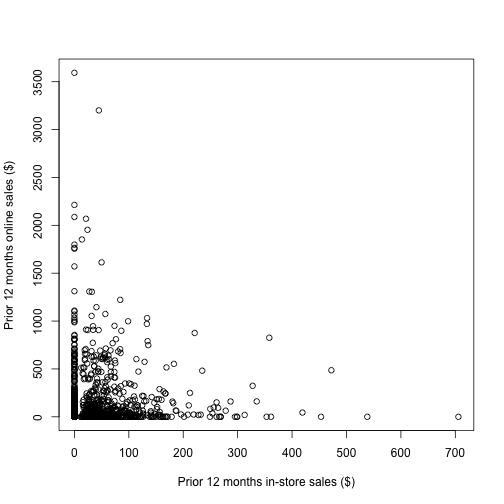

Looking at the skew
========
A histogram reveals the skew, e.g., for in-store spending:


```r
hist(cust.df$store.spend, 
     breaks=(0:ceiling(max(cust.df$store.spend)/10))*10,
     xlab="Prior 12 months online sales ($)" )
```

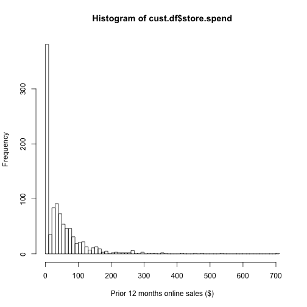

Using logarithmic axes
========
Use the log= argument to set one or both axes to logarithmic. **Caution**: 
log(x $\le$ 0) is not defined, so make sure values are positive. Add a constant
such as +1 if needed. Now we see little or no relationship:

```r
plot(cust.df$store.spend + 1, cust.df$online.spend + 1,
     log="xy")
```

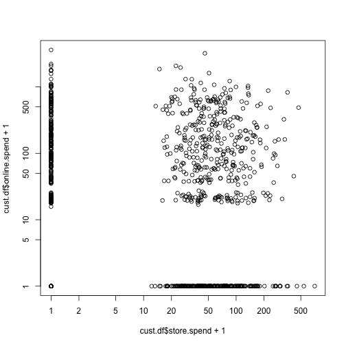


Multi-panel plots
========
How does distance relate to in-store and online spending? Use par(mfrow=c(ROWS, COLUMNS)) to put multiple plots together:

```r
par(mfrow=c(2, 2))
with(cust.df, plot(distance.to.store, store.spend))
with(cust.df, plot(distance.to.store, online.spend))
with(cust.df, plot(distance.to.store, store.spend+1, log="xy"))
with(cust.df, plot(distance.to.store, online.spend+1, log="xy"))
```

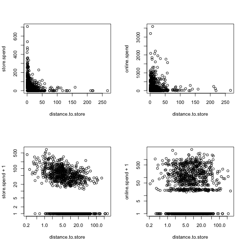


Scatterplot matrix: Quick 2-way Visualization
========

```r
pairs(formula = ~ age + credit.score + distance.to.store + 
                  online.spend + store.trans + store.spend,
      data=cust.df)
```

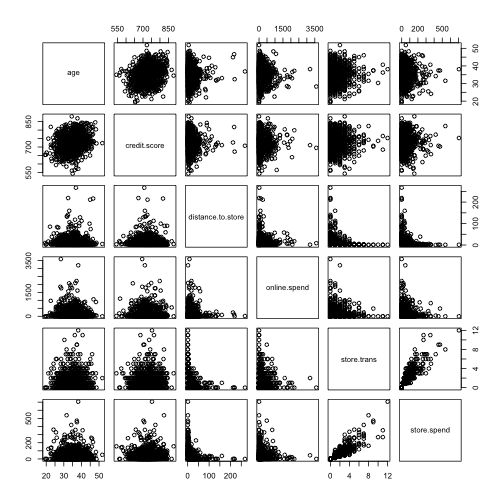


Fancy alternative: scatterplotMatrix in "car"
========

```r
library(car)       # install if needed
scatterplotMatrix(formula = ~ age + credit.score + 
                    distance.to.store + online.spend + 
                    store.trans + store.spend,
                  data=cust.df, diagonal="histogram")
```

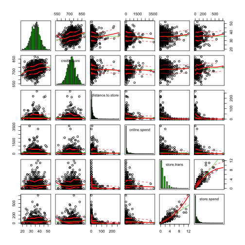


Correlation
========
A basic inferential test of Pearson's $r$ can be done with cor.test():

```r
cor.test(cust.df$age, cust.df$credit.score)
```

```

	Pearson's product-moment correlation

data:  cust.df$age and cust.df$credit.score
t = 8.3138, df = 998, p-value = 4.441e-16
alternative hypothesis: true correlation is not equal to 0
95 percent confidence interval:
 0.1955974 0.3115816
sample estimates:
      cor 
0.2545045 
```
Age is associated with credit score here, $r = 0.25, p \lt .05$.


Correlation matrix
========
The cor() function computes $r$ between all pairs of variables:

```r
cor(cust.df[, c(2, 3, 5:12)])  # only numeric cols
```

```
                           age credit.score distance.to.store
age                1.000000000  0.254504457        0.00198741
credit.score       0.254504457  1.000000000       -0.02326418
distance.to.store  0.001987410 -0.023264183        1.00000000
online.visits     -0.061381070 -0.010818272       -0.01460036
online.trans      -0.063019935 -0.005018400       -0.01955166
online.spend      -0.060685729 -0.006079881       -0.02040533
store.trans        0.024229708  0.040424158       -0.27673229
store.spend        0.003841953  0.042298123       -0.24149487
sat.service                 NA           NA                NA
sat.selection               NA           NA                NA
                  online.visits online.trans online.spend store.trans
age                 -0.06138107  -0.06301994 -0.060685729  0.02422971
credit.score        -0.01081827  -0.00501840 -0.006079881  0.04042416
distance.to.store   -0.01460036  -0.01955166 -0.020405326 -0.27673229
online.visits        1.00000000   0.98732805  0.982406842 -0.03666932
online.trans         0.98732805   1.00000000  0.993346657 -0.04024588
online.spend         0.98240684   0.99334666  1.000000000 -0.04089133
store.trans         -0.03666932  -0.04024588 -0.040891332  1.00000000
store.spend         -0.05068554  -0.05224465 -0.051690053  0.89275685
sat.service                  NA           NA           NA          NA
sat.selection                NA           NA           NA          NA
                   store.spend sat.service sat.selection
age                0.003841953          NA            NA
credit.score       0.042298123          NA            NA
distance.to.store -0.241494870          NA            NA
online.visits     -0.050685537          NA            NA
online.trans      -0.052244650          NA            NA
online.spend      -0.051690053          NA            NA
store.trans        0.892756851          NA            NA
store.spend        1.000000000          NA            NA
sat.service                 NA           1            NA
sat.selection               NA          NA             1
```


Redoing that with complete cases
========
Add **use="complete.obs"** argument:

```r
cor(cust.df[, c(2, 3, 5:12)], use="complete.obs")
```

```
                          age credit.score distance.to.store online.visits
age                1.00000000   0.27384005        0.04606521   -0.06334468
credit.score       0.27384005   1.00000000       -0.03444605   -0.04337523
distance.to.store  0.04606521  -0.03444605        1.00000000   -0.02680514
online.visits     -0.06334468  -0.04337523       -0.02680514    1.00000000
online.trans      -0.07282280  -0.03041161       -0.03046099    0.98349553
online.spend      -0.06857108  -0.03344978       -0.03224989    0.97645451
store.trans        0.01917930   0.07147923       -0.28777128   -0.01833510
store.spend       -0.01101162   0.07319630       -0.25249002   -0.06022874
sat.service       -0.05846361  -0.05095454        0.02561875   -0.01614200
sat.selection     -0.07411506  -0.02350937        0.01293211   -0.01837661
                  online.trans online.spend  store.trans  store.spend
age                -0.07282280  -0.06857108  0.019179304 -0.011011624
credit.score       -0.03041161  -0.03344978  0.071479231  0.073196297
distance.to.store  -0.03046099  -0.03224989 -0.287771277 -0.252490015
online.visits       0.98349553   0.97645451 -0.018335097 -0.060228738
online.trans        1.00000000   0.99306906 -0.026717771 -0.063219201
online.spend        0.99306906   1.00000000 -0.025572587 -0.061704685
store.trans        -0.02671777  -0.02557259  1.000000000  0.892855470
store.spend        -0.06321920  -0.06170469  0.892855470  1.000000000
sat.service        -0.01762744  -0.01187352  0.001821736  0.007466294
sat.selection      -0.01846859  -0.02114840  0.001309098  0.008642354
                   sat.service sat.selection
age               -0.058463613  -0.074115061
credit.score      -0.050954538  -0.023509365
distance.to.store  0.025618746   0.012932114
online.visits     -0.016142000  -0.018376612
online.trans      -0.017627444  -0.018468588
online.spend      -0.011873515  -0.021148403
store.trans        0.001821736   0.001309098
store.spend        0.007466294   0.008642354
sat.service        1.000000000   0.587855775
sat.selection      0.587855775   1.000000000
```


Visualize correlation matrix
========
Use the "corrplot" package. See book (and help) for more options.

```r
library(corrplot)    # install if needed
corrplot(corr=cor(cust.df[ , c(2, 3, 5:12)], 
                  use="complete.obs"), 
         method ="ellipse")
```

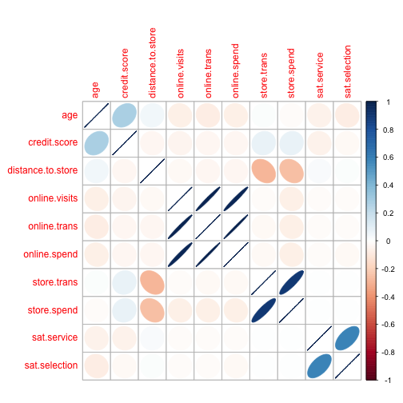


Data Transformation
========
R makes it easy to explore common transformations (log, 1/x, sqrt, etc.)


```r
cor(cust.df$distance.to.store, cust.df$store.spend)
```

```
[1] -0.2414949
```

```r
cor(1/cust.df$distance.to.store, cust.df$store.spend)
```

```
[1] 0.4329997
```

```r
cor(1/sqrt(cust.df$distance.to.store), cust.df$store.spend)
```

```
[1] 0.4843334
```
We see that closeness to store ($1/distance$) is strongly relation to spend.
Having a good transformation gives a better estimate of strength.

See book for more on common transformations and how to find an optimal transform.


Polychoric correlation
========
With ordinal variables such as satisfaction ratings, consider polychoric
correlation instead of Pearson's r. We need it because the ratings are not 
fine grained, and plot on top of one another:

```r
plot(cust.df$sat.service, cust.df$sat.selection, 
     xlab="Sat, Service", ylab="Sat, Selection")
```

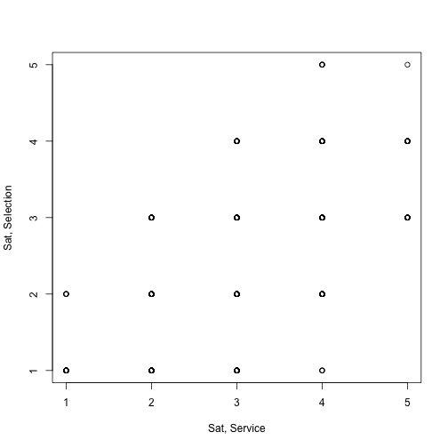


Polychoric correlation test
========
First identify respondents with data:

```r
resp <- !is.na(cust.df$sat.service)
```

Now compare Pearson correlation to polychoric:

```r
cor(cust.df$sat.service[resp], cust.df$sat.selection[resp]) 
```

```
[1] 0.5878558
```

```r
library(psych)   # install if needed
polychoric(cbind(cust.df$sat.service[resp], 
                 cust.df$sat.selection[resp]))
```

```
Call: polychoric(x = cbind(cust.df$sat.service[resp], cust.df$sat.selection[resp]))
Polychoric correlations 
   C1   C2  
R1 1.00     
R2 0.67 1.00

 with tau of 
         1     2    3   4
[1,] -1.83 -0.72 0.54 1.7
[2,] -0.99  0.12 1.26 2.4
```


Exercise!
=======
Access the `Salaries` data set:

```r
library(car)    # install.packages("car") if needed
data(Salaries)
```
1. Plot salary vs. years since PhD.
2. What is the correlation for salary vs. years since PhD? 
... vs. years of service? Are they statistically significant?
3. Draw a visualization of all bivariate relationships


Answers (1)
=======
Plot salary vs. years since PhD.

```r
with(Salaries, plot(yrs.since.phd, salary))
```

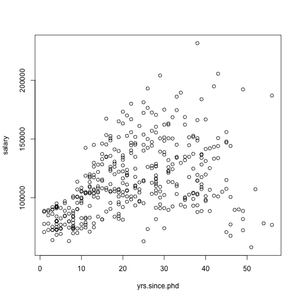


Answers (2)
=======
What is the correlation for salary vs. years since PhD? 
... vs. years of service? Are they statistically significant?

```r
with(Salaries, cor(salary, yrs.since.phd))
```

```
[1] 0.4192311
```

```r
with(Salaries, cor(salary, yrs.service))
```

```
[1] 0.3347447
```

```r
with(Salaries, cor.test(salary, yrs.since.phd))
```

```

	Pearson's product-moment correlation

data:  salary and yrs.since.phd
t = 9.1775, df = 395, p-value < 2.2e-16
alternative hypothesis: true correlation is not equal to 0
95 percent confidence interval:
 0.3346160 0.4971402
sample estimates:
      cor 
0.4192311 
```

```r
with(Salaries, cor.test(salary, yrs.service))
```

```

	Pearson's product-moment correlation

data:  salary and yrs.service
t = 7.0602, df = 395, p-value = 7.529e-12
alternative hypothesis: true correlation is not equal to 0
95 percent confidence interval:
 0.2443740 0.4193506
sample estimates:
      cor 
0.3347447 
```


Answers (3)
=======
Draw a visualization of all bivariate relationships

```r
library(car)
scatterplotMatrix(Salaries)   # could use pairs() instead
```

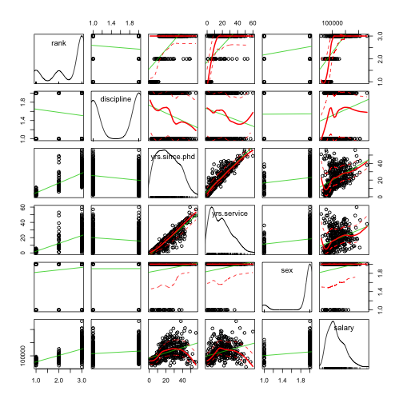


That's all for Chapter 4
=========
type: section

# Thank you! Time for Q&A.


Notes
========
<small>
This presentation is based on Chapter 6 of Chapman and Feit, *R for Marketing Research and Analytics* &copy; 2015 Springer. http://r-marketing.r-forge.r-project.org/

Exercises here use the `Salaries` data set from the `car` package, John Fox and Sanford Weisberg (2011). *An R Companion to Applied Regression*, Second Edition. Thousand Oaks CA: Sage. http://socserv.socsci.mcmaster.ca/jfox/Books/Companion

All code in the presentation is licensed under the Apache License, Version 2.0 (the "License"); you may not use this file except in compliance with the License.  You may obtain a copy of the License at http://www.apache.org/licenses/LICENSE-2.0\ Unless required by applicable law or agreed to in writing, software distributed under the License is distributed on an "AS IS" BASIS, WITHOUT WARRANTIES OR CONDITIONS OF ANY KIND, either express or implied. See the License for the specific language governing permissions and limitations under the License.  
</small>

