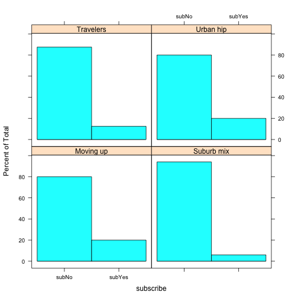
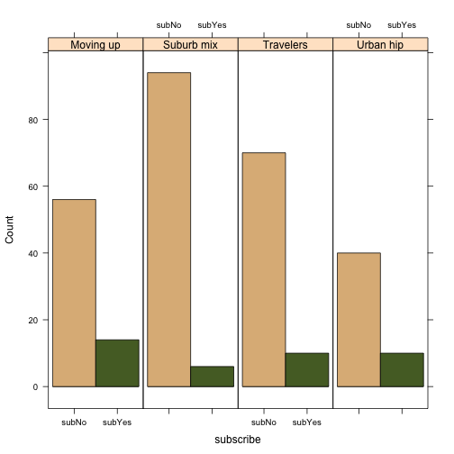
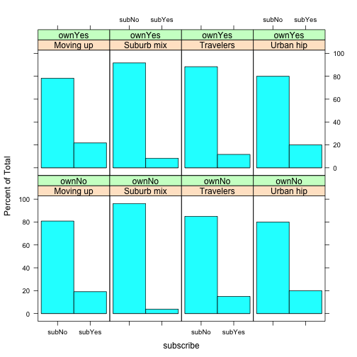
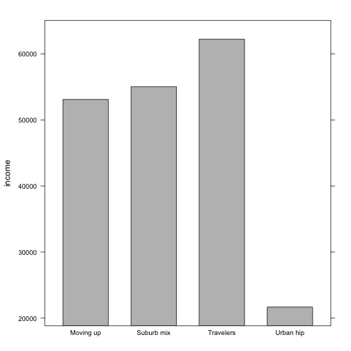
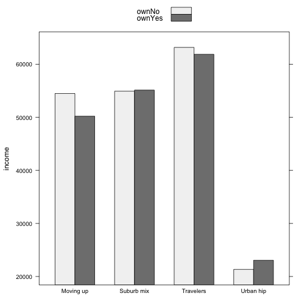
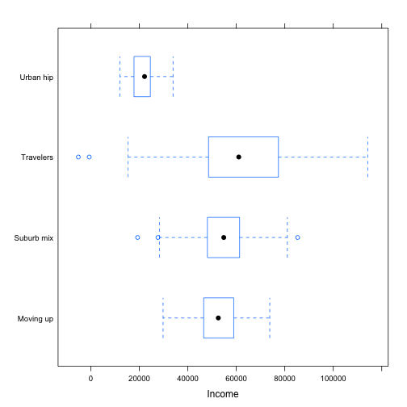
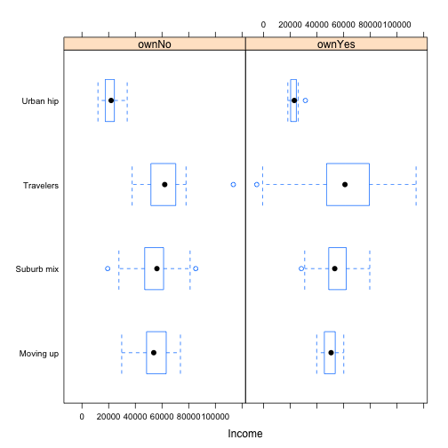
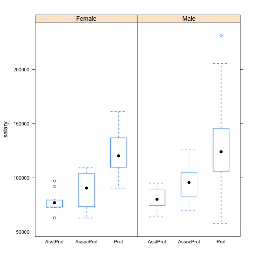

R for Marketing Research and Analytics
========================================================
Author: Chris Chapman and Elea McDonnell Feit
Date: January 2016
css: ../chapman-feit-slides.css
width: 1024
height: 768

**Chapter 5: Differences Between Groups**  

Website for all data files:  
[http://r-marketing.r-forge.r-project.org/data.html](http://r-marketing.r-forge.r-project.org/data.html)


Load Segmentation/Subscription data
========
As usual, check the book for details on the data simulation. For now:

```r
seg.df <- read.csv("http://goo.gl/qw303p")
summary(seg.df)
```

```
      age           gender        income            kids        ownHome   
 Min.   :19.26   Female:157   Min.   : -5183   Min.   :0.00   ownNo :159  
 1st Qu.:33.01   Male  :143   1st Qu.: 39656   1st Qu.:0.00   ownYes:141  
 Median :39.49                Median : 52014   Median :1.00               
 Mean   :41.20                Mean   : 50937   Mean   :1.27               
 3rd Qu.:47.90                3rd Qu.: 61403   3rd Qu.:2.00               
 Max.   :80.49                Max.   :114278   Max.   :7.00               
  subscribe         Segment   
 subNo :260   Moving up : 70  
 subYes: 40   Suburb mix:100  
              Travelers : 80  
              Urban hip : 50  
                              
                              
```


Descriptives: Selecting by group
========

```r
mean(seg.df$income[seg.df$Segment == "Moving up"])
```

```
[1] 53090.97
```

```r
mean(seg.df$income[seg.df$Segment == "Moving up" & 
                   seg.df$subscribe=="subNo"])
```

```
[1] 53633.73
```
This quickly gets tedious!


Descriptives: apply a function by group
========
**by**(VARIABLE of interest, GROUPING variable, FUNCTION)

```r
by(seg.df$income, seg.df$Segment, mean)
```

```
seg.df$Segment: Moving up
[1] 53090.97
-------------------------------------------------------- 
seg.df$Segment: Suburb mix
[1] 55033.82
-------------------------------------------------------- 
seg.df$Segment: Travelers
[1] 62213.94
-------------------------------------------------------- 
seg.df$Segment: Urban hip
[1] 21681.93
```
Use list() to have more than one grouping variable:

```r
by(seg.df$income, list(seg.df$Segment, seg.df$subscribe), mean)
```

```
: Moving up
: subNo
[1] 53633.73
-------------------------------------------------------- 
: Suburb mix
: subNo
[1] 54942.69
-------------------------------------------------------- 
: Travelers
: subNo
[1] 62746.11
-------------------------------------------------------- 
: Urban hip
: subNo
[1] 22082.11
-------------------------------------------------------- 
: Moving up
: subYes
[1] 50919.89
-------------------------------------------------------- 
: Suburb mix
: subYes
[1] 56461.41
-------------------------------------------------------- 
: Travelers
: subYes
[1] 58488.77
-------------------------------------------------------- 
: Urban hip
: subYes
[1] 20081.19
```

Aggregate: use a formula!
========
Break out *income by segment*, in data "*seg.df*", computing the *mean*:

```r
aggregate(income ~ Segment, data=seg.df, mean)
```

```
     Segment   income
1  Moving up 53090.97
2 Suburb mix 55033.82
3  Travelers 62213.94
4  Urban hip 21681.93
```

This extends easily to multiple dimensions:

```r
aggregate(income ~ Segment + ownHome, data=seg.df, mean)
```

```
     Segment ownHome   income
1  Moving up   ownNo 54497.68
2 Suburb mix   ownNo 54932.83
3  Travelers   ownNo 63188.42
4  Urban hip   ownNo 21337.59
5  Moving up  ownYes 50216.37
6 Suburb mix  ownYes 55143.21
7  Travelers  ownYes 61889.12
8  Urban hip  ownYes 23059.27
```

Aggregate returns a data frame
========

```r
agg.data <- aggregate(income ~ Segment + ownHome, 
                      data=seg.df, mean)
str(agg.data)
```

```
'data.frame':	8 obs. of  3 variables:
 $ Segment: Factor w/ 4 levels "Moving up","Suburb mix",..: 1 2 3 4 1 2 3 4
 $ ownHome: Factor w/ 2 levels "ownNo","ownYes": 1 1 1 1 2 2 2 2
 $ income : num  54498 54933 63188 21338 50216 ...
```

```r
agg.data[2, ]
```

```
     Segment ownHome   income
2 Suburb mix   ownNo 54932.83
```

```r
agg.data[2, 3]
```

```
[1] 54932.83
```


Tables
========
Reminder -- a table counts occurrences of a single value, such as one level of a factor.


```r
table(seg.df$Segment, seg.df$ownHome)
```

```
            
             ownNo ownYes
  Moving up     47     23
  Suburb mix    52     48
  Travelers     20     60
  Urban hip     40     10
```
Telling R to use *seg.df* for everything is easy with **with()**:

```r
with(seg.df, table(Segment, ownHome))
```

```
            ownHome
Segment      ownNo ownYes
  Moving up     47     23
  Suburb mix    52     48
  Travelers     20     60
  Urban hip     40     10
```
Note that table() uses R standard *(X, Y)* == *Row, Column* order.

prop.table()
========
Reminder -- get proportions for a table by wrapping **table()** with **prop.table()**:

```r
with(seg.df, prop.table(table(Segment, ownHome)))
```

```
            ownHome
Segment           ownNo     ownYes
  Moving up  0.15666667 0.07666667
  Suburb mix 0.17333333 0.16000000
  Travelers  0.06666667 0.20000000
  Urban hip  0.13333333 0.03333333
```

The default computes full table proportions. Obtain marginal proportions by 
specifying rows (*margin=1*) or columns (*margin=2*):

```r
with(seg.df, prop.table(table(Segment, ownHome), margin=1))
```

```
            ownHome
Segment          ownNo    ownYes
  Moving up  0.6714286 0.3285714
  Suburb mix 0.5200000 0.4800000
  Travelers  0.2500000 0.7500000
  Urban hip  0.8000000 0.2000000
```


Doing math in a table
========
Reminder -- **`aggregate()`** can be used to apply a function to data, computing the 
result within with each group.  

For instance, to add up the total number of kids in each segment, use *sum*:

```r
aggregate(kids ~ Segment, data=seg.df, sum)
```

```
     Segment kids
1  Moving up  134
2 Suburb mix  192
3  Travelers    0
4  Urban hip   55
```


Visualization: Counts by Group
=====
**histogram()** in the **lattice** package plots proportional frequency by 
group. This is an alternative to basic `hist()` that we saw in an earlier chapter.  

To get subscribers (**~subscribe**) by segment (**| Segment**):

```r
library(lattice)
histogram(~subscribe | Segment, data=seg.df)
```




Histograms continued
=====
You can plot counts instead of proportions with **type="count"**. 
There are options for the layout (cols, rows in this case) and colors:

```r
histogram(~subscribe | Segment, data=seg.df, type="count", 
          layout=c(4,1), col=c("burlywood", "darkolivegreen"))
```



# counts instead of proportions, and some visual options

Histograms by 2 factors
=====
Break out by multiple factors using **| var1 + var2 + ...**:

```r
histogram(~subscribe | Segment + ownHome, data=seg.df)
```




Continuous Data: "Spreadsheet" style
=====
The general process is to **aggregate()** the data that you want, then plot that. 
For example: mean income by segment, using a **barchart**:

```r
seg.mean <- aggregate(income ~ Segment, data=seg.df, mean)
library(lattice)
barchart(income ~ Segment, data=seg.mean, col="grey")
```




Continuous data by two factors
=====
Use aggregate with **+** to break out multiple factors:

```r
seg.agg <- aggregate(income ~ Segment + ownHome, data=seg.df, mean)
barchart(income ~ Segment, data=seg.agg, 
         groups=ownHome, auto.key=TRUE,
         par.settings = simpleTheme(col=c("gray95", "gray50")) )
```




Continuous Data: "Statistics" style
=====
Boxplots show much more information about the data distribution (see book for 
details). **`bwplot()`** from **`lattice`** is an upgrade over `boxplot()` that we saw in
earlier chapters:

```r
library(lattice)
bwplot(Segment ~ income, data=seg.df, horizontal=TRUE, 
       xlab = "Income")
```




Boxplots with two way grouping
=====
You can add a "conditioning" variable using **|**:

```r
bwplot(Segment ~ income | ownHome, data=seg.df, 
       horizontal=TRUE, xlab="Income")
```




Exercises
=====
Access the `Salaries` data set:

```r
library(car)    # install.packages("car") if needed
data(Salaries)
```
1. What are the mean salaries, by rank and sex?
2. Plot those with a horizontal boxplot (conditioned on sex)


Answers (1)
=====
What are the mean salaries, by rank and sex?

```r
aggregate(salary ~ rank + sex, data=Salaries, mean)
```

```
       rank    sex    salary
1  AsstProf Female  78049.91
2 AssocProf Female  88512.80
3      Prof Female 121967.61
4  AsstProf   Male  81311.46
5 AssocProf   Male  94869.70
6      Prof   Male 127120.82
```

Answers (2)
=====
Plot those with a boxplot (conditioned on sex)


```r
library(lattice)
bwplot(salary ~ rank | sex, data=Salaries)
```



Extra slides
=====
type: section

- Language: `for()`
- Language: `if()` and `ifelse()`


Language: for()
========
**`for()`** loops over a sequence of values, assigning them in turn to an index variable:

```r
for (i in 1:10) { print(i) }
```

```
[1] 1
[1] 2
[1] 3
[1] 4
[1] 5
[1] 6
[1] 7
[1] 8
[1] 9
[1] 10
```
Advanced R programmers often avoid **`for()`** ... but if it makes sense to you
then go ahead and use it!


Integers are not required, just a sequence
=========

```r
i.seq <- seq(from=2.1, to=6.2, by=0.65)
for (i in i.seq ) { print(i) }
```

```
[1] 2.1
[1] 2.75
[1] 3.4
[1] 4.05
[1] 4.7
[1] 5.35
[1] 6
```

```r
for (i in c(5, 4, 3, 5, 3, 0, -100, 10)) { cat(i, " ") }
```

```
5  4  3  5  3  0  -100  10  
```

```r
for (i in c("Hello ","world, ","welcome to R!")) { cat(i) }
```

```
Hello world, welcome to R!
```
See book for tips on `for()` and the importance of **`seq_along()`** as an alternative!


if()
========
**`if()`** is used for basic program flow control. 

**`if (A) { B else C } `** means:  
"If A is true, compute B *[any commands inside {}]*, otherwise compute C."


```r
x <- 2
if (x > 0) {
  print ("Positive!")
} else {
  print ("Zero or negative!")
}
```

```
[1] "Positive!"
```
Rules of brackets are confusing, so simplify: always use **{** and **}** !

**`else C `** is optional. If !A and no C block, nothing will occur.


ifelse()
========
**ifelse()** is a vectorized version of if(). Use it to *create a vector* using logic, 
*not* to control program flow.

```r
x <- -2:2

if (x > 0) {      # bad code -- only tests once!
  "pos"
} else { 
  "neg/zero"
}
```

```
[1] "neg/zero"
```
The correct way to do this is:

```r
ifelse(x > 0, "pos", "neg/zero")
```

```
[1] "neg/zero" "neg/zero" "neg/zero" "pos"      "pos"     
```
Instead of simply getting values as the result, you could perform actions 
(e.g., by calling functions to do something).


Notes
========
<small>
This presentation is based on Chapter 6 of Chapman and Feit, *R for Marketing Research and Analytics* &copy; 2015 Springer. http://r-marketing.r-forge.r-project.org/

Exercises here use the `Salaries` data set from the `car` package, John Fox and Sanford Weisberg (2011). *An R Companion to Applied Regression*, Second Edition. Thousand Oaks CA: Sage. http://socserv.socsci.mcmaster.ca/jfox/Books/Companion

All code in the presentation is licensed under the Apache License, Version 2.0 (the "License"); you may not use this file except in compliance with the License.  You may obtain a copy of the License at http://www.apache.org/licenses/LICENSE-2.0\ Unless required by applicable law or agreed to in writing, software distributed under the License is distributed on an "AS IS" BASIS, WITHOUT WARRANTIES OR CONDITIONS OF ANY KIND, either express or implied. See the License for the specific language governing permissions and limitations under the License.  
</small>
