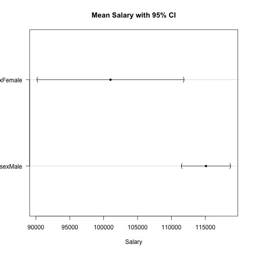

R for Marketing Research and Analytics
========================================================
Author: Chris Chapman and Elea McDonnell Feit
Date: January 2016
css: ../chapman-feit-slides.css
width: 1024
height: 768

**Chapter 6: Statistics to Compare Groups**  

Website for all data files:  
[http://r-marketing.r-forge.r-project.org/data.html](http://r-marketing.r-forge.r-project.org/data.html)


Load the data (same as Chapter 5)
=====
As always, see the book for details on the data simulation:

```r
seg.df <- read.csv("http://goo.gl/qw303p")
summary(seg.df)
```

```
      age           gender        income            kids        ownHome   
 Min.   :19.26   Female:157   Min.   : -5183   Min.   :0.00   ownNo :159  
 1st Qu.:33.01   Male  :143   1st Qu.: 39656   1st Qu.:0.00   ownYes:141  
 Median :39.49                Median : 52014   Median :1.00               
 Mean   :41.20                Mean   : 50937   Mean   :1.27               
 3rd Qu.:47.90                3rd Qu.: 61403   3rd Qu.:2.00               
 Max.   :80.49                Max.   :114278   Max.   :7.00               
  subscribe         Segment   
 subNo :260   Moving up : 70  
 subYes: 40   Suburb mix:100  
              Travelers : 80  
              Urban hip : 50  
                              
                              
```


Chi-square test
=====
Tests equality of marginal counts in groups. *Important*: compile a 
**table** first (don't use raw data). Then use **`chisq.test()`**.

Let's see this for simple, fake data first:

```r
tmp.tab <- table(rep(c(1:4), times=c(25,25,25,20)))
tmp.tab
```

```

 1  2  3  4 
25 25 25 20 
```

```r
chisq.test(tmp.tab)
```

```

	Chi-squared test for given probabilities

data:  tmp.tab
X-squared = 0.78947, df = 3, p-value = 0.852
```

chisq.test "significant" and "not significant"
=====

```r
tmp.tab <- table(rep(c(1:4), times=c(25,25,25,20)))
chisq.test(tmp.tab)
```

```

	Chi-squared test for given probabilities

data:  tmp.tab
X-squared = 0.78947, df = 3, p-value = 0.852
```

```r
tmp.tab <- table(rep(c(1:4), times=c(25,25,25,10)))
tmp.tab
```

```

 1  2  3  4 
25 25 25 10 
```

```r
chisq.test(tmp.tab)
```

```

	Chi-squared test for given probabilities

data:  tmp.tab
X-squared = 7.9412, df = 3, p-value = 0.04724
```


chisq.test with segment data
====
Are the segments the same size? (Not a very interesting question, perhaps.)

```r
table(seg.df$Segment)
```

```

 Moving up Suburb mix  Travelers  Urban hip 
        70        100         80         50 
```

```r
chisq.test(table(seg.df$Segment))
```

```

	Chi-squared test for given probabilities

data:  table(seg.df$Segment)
X-squared = 17.333, df = 3, p-value = 0.0006035
```


chisq.test with segment data
====
Do they have the same rate of subscription by ownership?

```r
table(seg.df$subscribe, seg.df$ownHome)
```

```
        
         ownNo ownYes
  subNo    137    123
  subYes    22     18
```

```r
chisq.test(table(seg.df$subscribe, seg.df$ownHome))
```

```

	Pearson's Chi-squared test with Yates' continuity correction

data:  table(seg.df$subscribe, seg.df$ownHome)
X-squared = 0.010422, df = 1, p-value = 0.9187
```
Without correction (matches traditional formula):

```r
chisq.test(table(seg.df$subscribe, seg.df$ownHome), correct=FALSE)
```

```

	Pearson's Chi-squared test

data:  table(seg.df$subscribe, seg.df$ownHome)
X-squared = 0.074113, df = 1, p-value = 0.7854
```


Proportions: binomial test
=====
**`binom.test(x=successes, n=trials, p=proportion)`** tests whether the count 
of *successes* in a certain number of *trials* matches an expected *proportion*:

```r
binom.test(12, 20, p=0.5)
```

```

	Exact binomial test

data:  12 and 20
number of successes = 12, number of trials = 20, p-value = 0.5034
alternative hypothesis: true probability of success is not equal to 0.5
95 percent confidence interval:
 0.3605426 0.8088099
sample estimates:
probability of success 
                   0.6 
```

Proportions: binomial test continued
=====
The same proportion with higher N can be significant:

```r
# binom.test(12, 20, p=0.5)
binom.test(120, 200, p=0.5)
```

```

	Exact binomial test

data:  120 and 200
number of successes = 120, number of trials = 200, p-value =
0.005685
alternative hypothesis: true probability of success is not equal to 0.5
95 percent confidence interval:
 0.5285357 0.6684537
sample estimates:
probability of success 
                   0.6 
```
See book for Agresti-Coull and other methods if your data has small N or is 
near 0 or 1 proportion.


t-tests
=====
Does income differ for home owners in our data? A t-test compares the means of 
two groups, relative to the variance. First let's visualize it:

```r
library(lattice)
bwplot(income ~ ownHome, data=seg.df)
```


t.test()
=====
Use formula syntax **`t.test(outcomeVar ~ groupingVar)`**:

```r
t.test(income ~ ownHome, data=seg.df)
```

```

	Welch Two Sample t-test

data:  income by ownHome
t = -3.2731, df = 285.25, p-value = 0.001195
alternative hypothesis: true difference in means is not equal to 0
95 percent confidence interval:
 -12080.155  -3007.193
sample estimates:
 mean in group ownNo mean in group ownYes 
            47391.01             54934.68 
```
Mean income is higher among home owners in our data, p < .01.


t.test() for a subset() of data
=====
**`subset()`** is an easy way to select portions of a data set. Here's the same 
t-test but only for the Travelers segment:

```r
t.test(income ~ ownHome, data=subset(seg.df, Segment=="Travelers"))
```

```

	Welch Two Sample t-test

data:  income by ownHome
t = 0.26561, df = 53.833, p-value = 0.7916
alternative hypothesis: true difference in means is not equal to 0
95 percent confidence interval:
 -8508.993 11107.604
sample estimates:
 mean in group ownNo mean in group ownYes 
            63188.42             61889.12 
```
Mean income is *not* significantly different between home owners and non-owners 
in the Travelers segment.


ANOVA basics
=====
ANOVA (analysis of variance) compares the difference in means among two or more 
groups, relative to their variances. 

Recommended procedure: (1) fit a model with **`aov()`**. (2) use **`anova()`**
on the model object to obtain a typical ANOVA table.

For two groups it is effectively the same as a t-test:


```r
seg.aov.own <- aov(income ~ ownHome, data=seg.df)
anova(seg.aov.own)
```

```
Analysis of Variance Table

Response: income
           Df     Sum Sq    Mean Sq F value   Pr(>F)   
ownHome     1 4.2527e+09 4252661211  10.832 0.001118 **
Residuals 298 1.1700e+11  392611030                    
---
Signif. codes:  0 '***' 0.001 '**' 0.01 '*' 0.05 '.' 0.1 ' ' 1
```


ANOVA: Multiple groups
=====
The same model works for multiple groups. Make sure that the independent
variable is a **factor** (use **`factor()`** to convert if necessary).


```r
aggregate(income ~ Segment, mean, data=seg.df)
```

```
     Segment   income
1  Moving up 53090.97
2 Suburb mix 55033.82
3  Travelers 62213.94
4  Urban hip 21681.93
```

```r
seg.aov.seg <- aov(income ~ Segment, data=seg.df)
anova(seg.aov.seg)
```

```
Analysis of Variance Table

Response: income
           Df     Sum Sq    Mean Sq F value    Pr(>F)    
Segment     3 5.4970e+10 1.8323e+10  81.828 < 2.2e-16 ***
Residuals 296 6.6281e+10 2.2392e+08                      
---
Signif. codes:  0 '***' 0.001 '**' 0.01 '*' 0.05 '.' 0.1 ' ' 1
```

Multiple Effect Models: Basic Formulas
=====
Use formula syntax to add variables

Symbol   | Meaning
-------- | --------
~        | RESPONSE ~ PREDICTOR(s)
+        | Additional main effect
:        | Interaction without main effect
*        | All main effects and their interactions
.        | Shortcut for "all other variables"

**Examples:**

Model           | Formula
--------------- | -----------------
income by ownership & segment | income ~ own + segment
income by interaaction of ownership by segment | income ~ own:segment
income with all effects of ownership with segment | income ~ own + segment + own:segment
... or the same but not as clear ...      | income ~ own*segment
income as a response to all other variables | income ~ .


ANOVA with Segment + Ownership
=====   

```r
anova(aov(income ~ Segment + ownHome, data=seg.df))
```

```
Analysis of Variance Table

Response: income
           Df     Sum Sq    Mean Sq F value Pr(>F)    
Segment     3 5.4970e+10 1.8323e+10 81.6381 <2e-16 ***
ownHome     1 6.9918e+07 6.9918e+07  0.3115 0.5772    
Residuals 295 6.6211e+10 2.2444e+08                   
---
Signif. codes:  0 '***' 0.001 '**' 0.01 '*' 0.05 '.' 0.1 ' ' 1
```
Mean income differs by *Segment*, but not by *ownership* after Segment is 
controlled. Model by ownership alone might be misleading:

```r
anova(aov(income ~ ownHome, data=seg.df))
```

```
Analysis of Variance Table

Response: income
           Df     Sum Sq    Mean Sq F value   Pr(>F)   
ownHome     1 4.2527e+09 4252661211  10.832 0.001118 **
Residuals 298 1.1700e+11  392611030                    
---
Signif. codes:  0 '***' 0.001 '**' 0.01 '*' 0.05 '.' 0.1 ' ' 1
```


ANOVA with interaction
=====

```r
anova(aov(income ~ Segment * ownHome, data=seg.df))
```

```
Analysis of Variance Table

Response: income
                 Df     Sum Sq    Mean Sq F value Pr(>F)    
Segment           3 5.4970e+10 1.8323e+10 81.1305 <2e-16 ***
ownHome           1 6.9918e+07 6.9918e+07  0.3096 0.5784    
Segment:ownHome   3 2.6329e+08 8.7762e+07  0.3886 0.7613    
Residuals       292 6.5948e+10 2.2585e+08                   
---
Signif. codes:  0 '***' 0.001 '**' 0.01 '*' 0.05 '.' 0.1 ' ' 1
```
Mean income differs by *segment*, not by *ownership*, and not by the 
*interaction* of ownership with segment.

Recommended: instead of using * , specify all effects directly:

```r
anova(aov(income ~ Segment + ownHome + Segment:ownHome, data=seg.df))
```


Model Comparison
=====
The **`anova()`** command will also compare the fit of models:

```r
anova(aov(income ~ Segment,           data=seg.df),
      aov(income ~ Segment + ownHome, data=seg.df))
```

```
Analysis of Variance Table

Model 1: income ~ Segment
Model 2: income ~ Segment + ownHome
  Res.Df        RSS Df Sum of Sq      F Pr(>F)
1    296 6.6281e+10                           
2    295 6.6211e+10  1  69918004 0.3115 0.5772
```
In this case, once we model income by segment, adding ownership does not 
improve the model fit.


Visualization: ANOVA Group means
=====
Use **glht()** in **multcomp** package as an easy way to get mean and CI:

```r
# install.packages("multcomp")     # if needed
library(multcomp)
seg.aov <- aov(income ~ -1 + Segment, data=seg.df)   # model w/o int.
by.seg  <- glht(seg.aov)                             # means and CIs
plot(by.seg, xlab="Income", main="Mean Income by Segment (95% CI)")
```


Exercises (Basic)
=====
Access the `Salaries` data set:

```r
library(car)    # install.packages("car") if needed
data(Salaries)
```
1. Does the proportion of women differ by discipline?
2. In a one-way ANOVA, are salaries different for men and women?
3. Visualize the mean salary for men and women, with 95% confidence intervals.


Answers (1)
=====
Does the proportion of women differ by discipline?

```r
with(Salaries, prop.table(table(discipline, sex), margin=1))
```

```
          sex
discipline     Female       Male
         A 0.09944751 0.90055249
         B 0.09722222 0.90277778
```

```r
with(Salaries, chisq.test(table(discipline, sex)))
```

```

	Pearson's Chi-squared test with Yates' continuity correction

data:  table(discipline, sex)
X-squared = 2.0875e-29, df = 1, p-value = 1
```

Answers (2)
=====
In a one-way ANOVA, are salaries different for men and women?

```r
aggregate(salary ~ sex, data=Salaries, mean)
```

```
     sex   salary
1 Female 101002.4
2   Male 115090.4
```

```r
anova(aov(salary ~ sex, data=Salaries))
```

```
Analysis of Variance Table

Response: salary
           Df     Sum Sq    Mean Sq F value   Pr(>F)   
sex         1 6.9800e+09 6980014930  7.7377 0.005667 **
Residuals 395 3.5632e+11  902077538                    
---
Signif. codes:  0 '***' 0.001 '**' 0.01 '*' 0.05 '.' 0.1 ' ' 1
```


Answers (3)
=====
Visualize the mean salary for men and women, with 95% confidence intervals.

```r
# install.packages("multcomp")     # if needed
library(multcomp)
salary.aov <- aov(salary ~ -1 + sex, data=Salaries)
by.sex  <- glht(salary.aov)                           
plot(by.sex, xlab="Salary", main="Mean Salary with 95% CI")
```




Extra Slides
=====
type: section
- Stepwise ANOVA
- Bayesian ANOVA
- Advanced Exercises


Optional: Stepwise ANOVA
=====
Use **step()** to do forward or (default) backward stepwise model fit. This
fits models and successively drops (or adds) variables to see if fit improves.
Returing to the segmentation data:


```r
seg.aov.step <- step(aov(income ~ ., data=seg.df))
```

```
Start:  AIC=5779.17
income ~ age + gender + kids + ownHome + subscribe + Segment

            Df  Sum of Sq        RSS    AIC
- age        1 4.7669e+06 6.5661e+10 5777.2
- ownHome    1 1.0337e+08 6.5759e+10 5777.6
- kids       1 1.3408e+08 6.5790e+10 5777.8
- subscribe  1 1.5970e+08 6.5816e+10 5777.9
- gender     1 2.6894e+08 6.5925e+10 5778.4
<none>                    6.5656e+10 5779.2
- Segment    3 1.9303e+10 8.4959e+10 5850.5

Step:  AIC=5777.19
income ~ gender + kids + ownHome + subscribe + Segment

            Df  Sum of Sq        RSS    AIC
- ownHome    1 1.0159e+08 6.5762e+10 5775.7
- kids       1 1.3205e+08 6.5793e+10 5775.8
- subscribe  1 1.5794e+08 6.5819e+10 5775.9
- gender     1 2.7009e+08 6.5931e+10 5776.4
<none>                    6.5661e+10 5777.2
- Segment    3 4.9044e+10 1.1470e+11 5938.6

Step:  AIC=5775.66
income ~ gender + kids + subscribe + Segment

            Df  Sum of Sq        RSS    AIC
- kids       1 1.0707e+08 6.5869e+10 5774.1
- subscribe  1 1.6370e+08 6.5926e+10 5774.4
- gender     1 2.5520e+08 6.6017e+10 5774.8
<none>                    6.5762e+10 5775.7
- Segment    3 5.2897e+10 1.1866e+11 5946.7

Step:  AIC=5774.15
income ~ gender + subscribe + Segment

            Df  Sum of Sq        RSS    AIC
- subscribe  1 1.6226e+08 6.6032e+10 5772.9
- gender     1 2.4390e+08 6.6113e+10 5773.3
<none>                    6.5869e+10 5774.1
- Segment    3 5.3005e+10 1.1887e+11 5945.3

Step:  AIC=5772.88
income ~ gender + Segment

          Df  Sum of Sq        RSS    AIC
- gender   1 2.4949e+08 6.6281e+10 5772.0
<none>                  6.6032e+10 5772.9
- Segment  3 5.4001e+10 1.2003e+11 5946.2

Step:  AIC=5772.02
income ~ Segment

          Df Sum of Sq        RSS    AIC
<none>                 6.6281e+10 5772.0
- Segment  3 5.497e+10 1.2125e+11 5947.2
```

Stepwise ANOVA: Result
=====

```r
seg.aov.step <- step(aov(income ~ ., data=seg.df))
```
After **step()** tests all main effect variables in the model (**income ~ .**),
the best-fitting model balancing fit and complexity is:

```r
anova(seg.aov.step)
```

```
Analysis of Variance Table

Response: income
           Df     Sum Sq    Mean Sq F value    Pr(>F)    
Segment     3 5.4970e+10 1.8323e+10  81.828 < 2.2e-16 ***
Residuals 296 6.6281e+10 2.2392e+08                      
---
Signif. codes:  0 '***' 0.001 '**' 0.01 '*' 0.05 '.' 0.1 ' ' 1
```


More Advanced: Bayesian ANOVA
=====
There are many R packages that support Bayesian inference. Simple example for ANOVA. Fit two models:

```r
# install.packages("BayesFactor")   # if needed
library(BayesFactor)
set.seed(96761)                     # optional, for replication
seg.bf1 <- lmBF(income ~ Segment,           data=seg.df)
seg.bf2 <- lmBF(income ~ Segment + ownHome, data=seg.df)
```

And compare them for which has more evidence in the data:

```r
seg.bf1 / seg.bf2
```

```
Bayes factor analysis
--------------
[1] Segment : 6.579729 ±1.62%

Against denominator:
  income ~ Segment + ownHome 
---
Bayes factor type: BFlinearModel, JZS
```
Model 1 has "6x" as much evidence, considering just these two models.


Bayesian ANOVA: Under the hood
=====
The model works by drawing 1000s of likely estimates for the model parameters
(overall mean and segment means). We can examine:

```r
seg.bf.chain <- posterior(seg.bf1, 1, iterations = 10000)
head(seg.bf.chain[, 1:4])
```

```
Markov Chain Monte Carlo (MCMC) output:
Start = 1 
End = 7 
Thinning interval = 1 
           mu Segment-Moving up Segment-Suburb mix Segment-Travelers
[1,] 48055.75         4964.3105           6909.032          13983.21
[2,] 47706.52         6478.1497           7816.873          12160.32
[3,] 48362.90         5228.0718           6654.030          12565.87
[4,] 49417.43         5300.9543           7249.228          12218.89
[5,] 48177.21         6150.6339           6025.763          15589.03
[6,] 49440.51          186.6233           6259.676          14172.76
[7,] 46650.93         3530.4188           6921.267          14348.78
```
Segment estimates are deviations from the overall mean estimate.


Bayesian ANOVA: Plotting the Draws
=====

```r
plot(seg.bf.chain[, 1:2])   # overall mean + first segment
```


Bayesian ANOVA: Segment Estimates
=====
Segment mean estimate = overall mean + segment deviation

```r
seg.bf.chain[1:4, 1:4]
```

```
           mu Segment-Moving up Segment-Suburb mix Segment-Travelers
[1,] 48055.75          4964.310           6909.032          13983.21
[2,] 47706.52          6478.150           7816.873          12160.32
[3,] 48362.90          5228.072           6654.030          12565.87
[4,] 49417.43          5300.954           7249.228          12218.89
```

```r
seg.bf.chain[1:4, 2:4] + seg.bf.chain[1:4, 1]
```

```
     Segment-Moving up Segment-Suburb mix Segment-Travelers
[1,]          53020.06           54964.78          62038.95
[2,]          54184.67           55523.40          59866.84
[3,]          53590.97           55016.93          60928.77
[4,]          54718.38           56666.66          61636.32
```

Bayesian ANOVA: Segment CIs
=====
First get the segment estimates for each of 10000 draws:

```r
seg.bf.chain.total <- seg.bf.chain[, 2:5] + seg.bf.chain[, 1]
seg.bf.chain.total[1:4, 1:3]
```

```
     Segment-Moving up Segment-Suburb mix Segment-Travelers
[1,]          53020.06           54964.78          62038.95
[2,]          54184.67           55523.40          59866.84
[3,]          53590.97           55016.93          60928.77
[4,]          54718.38           56666.66          61636.32
```

Then get the 95% credible intervals that we observe there:

```r
seg.bf.ci <- t(apply(seg.bf.chain.total, 2, 
                     quantile, pr=c(0.025, 0.5, 0.975)))
seg.bf.ci
```

```
                       2.5%      50%    97.5%
Segment-Moving up  49582.08 53020.98 56522.05
Segment-Suburb mix 52039.66 54988.99 57867.29
Segment-Travelers  58799.46 62048.33 65355.62
Segment-Urban hip  17992.85 22216.26 26450.56
```

Bayesian ANOVA: Plot the CIs
=====
Make a data frame of the CI results:

```r
seg.bf.df <- data.frame(seg.bf.ci)
seg.bf.df$Segment <- rownames(seg.bf.df)
```
And use that to build the plot:

```r
library(ggplot2)
# basic plot object with CIs on Y axis by Segment on X
p <- ggplot(seg.bf.df, aes(x=Segment, 
                           y=X50., ymax=X97.5., ymin=X2.5.))

# add points for the Y var and error bars for ymax, ymin
p <- p + geom_point(size=4) + geom_errorbar(width=0.2)

# add a title and rotate the plot to horizontal
p <- p + 
     ggtitle("95% CI for Mean Income by Segment") + coord_flip()
```
So what happened? We built a plot object! Now ...

Plot it
=====

```r
p
```


Exercises (Advanced)
=====
Access the `Salaries` data set:

```r
library(car)    # install.packages("car") if needed
data(Salaries)
```
1. Using a stepwise ANOVA, which predictors are associated with salary?
2. Using the predictors identified by stepwise ANOVA, do a Bayesian ANOVA model.
What are the 95% credible intervals for the main effects?
3. Is the Bayesian model improved if sex is included as a linear predictor? 
4. How does that answer compare to comparison of traditional ANOVA models?
5. Plot the credible intervals for salary by rank in the Bayesian model (ignoring other effects).


Answers (Advanced, 1)
=====
Using a stepwise ANOVA, which predictors are associated with salary?

```r
salary.step <- step(aov(salary ~ ., data=Salaries))   # output hidden
```

```r
anova(salary.step)
```

```
Analysis of Variance Table

Response: salary
               Df     Sum Sq    Mean Sq  F value    Pr(>F)    
rank            2 1.4323e+11 7.1616e+10 140.7855 < 2.2e-16 ***
discipline      1 1.8430e+10 1.8430e+10  36.2303 4.039e-09 ***
yrs.since.phd   1 1.6565e+08 1.6565e+08   0.3256   0.56857    
yrs.service     1 2.5763e+09 2.5763e+09   5.0646   0.02497 *  
Residuals     391 1.9890e+11 5.0869e+08                       
---
Signif. codes:  0 '***' 0.001 '**' 0.01 '*' 0.05 '.' 0.1 ' ' 1
```

Answers (Advanced, 2)
=====
Using the predictors identified by stepwise ANOVA, do a Bayesian ANOVA model.
What are the 95% credible intervals for the main effects?

```r
library(BayesFactor)
set.seed(96761)                     # optional for replication

salary.b  <- lmBF(salary ~ rank + discipline + yrs.service, 
                  data=Salaries)
salary.mc <- posterior(salary.b, 1, iterations=10000)

t(apply(salary.mc[, 1:7], 2, quantile, pr=c(0.025, 0.5, 0.975)))
```

```
                               2.5%         50%       97.5%
mu                       96140.5552  99183.0465 102160.5734
rank-AsstProf           -25606.7816 -20875.8574 -16296.1832
rank-AssocProf          -10971.6824  -6811.8484  -2680.7953
rank-Prof                23840.8543  27721.1831  31590.4752
discipline-A             -8918.5337  -6635.0952  -4386.1522
discipline-B              4386.1522   6635.0952   8918.5337
yrs.service-yrs.service   -273.9851    -60.5864    147.7961
```

Answers (Advanced, 3)
=====
Is the Bayesian model improved if sex is included as a linear predictor? 

```r
salary.b2 <- lmBF(salary ~ rank + discipline + yrs.service + sex, 
                  data=Salaries)

salary.b2 / salary.b
```

```
Bayes factor analysis
--------------
[1] rank + discipline + yrs.service + sex : 0.3426499 ±8.08%

Against denominator:
  salary ~ rank + discipline + yrs.service 
---
Bayes factor type: BFlinearModel, JZS
```

Answers (Advanced, 4)
=====
How does that answer compare to comparison of traditional ANOVA models?

```r
aov1 <- aov(salary ~ rank + discipline + yrs.service,       
            data=Salaries)
aov2 <- aov(salary ~ rank + discipline + yrs.service + sex, 
            data=Salaries)
anova(aov1, aov2)
```

```
Analysis of Variance Table

Model 1: salary ~ rank + discipline + yrs.service
Model 2: salary ~ rank + discipline + yrs.service + sex
  Res.Df        RSS Df Sum of Sq      F Pr(>F)
1    392 2.0140e+11                           
2    391 2.0062e+11  1 776686259 1.5137 0.2193
```

Answers (Advanced, 5)
=====
Plot the credible intervals for mean salary by rank in the Bayesian model (ignoring other effects).

```r
salary.cidf <- data.frame(t(apply(salary.mc[, 2:4] + salary.mc[ , 1], 2, 
                                  quantile, pr=c(0.025, 0.5, 0.975))))
salary.cidf$rank <- rownames(salary.cidf)
library(ggplot2)
p <- ggplot(salary.cidf, aes(x=rank, 
                             y=X50., ymax=X97.5., ymin=X2.5.))
p <- p + geom_point(size=4) + geom_errorbar(width=0.2)
p + ggtitle("95% Credible Intervals for Mean Salary by Rank") + 
    coord_flip()
```


Notes
========
<small>
This presentation is based on Chapter 6 of Chapman and Feit, *R for Marketing Research and Analytics* &copy; 2015 Springer. http://r-marketing.r-forge.r-project.org/

Exercises here use the `Salaries` data set from the `car` package, John Fox and Sanford Weisberg (2011). *An R Companion to Applied Regression*, Second Edition. Thousand Oaks CA: Sage. http://socserv.socsci.mcmaster.ca/jfox/Books/Companion

All code in the presentation is licensed under the Apache License, Version 2.0 (the "License"); you may not use this file except in compliance with the License.  You may obtain a copy of the License at http://www.apache.org/licenses/LICENSE-2.0\ Unless required by applicable law or agreed to in writing, software distributed under the License is distributed on an "AS IS" BASIS, WITHOUT WARRANTIES OR CONDITIONS OF ANY KIND, either express or implied. See the License for the specific language governing permissions and limitations under the License.  
</small>
