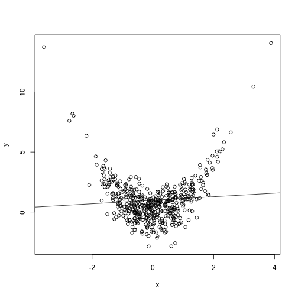

R for Marketing Research and Analytics
========================================================
Author: Chris Chapman and Elea McDonnell Feit
Date: February 2016
css: ../chapman-feit-slides.css
width: 1024
height: 768

**Chapter 7: Identifying Drivers of Outcomes: Linear Models**  

Website for all data files:  
[http://r-marketing.r-forge.r-project.org/data.html](http://r-marketing.r-forge.r-project.org/data.html)


Satisfaction survey data
========================================================

Data represents customer responses to a survey about their satisfaction with diferent aspects of their recent visit to an amusement park.
  
<small>
Image source: hersheypark.com 
</small>

To load the data:

```r
sat.df <- read.csv("http://goo.gl/HKnl74")
```

Inspecting the data
========================================================

```r
summary(sat.df)
```

```
 weekend     num.child        distance            rides       
 no :259   Min.   :0.000   Min.   :  0.5267   Min.   : 72.00  
 yes:241   1st Qu.:0.000   1st Qu.: 10.3181   1st Qu.: 82.00  
           Median :2.000   Median : 19.0191   Median : 86.00  
           Mean   :1.738   Mean   : 31.0475   Mean   : 85.85  
           3rd Qu.:3.000   3rd Qu.: 39.5821   3rd Qu.: 90.00  
           Max.   :5.000   Max.   :239.1921   Max.   :100.00  
     games             wait           clean          overall      
 Min.   : 57.00   Min.   : 40.0   Min.   : 74.0   Min.   :  6.00  
 1st Qu.: 73.00   1st Qu.: 62.0   1st Qu.: 84.0   1st Qu.: 40.00  
 Median : 78.00   Median : 70.0   Median : 88.0   Median : 50.00  
 Mean   : 78.67   Mean   : 69.9   Mean   : 87.9   Mean   : 51.26  
 3rd Qu.: 85.00   3rd Qu.: 77.0   3rd Qu.: 91.0   3rd Qu.: 62.00  
 Max.   :100.00   Max.   :100.0   Max.   :100.0   Max.   :100.00  
```
`weekend`: was the visit on a weekend  
`num.child`: how may children were in the party  
`distance`: how far did the party travel to the park  
`rides`, `games`, `wait`, `clean`, `overall`: satisfaction ratings

Fitting a linear model with lm()
========================================================
type: section

* We'll cover how to fit a linear model, i.e. a linear regression, using the `lm()` function in R. Linear models relate one or more **predictors** (independant variables) to an **outcome** (dependant variables). 

* Key steps in linear modeling:
  + Evaluate the data for suitability for modeling
  + Fit model
  + Evaluate the model
  + Interpret 
  
Plotting the data
=======================================================
A **scatterplot matrix** can help you quickly visualize the relationships between pairs of variables in the data. **Skewness** of predictors or **correlations** between predictors are potential problems. 

```r
library(gpairs)
gpairs(sat.df)
```


 

Transforming some variables
=======================================================

```r
hist(sat.df$distance)
```


***


```r
sat.df$logdist <- log(sat.df$distance)
hist(sat.df$logdist)
```


corrplot: an alternative to the scatterplot matrix
=======================================================

```r
library(corrplot)
corrplot.mixed(cor(sat.df[ , c(2, 4:9)]), upper="ellipse")
```


Fitting a model with one predictor
======================================================
To fit a model relating the ratings for rides to the overall satisfation rating we use `lm()`. `lm()` uses R's formula notation `overall ~ rides` to indicate that you want a model predicting `overall` as a function of `rides`.  

```r
lm(overall ~ rides, data=sat.df)
```

```

Call:
lm(formula = overall ~ rides, data = sat.df)

Coefficients:
(Intercept)        rides  
    -94.962        1.703  
```
So, if a visitor gives a rating of 95 for rides, then our prediction for their overall rating is:  


```r
-94.962 + 1.703*95
```

```
[1] 66.823
```

Model objects
=====================================================
Typically, we assign the output of `lm()` to a variable. 

```r
m1 <- lm(overall ~ rides, data=sat.df)
str(m1)
```

```
List of 12
 $ coefficients : Named num [1:2] -95 1.7
  ..- attr(*, "names")= chr [1:2] "(Intercept)" "rides"
 $ residuals    : Named num [1:500] -6.22 11.78 11.18 -17.93 19.89 ...
  ..- attr(*, "names")= chr [1:500] "1" "2" "3" "4" ...
 $ effects      : Named num [1:500] -1146.2 -207.9 11.5 -17.9 20.3 ...
  ..- attr(*, "names")= chr [1:500] "(Intercept)" "rides" "" "" ...
 $ rank         : int 2
 $ fitted.values: Named num [1:500] 53.2 53.2 49.8 54.9 48.1 ...
  ..- attr(*, "names")= chr [1:500] "1" "2" "3" "4" ...
 $ assign       : int [1:2] 0 1
 $ qr           :List of 5
  ..$ qr   : num [1:500, 1:2] -22.3607 0.0447 0.0447 0.0447 0.0447 ...
  .. ..- attr(*, "dimnames")=List of 2
  .. .. ..$ : chr [1:500] "1" "2" "3" "4" ...
  .. .. ..$ : chr [1:2] "(Intercept)" "rides"
  .. ..- attr(*, "assign")= int [1:2] 0 1
  ..$ qraux: num [1:2] 1.04 1.01
  ..$ pivot: int [1:2] 1 2
  ..$ tol  : num 1e-07
  ..$ rank : int 2
  ..- attr(*, "class")= chr "qr"
 $ df.residual  : int 498
 $ xlevels      : Named list()
 $ call         : language lm(formula = overall ~ rides, data = sat.df)
 $ terms        :Classes 'terms', 'formula' length 3 overall ~ rides
  .. ..- attr(*, "variables")= language list(overall, rides)
  .. ..- attr(*, "factors")= int [1:2, 1] 0 1
  .. .. ..- attr(*, "dimnames")=List of 2
  .. .. .. ..$ : chr [1:2] "overall" "rides"
  .. .. .. ..$ : chr "rides"
  .. ..- attr(*, "term.labels")= chr "rides"
  .. ..- attr(*, "order")= int 1
  .. ..- attr(*, "intercept")= int 1
  .. ..- attr(*, "response")= int 1
  .. ..- attr(*, ".Environment")=<environment: R_GlobalEnv> 
  .. ..- attr(*, "predvars")= language list(overall, rides)
  .. ..- attr(*, "dataClasses")= Named chr [1:2] "numeric" "numeric"
  .. .. ..- attr(*, "names")= chr [1:2] "overall" "rides"
 $ model        :'data.frame':	500 obs. of  2 variables:
  ..$ overall: int [1:500] 47 65 61 37 68 27 40 30 58 36 ...
  ..$ rides  : int [1:500] 87 87 85 88 84 81 77 82 90 88 ...
  ..- attr(*, "terms")=Classes 'terms', 'formula' length 3 overall ~ rides
  .. .. ..- attr(*, "variables")= language list(overall, rides)
  .. .. ..- attr(*, "factors")= int [1:2, 1] 0 1
  .. .. .. ..- attr(*, "dimnames")=List of 2
  .. .. .. .. ..$ : chr [1:2] "overall" "rides"
  .. .. .. .. ..$ : chr "rides"
  .. .. ..- attr(*, "term.labels")= chr "rides"
  .. .. ..- attr(*, "order")= int 1
  .. .. ..- attr(*, "intercept")= int 1
  .. .. ..- attr(*, "response")= int 1
  .. .. ..- attr(*, ".Environment")=<environment: R_GlobalEnv> 
  .. .. ..- attr(*, "predvars")= language list(overall, rides)
  .. .. ..- attr(*, "dataClasses")= Named chr [1:2] "numeric" "numeric"
  .. .. .. ..- attr(*, "names")= chr [1:2] "overall" "rides"
 - attr(*, "class")= chr "lm"
```

A plot of the model
=====================================================
Using the model object `m1` we can draw our linear model on a plot. The function `abline()` takes the model object `m1` as input. 

```r
plot(overall ~ rides, data=sat.df,
     xlab="Satisfaction with Rides", ylab="Overall Satisfaction")
abline(m1, col='blue')
```


Model summary
=====================================================
To get a complete report on our model we type:

```r
summary(m1)
```

```

Call:
lm(formula = overall ~ rides, data = sat.df)

Residuals:
    Min      1Q  Median      3Q     Max 
-33.597 -10.048   0.425   8.694  34.699 

Coefficients:
            Estimate Std. Error t value Pr(>|t|)    
(Intercept) -94.9622     9.0790  -10.46   <2e-16 ***
rides         1.7033     0.1055   16.14   <2e-16 ***
---
Signif. codes:  0 '***' 0.001 '**' 0.01 '*' 0.05 '.' 0.1 ' ' 1

Residual standard error: 12.88 on 498 degrees of freedom
Multiple R-squared:  0.3434,	Adjusted R-squared:  0.3421 
F-statistic: 260.4 on 1 and 498 DF,  p-value: < 2.2e-16
```

Things you should review in the summary
====================================================
* Coefficients
* Std. Error of the coefficients
* Significance tests for coefficients
* Residuals (prediction errors)
* R-squared

Model assumptions
=====================================================
type: alert
Linear models assume that the relationship between the predictor and the outcome is **linear**. If this is not the case,you may get unexpected results. 

```r
x <- rnorm(500)
y <- x^2 + rnorm(500)
toy.model <- lm(y ~ x)
summary(toy.model)
```

```

Call:
lm(formula = y ~ x)

Residuals:
    Min      1Q  Median      3Q     Max 
-3.7456 -1.0233 -0.1887  0.7653  7.5366 

Coefficients:
            Estimate Std. Error t value Pr(>|t|)    
(Intercept)  1.00933    0.07417  13.608   <2e-16 ***
x           -0.18848    0.07381  -2.554    0.011 *  
---
Signif. codes:  0 '***' 0.001 '**' 0.01 '*' 0.05 '.' 0.1 ' ' 1

Residual standard error: 1.658 on 498 degrees of freedom
Multiple R-squared:  0.01293,	Adjusted R-squared:  0.01094 
F-statistic: 6.521 on 1 and 498 DF,  p-value: 0.01096
```

Model assumptions
=====================================================
type: alert
A plot will often reveal the violation of linear model assumptions. **So, plot early and often!**

```r
plot(y ~ x)
abline(toy.model)
```



Standard plots for assessing model fit
======================================================
Returning to our satisfaction drivers example, we can use R's standard set of plots for assessing model fit and detecting violations of model assumptions. 

```r
par(mfrow=c(2,2))
plot(m1)
```


Inspecting outliers
======================================================
We should inspect any outliers to see if there is a problem with the data, such a miscoding or a data entry error.

```r
sat.df[c(57, 129, 295),]
```

```
    weekend num.child distance rides games wait clean overall  logdist
57      yes         2 63.29248    98    87   89   100     100 4.147767
129     yes         0 11.89550    76    77   51    77       6 2.476161
295      no         0 11.74474    98    83   63    92      45 2.463406
```
**Nothing unusual or surprising here!**

Fitting a model with multiple predictors
======================================================
type: section
What we really want to know is which features of the park are most closely related to overall satisfaction. To do that, we fit a model where all the features of the park are included as predictors.

Fitting a model with multiple predictors
======================================================
Fit a model relating `overall` satisfaction to satisfaction with all four features.

```r
m2 <- lm(overall ~ rides + games + wait + clean, data=sat.df)
summary(m2)
```

```

Call:
lm(formula = overall ~ rides + games + wait + clean, data = sat.df)

Residuals:
    Min      1Q  Median      3Q     Max 
-29.944  -6.841   1.072   7.167  28.618 

Coefficients:
              Estimate Std. Error t value Pr(>|t|)    
(Intercept) -131.40919    8.33377 -15.768  < 2e-16 ***
rides          0.52908    0.14207   3.724 0.000219 ***
games          0.15334    0.06908   2.220 0.026903 *  
wait           0.55333    0.04781  11.573  < 2e-16 ***
clean          0.98421    0.15987   6.156 1.54e-09 ***
---
Signif. codes:  0 '***' 0.001 '**' 0.01 '*' 0.05 '.' 0.1 ' ' 1

Residual standard error: 10.59 on 495 degrees of freedom
Multiple R-squared:  0.5586,	Adjusted R-squared:  0.5551 
F-statistic: 156.6 on 4 and 495 DF,  p-value: < 2.2e-16
```

Intepreting model coefficients
======================================================
The model coefficients tell us the association between `rides`, `games`, `wait` and `clean` and `overall` satisfaction. This can help the park come up with strategies to improve overall satisfaction.  

**Note that relationships may not be _causal_.  The model tells us that in the past, customers who were more satisfied overall were also more satisfied with cleanliness. Improving satisfaction with `clean` may not ultimately raise overall satisfaction.**  

In deciding what actions to take to improve satisfaction, the park also needs to consider how easy or hard it would be to change satisfaction with `clean` versus `rides` or `wait`. 

Presenting the findings
======================================================
A nice way to visualize the findings from the model is to plot the coefficients, which describe the relationship between each feature and overall satisfaction. 

```r
# library(coefplot)
# coefplot(m2, intercept=FALSE, outerCI=1.96, lwdOuter=1.5,
#          ylab="Rating of Feature", 
#          xlab="Association with Overall Satisfaction")
```


Comparing two models: R-squared
=======================================================
R-squared is a measure of how well the model predicts: 

```r
summary(m1)$r.squared # single predictor: rides
```

```
[1] 0.3433799
```

```r
summary(m2)$r.squared # multple predictors
```

```
[1] 0.558621
```
Adjusted R-squared makes an adjustment to account for the fact that models with more predictors will predict better. 

```r
summary(m1)$adj.r.squared
```

```
[1] 0.3420614
```

```r
summary(m2)$adj.r.squared
```

```
[1] 0.5550543
```

Comparing models: visually
======================================================
We can compare two models visually. **Plot early, plot often!**

```r
plot(sat.df$overall, fitted(m1), col='red',
     xlim=c(0,100), ylim=c(0,100),
     xlab="Actual Overall Satisfaction", ylab="Fitted Overall Satisfaction")
points(sat.df$overall, fitted(m2), col='blue')
legend("topleft", legend=c("model 1", "model 2"), 
       col=c("red", "blue"), pch=1)
```


Comparing models: formal statistical test
=======================================================
For  **nested** models (the predictors in `m2` includes all the predictors in `m1` plus some additional predictors) there is a formal test of whether the additional variables improve the fit of the model:

```r
anova(m1, m2)
```

```
Analysis of Variance Table

Model 1: overall ~ rides
Model 2: overall ~ rides + games + wait + clean
  Res.Df   RSS Df Sum of Sq      F    Pr(>F)    
1    498 82612                                  
2    495 55532  3     27080 80.463 < 2.2e-16 ***
---
Signif. codes:  0 '***' 0.001 '**' 0.01 '*' 0.05 '.' 0.1 ' ' 1
```

Making predictions
======================================================
You can make a prediction for what overall ratings a customer would give, if she gave 100 ratings for all the park features. 

```r
coef(m2)["(Intercept)"] + coef(m2)["rides"]*100 + coef(m2)["games"]*100 + 
  coef(m2)["wait"]*100 + coef(m2)["clean"]*100 
```

```
(Intercept) 
   90.58612 
```
Or more easily using R's matrix multiplication.

```r
coef(m2)%*%c(1, 100, 100, 100, 100)
```

```
         [,1]
[1,] 90.58612
```

Making predictions
=====================================================
Or using the built-in functions. 

```r
predict(m2, sat.df[1:10, ])  # first 10 observations
```

```
       1        2        3        4        5        6        7        8 
46.60864 54.26012 51.17289 50.30434 52.94625 27.87214 36.27435 43.13123 
       9       10 
66.91439 45.38024 
```

```r
fitted(m2)[1:10]            # same, automatically in model object
```

```
       1        2        3        4        5        6        7        8 
46.60864 54.26012 51.17289 50.30434 52.94625 27.87214 36.27435 43.13123 
       9       10 
66.91439 45.38024 
```

Advanced regression topics
=======================================================
type: section

Standardizing predictors
======================================================
When you want to **comapre** coefficients, it can be helpful to put the predictors on the same scale by **standarding** them.   

You can do that by hand:

```r
head(sat.df$rides - mean(sat.df$rides)) / sd(sat.df$rides)
```

```
[1]  0.2112477  0.2112477 -0.1548662  0.3943047 -0.3379232 -0.8870941
```
Or using R's built-in function, `scale()`

```r
head(scale(sat.df$rides))
```

```
           [,1]
[1,]  0.2112477
[2,]  0.2112477
[3,] -0.1548662
[4,]  0.3943047
[5,] -0.3379232
[6,] -0.8870941
```

Standardizing our data
======================================================
So that we don't have to worry about scale, we will standardize the whole data set.

```r
sat.std <- sat.df[ , -3]  # sat but remove distance
sat.std[ , 3:7] <- scale(sat.std[ , 3:7])
sat.std$logdist <- log(sat.df$distance)   # add transformed distance
head(sat.std)
```

```
  weekend num.child      rides       games         wait       clean
1     yes         0  0.2112477 -0.69750817 -0.918784090  0.21544189
2     yes         2  0.2112477 -0.08198737  0.566719693 -0.17555973
3      no         1 -0.1548662  0.16422095  0.009655775  0.01994108
4     yes         0  0.3943047 -0.82061233 -0.361720171  0.21544189
5      no         4 -0.3379232  1.02595006  0.381031720 -0.17555973
6      no         5 -0.8870941  0.04111679 -2.032911927 -1.73956621
     overall  logdist
1 -0.2681587 4.741869
2  0.8654385 3.296359
3  0.6135280 4.147901
4 -0.8979350 3.254626
5  1.0543714 4.002198
6 -1.5277112 3.121454
```

Checking the standardized data
======================================================

```r
summary(sat.std)
```

```
 weekend     num.child         rides              games         
 no :259   Min.   :0.000   Min.   :-2.53461   Min.   :-2.66717  
 yes:241   1st Qu.:0.000   1st Qu.:-0.70404   1st Qu.:-0.69751  
           Median :2.000   Median : 0.02819   Median :-0.08199  
           Mean   :1.738   Mean   : 0.00000   Mean   : 0.00000  
           3rd Qu.:3.000   3rd Qu.: 0.76042   3rd Qu.: 0.77974  
           Max.   :5.000   Max.   : 2.59099   Max.   : 2.62630  
      wait               clean             overall        
 Min.   :-2.775664   Min.   :-2.71707   Min.   :-2.85024  
 1st Qu.:-0.733096   1st Qu.:-0.76206   1st Qu.:-0.70900  
 Median : 0.009656   Median : 0.01994   Median :-0.07923  
 Mean   : 0.000000   Mean   : 0.00000   Mean   : 0.00000  
 3rd Qu.: 0.659564   3rd Qu.: 0.60644   3rd Qu.: 0.67651  
 Max.   : 2.794975   Max.   : 2.36595   Max.   : 3.06966  
    logdist       
 Min.   :-0.6411  
 1st Qu.: 2.3339  
 Median : 2.9454  
 Mean   : 2.9782  
 3rd Qu.: 3.6784  
 Max.   : 5.4773  
```

Don't do this
=======================================================
**What is odd about this model?**

```r
m3 <- lm(overall ~ rides + games + wait + clean + 
                   weekend + logdist + num.child, data = sat.std)
summary(m3)
```

```

Call:
lm(formula = overall ~ rides + games + wait + clean + weekend + 
    logdist + num.child, data = sat.std)

Residuals:
     Min       1Q   Median       3Q      Max 
-1.51427 -0.40271  0.01142  0.41613  1.69000 

Coefficients:
            Estimate Std. Error t value Pr(>|t|)    
(Intercept) -0.56814    0.09275  -6.125 1.85e-09 ***
rides        0.21288    0.04197   5.073 5.57e-07 ***
games        0.07066    0.03026   2.335   0.0199 *  
wait         0.38138    0.02777  13.734  < 2e-16 ***
clean        0.29690    0.04415   6.725 4.89e-11 ***
weekendyes  -0.04589    0.05141  -0.893   0.3725    
logdist      0.06562    0.02608   2.516   0.0122 *  
num.child    0.22717    0.01711  13.274  < 2e-16 ***
---
Signif. codes:  0 '***' 0.001 '**' 0.01 '*' 0.05 '.' 0.1 ' ' 1

Residual standard error: 0.5709 on 492 degrees of freedom
Multiple R-squared:  0.6786,	Adjusted R-squared:  0.674 
F-statistic: 148.4 on 7 and 492 DF,  p-value: < 2.2e-16
```

Including a factor predictor
========================================================

```r
sat.std$num.child.factor <- factor(sat.std$num.child)
m4 <- lm(overall ~ rides + games + wait + clean + 
                   weekend + logdist + num.child.factor, data=sat.std)
summary(m4)
```

```

Call:
lm(formula = overall ~ rides + games + wait + clean + weekend + 
    logdist + num.child.factor, data = sat.std)

Residuals:
     Min       1Q   Median       3Q      Max 
-1.25923 -0.35048 -0.00154  0.31400  1.52690 

Coefficients:
                  Estimate Std. Error t value Pr(>|t|)    
(Intercept)       -0.78728    0.07941  -9.914  < 2e-16 ***
rides              0.22313    0.03541   6.301 6.61e-10 ***
games              0.04258    0.02551   1.669   0.0958 .  
wait               0.38472    0.02338  16.453  < 2e-16 ***
clean              0.30917    0.03722   8.308 9.72e-16 ***
weekendyes        -0.02227    0.04322  -0.515   0.6065    
logdist            0.03233    0.02203   1.467   0.1429    
num.child.factor1  1.01610    0.07130  14.250  < 2e-16 ***
num.child.factor2  1.03732    0.05640  18.393  < 2e-16 ***
num.child.factor3  0.98000    0.07022  13.955  < 2e-16 ***
num.child.factor4  0.93154    0.08032  11.598  < 2e-16 ***
num.child.factor5  1.00193    0.10369   9.663  < 2e-16 ***
---
Signif. codes:  0 '***' 0.001 '**' 0.01 '*' 0.05 '.' 0.1 ' ' 1

Residual standard error: 0.4795 on 488 degrees of freedom
Multiple R-squared:  0.7751,	Adjusted R-squared:   0.77 
F-statistic: 152.9 on 11 and 488 DF,  p-value: < 2.2e-16
```

Simplifying the num.child predictor
======================================================

```r
sat.std$has.child <- factor(sat.std$num.child > 0)
m5 <- lm(overall ~ rides + games + wait + clean + logdist + has.child, 
         data=sat.std)
summary(m5)
```

```

Call:
lm(formula = overall ~ rides + games + wait + clean + logdist + 
    has.child, data = sat.std)

Residuals:
     Min       1Q   Median       3Q      Max 
-1.23491 -0.35539 -0.00838  0.32435  1.46624 

Coefficients:
              Estimate Std. Error t value Pr(>|t|)    
(Intercept)   -0.80802    0.07391 -10.932  < 2e-16 ***
rides          0.22272    0.03512   6.342 5.12e-10 ***
games          0.04424    0.02539   1.742   0.0821 .  
wait           0.38582    0.02326  16.589  < 2e-16 ***
clean          0.30876    0.03696   8.354 6.75e-16 ***
logdist        0.03562    0.02179   1.635   0.1027    
has.childTRUE  1.00565    0.04683  21.472  < 2e-16 ***
---
Signif. codes:  0 '***' 0.001 '**' 0.01 '*' 0.05 '.' 0.1 ' ' 1

Residual standard error: 0.4782 on 493 degrees of freedom
Multiple R-squared:  0.7741,	Adjusted R-squared:  0.7713 
F-statistic: 281.5 on 6 and 493 DF,  p-value: < 2.2e-16
```

Interactions between predictors
======================================================
An **interaction** between two predictors occurs when the effect of one predictor depends on the value of the other predictor. 

```r
(m7 <- lm(overall ~ rides + games + wait + clean + logdist + has.child + 
                   wait:has.child,
         data=sat.std))
```

```

Call:
lm(formula = overall ~ rides + games + wait + clean + logdist + 
    has.child + wait:has.child, data = sat.std)

Coefficients:
       (Intercept)               rides               games  
          -0.78133             0.21264             0.04870  
              wait               clean             logdist  
           0.15095             0.30244             0.02961  
     has.childTRUE  wait:has.childTRUE  
           0.99830             0.34688  
```

Reporting the coefficients
=====================================================

```r
library(coefplot)      # NB: recent library problems, using image
coefplot(m7, intercept=FALSE, outerCI=1.96, lwdOuter=1.5,
         ylab="Rating of Feature", 
         xlab="Association with Overall Satisfaction")
```


Advanced formula syntax
======================================================
Formulas are used in many R functions and there are many variations on them.


You can play around with adding or removing interactions, squared predictors and so forth, but be cautious about **overfitting**. 

Steps for model building
======================================================
* Examine the data.  Is it what you expect?
* Check for skewness in variables. Consider `log()` or other tranforms.
* Plot pairs of variables. If any are highly correlated, consider omitting some predictors. (More in Chapter 9.)
* If you wish, standardize the variables, do so with `scale()`.
* Fit the model and check the fit. 
* Use `plot()` to get standard diagnostic plots and inspect them for model fit and outliers. 
* Try several different models: add or remove predictors, add interactions, etc. Compare fit using plots, R-squared, or `anova()`.
* Report the confidence intervals of your coefficients with your interpretations and reccomendations. 
* Make predictions for new observations.

Bayesian linear models with MCMCregress()
=======================================================
type: section

Bayesian lm with MCMCregress()
======================================================
The Bayesian version of the linear model is also easy to run in R. 

```r
library(MCMCpack)
m7.b <- MCMCregress(overall ~ rides + games + wait + clean + logdist + 
                              has.child + wait:has.child, data=sat.std)
summary(m7.b)
```

```

Iterations = 1001:11000
Thinning interval = 1 
Number of chains = 1 
Sample size per chain = 10000 

1. Empirical mean and standard deviation for each variable,
   plus standard error of the mean:

                       Mean      SD  Naive SE Time-series SE
(Intercept)        -0.78162 0.07010 0.0007010      0.0007010
rides               0.21262 0.03351 0.0003351      0.0003297
games               0.04885 0.02400 0.0002400      0.0002400
wait                0.15096 0.03683 0.0003683      0.0003683
clean               0.30205 0.03515 0.0003515      0.0003515
logdist             0.02953 0.02066 0.0002066      0.0002066
has.childTRUE       0.99872 0.04414 0.0004414      0.0004478
wait:has.childTRUE  0.34732 0.04359 0.0004359      0.0004359
sigma2              0.20374 0.01306 0.0001306      0.0001306

2. Quantiles for each variable:

                        2.5%      25%      50%      75%    97.5%
(Intercept)        -0.915802 -0.82914 -0.78189 -0.73484 -0.64289
rides               0.145492  0.19004  0.21289  0.23501  0.27819
games               0.001618  0.03284  0.04883  0.06457  0.09679
wait                0.079464  0.12628  0.15060  0.17601  0.22354
clean               0.233651  0.27852  0.30216  0.32582  0.37075
logdist            -0.011536  0.01575  0.02959  0.04371  0.06920
has.childTRUE       0.911439  0.96929  0.99842  1.02837  1.08416
wait:has.childTRUE  0.261227  0.31781  0.34720  0.37714  0.43193
sigma2              0.179781  0.19454  0.20311  0.21213  0.23094
```


Exercises
=====
Access the `Salaries` data set:

```r
library(car)    # install.packages("car") if needed
data(Salaries)
```
1. Visualize salary. Should it be transformed? If so, how? And if so, do that and include as a new variable.
2. Fit a linear model for salary as a response of sex, rank, discipline, and 
years since PhD. Which effects are statistically significant?
3. Plot the coefficients for those effects.
4. Repeat the linear model (salary in response to sex, rank, discipline, and 
years since PhD) using Bayesian estimation. Summarize the results.

Answers (1)
=====
Visualize salary. Should it be transformed? If so, how? And if so, do that and include as a new variable.

```r
Salaries$logsalary <- log(Salaries$salary)
par(mfrow=c(1,2))
hist(Salaries$salary)       # <== actually do this first
hist(log(Salaries$salary))  # also try sqrt() etc
```


Answers (2)
=====
Fit a linear model for salary as a response of sex, rank, discipline, and 
years of service. Which effects are statistically significant?

```r
salary.lm <- lm(salary ~ sex + rank + discipline + yrs.service,
                data=Salaries)
summary(salary.lm)
```

```

Call:
lm(formula = salary ~ sex + rank + discipline + yrs.service, 
    data = Salaries)

Residuals:
   Min     1Q Median     3Q    Max 
-64202 -14255  -1533  10571  99163 

Coefficients:
              Estimate Std. Error t value Pr(>|t|)    
(Intercept)   68351.67    4482.20  15.250  < 2e-16 ***
sexMale        4771.25    3878.00   1.230 0.219311    
rankAssocProf 14560.40    4098.32   3.553 0.000428 ***
rankProf      49159.64    3834.49  12.820  < 2e-16 ***
disciplineB   13473.38    2315.50   5.819 1.24e-08 ***
yrs.service     -88.78     111.64  -0.795 0.426958    
---
Signif. codes:  0 '***' 0.001 '**' 0.01 '*' 0.05 '.' 0.1 ' ' 1

Residual standard error: 22650 on 391 degrees of freedom
Multiple R-squared:  0.4478,	Adjusted R-squared:  0.4407 
F-statistic: 63.41 on 5 and 391 DF,  p-value: < 2.2e-16
```


Answers (3)
=====
Plot the coefficients for those (linear model) effects. *[Note: this plot shows
$\pm$ 1 standard error, not 95% confidence interval.]*

```r
library(coefplot)     # install if needed
coefplot(salary.lm)
```


Answers (4)
=====
Repeat the linear model (salary in response to sex, rank, discipline, and 
years since PhD) using Bayesian estimation. Summarize the results.


```r
library(MCMCpack)
set.seed(98108)
salary.lm.b <- MCMCregress(
                  salary ~ sex + rank + discipline + yrs.service,
                  data=Salaries)
```

```r
options("scipen"=100, "digits"=4)    # force non-scientific notation
summary(salary.lm.b)$quantiles
```

```
                     2.5%         25%          50%          75%
(Intercept)       59547.9     65230.0     68373.96     71426.16
sexMale           -2796.3      2103.3      4747.86      7405.16
rankAssocProf      6451.9     11861.5     14570.61     17311.99
rankProf          41611.2     46577.3     49200.72     51737.03
disciplineB        8910.1     11895.7     13460.51     15007.37
yrs.service        -307.6      -163.5       -89.82       -12.29
sigma2        448001458.5 489995080.7 513985664.78 539697427.20
                    97.5%
(Intercept)       77157.3
sexMale           12498.5
rankAssocProf     22629.5
rankProf          56678.2
disciplineB       17920.9
yrs.service         133.7
sigma2        593796060.9
```


That's all for Chapter 7!
=========
type: section

# Break time


Notes
========
<small>
This presentation is based on Chapter 7 of Chapman and Feit, *R for Marketing Research and Analytics* &copy; 2015 Springer.    

Exercises here use the `Salaries` data set from the `car` package, John Fox and Sanford Weisberg (2011). *An R Companion to Applied Regression*, Second Edition. Thousand Oaks CA: Sage. http://socserv.socsci.mcmaster.ca/jfox/Books/Companion

All code in the presentation is licensed under the Apache License, Version 2.0 (the "License"); you may not use this file except in compliance with the License.  You may obtain a copy of the License at http://www.apache.org/licenses/LICENSE-2.0\ Unless required by applicable law or agreed to in writing, software distributed under the License is distributed on an "AS IS" BASIS, WITHOUT WARRANTIES OR CONDITIONS OF ANY KIND, either express or implied. See the License for the specific language governing permissions and limitations under the License.  
</small>


