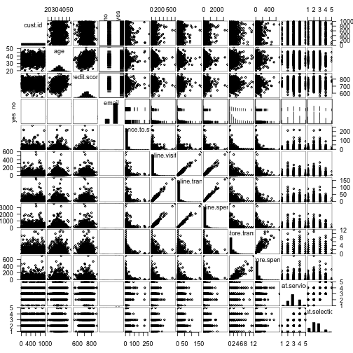

R for Marketing Research and Analytics
========================================================
Author: Chris Chapman and Elea McDonnell Feit
Date: February 2016
css: ../chapman-feit-slides.css
width: 1024
height: 768

**Chapter 9: Advanced Linear Modeling Topics**  

Website for all data files:  
[http://r-marketing.r-forge.r-project.org/data.html](http://r-marketing.r-forge.r-project.org/data.html)


Topics
=====
We cover several separate topics that extending discussion of linear models.

- Collinearity: detecting and fixing
- Logistic regression
- Hierarchical linear models (mixed effects models)
- Bayesian estimation of hierarchical linear models


Collinearity
=====
type: section


First load the data
=====
We will use the retail transaction + CRM-like data from Chapter 4:


```r
cust.df <- read.csv("http://goo.gl/PmPkaG")
summary(cust.df)
```

```
    cust.id            age         credit.score   email    
 Min.   :   1.0   Min.   :19.34   Min.   :543.0   no :186  
 1st Qu.: 250.8   1st Qu.:31.43   1st Qu.:691.7   yes:814  
 Median : 500.5   Median :35.10   Median :725.5            
 Mean   : 500.5   Mean   :34.92   Mean   :725.5            
 3rd Qu.: 750.2   3rd Qu.:38.20   3rd Qu.:757.2            
 Max.   :1000.0   Max.   :51.86   Max.   :880.8            
                                                           
 distance.to.store  online.visits     online.trans      online.spend    
 Min.   :  0.2136   Min.   :  0.00   Min.   :  0.000   Min.   :   0.00  
 1st Qu.:  3.3383   1st Qu.:  0.00   1st Qu.:  0.000   1st Qu.:   0.00  
 Median :  7.1317   Median :  6.00   Median :  2.000   Median :  37.03  
 Mean   : 14.6553   Mean   : 28.29   Mean   :  8.385   Mean   : 170.32  
 3rd Qu.: 16.6589   3rd Qu.: 31.00   3rd Qu.:  9.000   3rd Qu.: 177.89  
 Max.   :267.0864   Max.   :606.00   Max.   :169.000   Max.   :3593.03  
                                                                        
  store.trans      store.spend      sat.service   sat.selection  
 Min.   : 0.000   Min.   :  0.00   Min.   :1.00   Min.   :1.000  
 1st Qu.: 0.000   1st Qu.:  0.00   1st Qu.:3.00   1st Qu.:2.000  
 Median : 1.000   Median : 30.05   Median :3.00   Median :2.000  
 Mean   : 1.323   Mean   : 47.58   Mean   :3.07   Mean   :2.401  
 3rd Qu.: 2.000   3rd Qu.: 66.49   3rd Qu.:4.00   3rd Qu.:3.000  
 Max.   :12.000   Max.   :705.66   Max.   :5.00   Max.   :5.000  
                                   NA's   :341    NA's   :341    
```


Initial linear model
=====
Suppose we want to estimate online spend on the basis of other variables. 
A first attempt might be:


```r
spend.m1 <- lm(online.spend ~ ., 
               data=subset(cust.df[ , -1], online.spend > 0))
summary(spend.m1)
```

```

Call:
lm(formula = online.spend ~ ., data = subset(cust.df[, -1], online.spend > 
    0))

Residuals:
     Min       1Q   Median       3Q      Max 
-234.097   -8.828    0.519    9.956  227.238 

Coefficients:
                   Estimate Std. Error t value Pr(>|t|)    
(Intercept)        6.718948  33.537665   0.200   0.8413    
age                0.422773   0.450825   0.938   0.3489    
credit.score      -0.033698   0.043977  -0.766   0.4440    
emailyes          -5.689283   5.806621  -0.980   0.3278    
distance.to.store -0.043548   0.100539  -0.433   0.6651    
online.visits     -0.072269   0.204061  -0.354   0.7234    
online.trans      20.610744   0.667450  30.880   <2e-16 ***
store.trans        0.135018   3.211943   0.042   0.9665    
store.spend        0.001796   0.078732   0.023   0.9818    
sat.service        5.638769   3.016181   1.870   0.0623 .  
sat.selection     -4.370606   2.909073  -1.502   0.1338    
---
Signif. codes:  0 '***' 0.001 '**' 0.01 '*' 0.05 '.' 0.1 ' ' 1

Residual standard error: 42.77 on 407 degrees of freedom
  (214 observations deleted due to missingness)
Multiple R-squared:  0.9831,	Adjusted R-squared:  0.9827 
F-statistic:  2363 on 10 and 407 DF,  p-value: < 2.2e-16
```


Puzzle
=====
Online spend is highly related to online transactions ... but not to online _visits_?


```r
                   Estimate Std. Error t value Pr(>|t|)    
(Intercept)        6.718948  33.537665   0.200   0.8413    
online.visits     -0.072269   0.204061  -0.354   0.7234    
online.trans      20.610744   0.667450  30.880   <2e-16 ***
store.trans        0.135018   3.211943   0.042   0.9665    
store.spend        0.001796   0.078732   0.023   0.9818    
sat.service        5.638769   3.016181   1.870   0.0623 .  
```
That doesn't make sense. If they visit more, they should spend more.  

What's going on?


Something we omitted
=====
Before modeling, look at the data! Scatter plots show problems here. Many 
items are skewed and also highly correlated.


```r
library(gpairs)
gpairs(cust.df)
```




Fixing skew
=====
We could fix skew --- e.g., in transactions and visits -- one variable at a 
time. Or, we can automate it.


```
Error in library(forecast) : there is no package called 'forecast'
```
