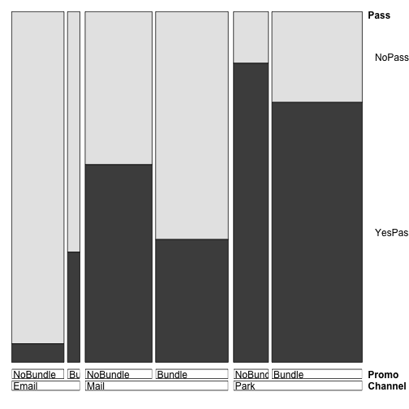

R for Marketing Research and Analytics
========================================================
Author: Chris Chapman and Elea McDonnell Feit
Date: February 2016
css: ../chapman-feit-slides.css
width: 1024
height: 768

**Chapter 9: Advanced Linear Modeling Topics**  

Website for all data files:  
[http://r-marketing.r-forge.r-project.org/data.html](http://r-marketing.r-forge.r-project.org/data.html)


Topics
=====
We cover several separate topics that extending discussion of linear models.

- Collinearity: detecting and fixing
- Logistic regression
- Hierarchical linear models (mixed effects models)
- Bayesian estimation of hierarchical linear models


Collinearity
=====
type: section


First load the data
=====
We will use the retail transaction + CRM-like data from Chapter 4:


```r
cust.df <- read.csv("http://goo.gl/PmPkaG")
summary(cust.df)
```

```
    cust.id            age         credit.score   email    
 Min.   :   1.0   Min.   :19.34   Min.   :543.0   no :186  
 1st Qu.: 250.8   1st Qu.:31.43   1st Qu.:691.7   yes:814  
 Median : 500.5   Median :35.10   Median :725.5            
 Mean   : 500.5   Mean   :34.92   Mean   :725.5            
 3rd Qu.: 750.2   3rd Qu.:38.20   3rd Qu.:757.2            
 Max.   :1000.0   Max.   :51.86   Max.   :880.8            
                                                           
 distance.to.store  online.visits     online.trans      online.spend    
 Min.   :  0.2136   Min.   :  0.00   Min.   :  0.000   Min.   :   0.00  
 1st Qu.:  3.3383   1st Qu.:  0.00   1st Qu.:  0.000   1st Qu.:   0.00  
 Median :  7.1317   Median :  6.00   Median :  2.000   Median :  37.03  
 Mean   : 14.6553   Mean   : 28.29   Mean   :  8.385   Mean   : 170.32  
 3rd Qu.: 16.6589   3rd Qu.: 31.00   3rd Qu.:  9.000   3rd Qu.: 177.89  
 Max.   :267.0864   Max.   :606.00   Max.   :169.000   Max.   :3593.03  
                                                                        
  store.trans      store.spend      sat.service   sat.selection  
 Min.   : 0.000   Min.   :  0.00   Min.   :1.00   Min.   :1.000  
 1st Qu.: 0.000   1st Qu.:  0.00   1st Qu.:3.00   1st Qu.:2.000  
 Median : 1.000   Median : 30.05   Median :3.00   Median :2.000  
 Mean   : 1.323   Mean   : 47.58   Mean   :3.07   Mean   :2.401  
 3rd Qu.: 2.000   3rd Qu.: 66.49   3rd Qu.:4.00   3rd Qu.:3.000  
 Max.   :12.000   Max.   :705.66   Max.   :5.00   Max.   :5.000  
                                   NA's   :341    NA's   :341    
```


Initial linear model
=====
Suppose we want to estimate online spend on the basis of other variables. 
A first attempt might be:


```r
spend.m1 <- lm(online.spend ~ ., 
               data=subset(cust.df[ , -1], online.spend > 0))
summary(spend.m1)
```

```

Call:
lm(formula = online.spend ~ ., data = subset(cust.df[, -1], online.spend > 
    0))

Residuals:
     Min       1Q   Median       3Q      Max 
-234.097   -8.828    0.519    9.956  227.238 

Coefficients:
                   Estimate Std. Error t value Pr(>|t|)    
(Intercept)        6.718948  33.537665   0.200   0.8413    
age                0.422773   0.450825   0.938   0.3489    
credit.score      -0.033698   0.043977  -0.766   0.4440    
emailyes          -5.689283   5.806621  -0.980   0.3278    
distance.to.store -0.043548   0.100539  -0.433   0.6651    
online.visits     -0.072269   0.204061  -0.354   0.7234    
online.trans      20.610744   0.667450  30.880   <2e-16 ***
store.trans        0.135018   3.211943   0.042   0.9665    
store.spend        0.001796   0.078732   0.023   0.9818    
sat.service        5.638769   3.016181   1.870   0.0623 .  
sat.selection     -4.370606   2.909073  -1.502   0.1338    
---
Signif. codes:  0 '***' 0.001 '**' 0.01 '*' 0.05 '.' 0.1 ' ' 1

Residual standard error: 42.77 on 407 degrees of freedom
  (214 observations deleted due to missingness)
Multiple R-squared:  0.9831,	Adjusted R-squared:  0.9827 
F-statistic:  2363 on 10 and 407 DF,  p-value: < 2.2e-16
```


Puzzle
=====
Online spend is highly related to online transactions ... but not to online _visits_?


```r
                   Estimate Std. Error t value Pr(>|t|)    
(Intercept)        6.718948  33.537665   0.200   0.8413    
online.visits     -0.072269   0.204061  -0.354   0.7234    
online.trans      20.610744   0.667450  30.880   <2e-16 ***
store.trans        0.135018   3.211943   0.042   0.9665    
store.spend        0.001796   0.078732   0.023   0.9818    
sat.service        5.638769   3.016181   1.870   0.0623 .  
```
That doesn't make sense. If they visit more, they should spend more.  

What's going on?


Something we omitted
=====
Before modeling, look at the data! Scatter plots show problems here. Many 
items are skewed and also highly correlated.


```r
library(gpairs)
gpairs(cust.df)
```


Fixing skew
=====
We could fix skew --- e.g., in transactions and visits -- one variable at a 
time. Or, we can automate it.


```r
autoTransform <- function(x) { 
  library(forecast)
  return(scale(BoxCox(x, BoxCox.lambda(x))))
}

cust.df.bc <- cust.df[complete.cases(cust.df), -1]  # copy of data
cust.df.bc <- subset(cust.df.bc, online.spend > 0)  # data with spend
numcols <- which(colnames(cust.df.bc) != "email")   # numeric columns
cust.df.bc[, numcols] <- lapply(cust.df.bc[, numcols], autoTransform)
```

We use the Box-Cox transformation to transform data to approximate normality,
using `BoxCox` from the `forecast` package. 

Data is also rescaled with `scale` to be on Z-score (standardized) scale.


Plot again
=====

```r
gpairs(cust.df.bc)
```


Does that solve it?
=====
It's a good thing to do, but not enough.

```r
spend.m2 <- lm(online.spend ~ ., data=cust.df.bc)
summary(spend.m2)
```

```

Call:
lm(formula = online.spend ~ ., data = cust.df.bc)

Residuals:
     Min       1Q   Median       3Q      Max 
-0.38976 -0.05409  0.00027  0.05591  0.26628 

Coefficients:
                    Estimate Std. Error t value Pr(>|t|)    
(Intercept)       -0.0059639  0.0108943  -0.547    0.584    
age                0.0001875  0.0044821   0.042    0.967    
credit.score      -0.0026632  0.0045185  -0.589    0.556    
emailyes           0.0071023  0.0119316   0.595    0.552    
distance.to.store -0.0020362  0.0048800  -0.417    0.677    
online.visits     -0.0003913  0.0126165  -0.031    0.975    
online.trans       0.9960378  0.0126687  78.622   <2e-16 ***
store.trans       -0.0266674  0.0480675  -0.555    0.579    
store.spend        0.0274099  0.0475888   0.576    0.565    
sat.service        0.0059429  0.0052732   1.127    0.260    
sat.selection      0.0030628  0.0052624   0.582    0.561    
---
Signif. codes:  0 '***' 0.001 '**' 0.01 '*' 0.05 '.' 0.1 ' ' 1

Residual standard error: 0.08747 on 407 degrees of freedom
Multiple R-squared:  0.9925,	Adjusted R-squared:  0.9923 
F-statistic:  5410 on 10 and 407 DF,  p-value: < 2.2e-16
```


Check variables in the model
=====
For any linear model with correlated variables check the _variable inflation factor_. 

VIF measures how much a variable's standard error is inflated due to its variance being shared with other variables.


```r
library(car)
vif(spend.m2)
```

```
              age      credit.score             email distance.to.store 
         1.094949          1.112784          1.046874          1.297978 
    online.visits      online.trans       store.trans       store.spend 
         8.675817          8.747756        125.931383        123.435407 
      sat.service     sat.selection 
         1.515576          1.509377 
```

Rule of thumb: VIF > 5 indicates a problem. In this case, the `..visits` and 
`..trans` variables are problematic.


Solution 1: Omit covariates
=====
Fit the model again, omitting one each of the `visits` and `trans` variables.


```r
spend.m4 <- lm(online.spend ~ . -online.trans -store.trans, 
               data=cust.df.bc)
vif(spend.m4)
```

```
              age      credit.score             email distance.to.store 
         1.081411          1.103586          1.033945          1.211607 
    online.visits       store.spend       sat.service     sat.selection 
         1.026148          1.215208          1.507866          1.509001 
```

Solution 1: Omit variables (result)
=====
Now visits are related to spend (!)


```r
summary(spend.m4)
```

```

Call:
lm(formula = online.spend ~ . - online.trans - store.trans, data = cust.df.bc)

Residuals:
     Min       1Q   Median       3Q      Max 
-1.36373 -0.13135  0.05888  0.18476  1.03794 

Coefficients:
                    Estimate Std. Error t value Pr(>|t|)    
(Intercept)       -0.0923395  0.0435047  -2.123   0.0344 *  
age               -0.0333779  0.0178813  -1.867   0.0627 .  
credit.score      -0.0084524  0.0180637  -0.468   0.6401    
emailyes           0.1099655  0.0476011   2.310   0.0214 *  
distance.to.store  0.0001702  0.0189271   0.009   0.9928    
online.visits      0.9295374  0.0174184  53.365   <2e-16 ***
store.spend        0.0092463  0.0189552   0.488   0.6260    
sat.service       -0.0121405  0.0211147  -0.575   0.5656    
sat.selection      0.0048591  0.0211226   0.230   0.8182    
---
Signif. codes:  0 '***' 0.001 '**' 0.01 '*' 0.05 '.' 0.1 ' ' 1

Residual standard error: 0.3511 on 409 degrees of freedom
Multiple R-squared:  0.8791,	Adjusted R-squared:  0.8767 
F-statistic: 371.6 on 8 and 409 DF,  p-value: < 2.2e-16
```


Solution 2: Reduce Dimensions
=====
Because `visits` and `trans` are very closely related, we could regard them as
a single dimension ("activity") that happens to be measured twice.

We can reduce that to a single dimension using PCA.


```r
pc.online <- prcomp(cust.df.bc[ , c("online.visits", "online.trans")])
cust.df.bc$online <- pc.online$x[ , 1]

pc.store <- prcomp(cust.df.bc[ , c("store.trans", "store.spend")])
cust.df.bc$store <- pc.store$x[ , 1]
```


Solution 2: Model
=====
Now we use the principal component as the predictor.

```r
spend.m5 <- lm(online.spend ~ email + age + credit.score + 
                 distance.to.store + sat.service + sat.selection + 
                 online + store, 
               data=cust.df.bc)

vif(spend.m5)
```

```
            email               age      credit.score distance.to.store 
         1.039458          1.081430          1.103206          1.224019 
      sat.service     sat.selection            online             store 
         1.508487          1.509001          1.032362          1.228073 
```

Solution 2: Result
=====

```r
summary(spend.m5)
```

```

Call:
lm(formula = online.spend ~ email + age + credit.score + distance.to.store + 
    sat.service + sat.selection + online + store, data = cust.df.bc)

Residuals:
     Min       1Q   Median       3Q      Max 
-0.83697 -0.08532  0.01288  0.09664  0.73327 

Coefficients:
                    Estimate Std. Error  t value Pr(>|t|)    
(Intercept)       -3.928e-02  2.410e-02   -1.630   0.1039    
emailyes           4.678e-02  2.638e-02    1.773   0.0769 .  
age               -1.695e-02  9.882e-03   -1.715   0.0871 .  
credit.score      -3.649e-03  9.981e-03   -0.366   0.7148    
distance.to.store -2.666e-05  1.051e-02   -0.003   0.9980    
sat.service       -2.762e-03  1.167e-02   -0.237   0.8130    
sat.selection      3.153e-03  1.167e-02    0.270   0.7872    
online            -7.019e-01  6.933e-03 -101.247   <2e-16 ***
store             -2.712e-03  7.455e-03   -0.364   0.7162    
---
Signif. codes:  0 '***' 0.001 '**' 0.01 '*' 0.05 '.' 0.1 ' ' 1

Residual standard error: 0.1941 on 409 degrees of freedom
Multiple R-squared:  0.9631,	Adjusted R-squared:  0.9623 
F-statistic:  1333 on 8 and 409 DF,  p-value: < 2.2e-16
```


Logistic Regression
=====
type: section


Logistic Regression: Intro
=====

Logistic regression predicts a binary outcome from any mix of predictors. See 
book Section 9.2.1 for more background and intuition.

First, we'll set up some data. This reflects whether a _season pass_ was sold
for a ski area, as a function of _sales channel_ and _bundle promotion_.


```r
pass.df <- read.csv("http://goo.gl/J8MH6A")
pass.df$Promo <- factor(pass.df$Promo, levels=c("NoBundle", "Bundle"))
summary(pass.df)
```

```
  Channel          Promo           Pass     
 Email: 633   NoBundle:1482   NoPass :1567  
 Mail :1328   Bundle  :1674   YesPass:1589  
 Park :1195                                 
```
Note: we set the `bundle` factor levels explicitly (why?)


Logistic regression with glm(): model 1
=====
Is `Promotion` related to `Pass` purchase? (Warning: naive model!)

```r
pass.m1 <- glm(Pass ~ Promo, data=pass.df, family=binomial)
summary(pass.m1)
```

```

Call:
glm(formula = Pass ~ Promo, family = binomial, data = pass.df)

Deviance Residuals: 
   Min      1Q  Median      3Q     Max  
-1.262  -1.097   1.095   1.095   1.260  

Coefficients:
            Estimate Std. Error z value Pr(>|z|)    
(Intercept) -0.19222    0.05219  -3.683 0.000231 ***
PromoBundle  0.38879    0.07167   5.425 5.81e-08 ***
---
Signif. codes:  0 '***' 0.001 '**' 0.01 '*' 0.05 '.' 0.1 ' ' 1

(Dispersion parameter for binomial family taken to be 1)

    Null deviance: 4375.0  on 3155  degrees of freedom
Residual deviance: 4345.4  on 3154  degrees of freedom
AIC: 4349.4

Number of Fisher Scoring iterations: 3
```


Effect of promotion: take 1
=====

```r
coef(pass.m1)
```

```
(Intercept) PromoBundle 
 -0.1922226   0.3887910 
```

```r
exp(coef(pass.m1))                    # odds ratio
```

```
(Intercept) PromoBundle 
  0.8251232   1.4751962 
```

```r
plogis(0.3888) / (1-plogis(0.3888))   # another way to look at it ...
```

```
[1] 1.475209
```

```r
exp(confint(pass.m1))                 # conf interval
```

```
               2.5 %    97.5 %
(Intercept) 0.744749 0.9138654
PromoBundle 1.282055 1.6979776
```


Remember: Visualize first!
=====
We see that `bundle` has lower proportional sales of `pass` after it is broken
out by `channel`. This is a case of _Simpson's paradox_.

```r
library(vcd)    # install if needed
doubledecker(table(pass.df))
```




New Model with Channel and interaction
=====
The more complete model suggests that `bundle` has an effect only in _email_. 
We would want to avoid bundling in other channels (park, direct mail). 

```r
pass.m3 <- glm(Pass ~ Promo + Channel + Promo:Channel, 
               data=pass.df, family=binomial)
exp(confint(pass.m3))   # CI for odds ratios
```

```
                              2.5 %       97.5 %
(Intercept)              0.03688720   0.08032263
PromoBundle              4.78970184  14.31465957
ChannelMail             15.54800270  35.97860059
ChannelPark             64.74364028 173.57861021
PromoBundle:ChannelMail  0.02795867   0.09102369
PromoBundle:ChannelPark  0.03135437   0.11360965
```
If the data were real, follow-up research would be good to understand why 
this is occurring.


Bonus: Visualize Effects
=====
We can compare the effect of the different interventions (channel, bundle).

First, get the coefs and CIs:

```r
pass.ci <- data.frame(confint(pass.m3))     # confidence intervals
pass.ci$X50 <- coef(pass.m3)                # midpoint estimate
pass.ci$Factor <- rownames(pass.ci)         # for ggplot2 labels
pass.ci
```

```
                           X2.5..   X97.5..       X50
(Intercept)             -3.299891 -2.521704 -2.888312
PromoBundle              1.566468  2.661284  2.107058
ChannelMail              2.743932  3.582924  3.144013
ChannelPark              4.170435  5.156631  4.645466
PromoBundle:ChannelMail -3.577028 -2.396636 -2.980844
PromoBundle:ChannelPark -3.462402 -2.174987 -2.811479
                                         Factor
(Intercept)                         (Intercept)
PromoBundle                         PromoBundle
ChannelMail                         ChannelMail
ChannelPark                         ChannelPark
PromoBundle:ChannelMail PromoBundle:ChannelMail
PromoBundle:ChannelPark PromoBundle:ChannelPark
```

Build a ggplot, 1
=====
First we add data for the midpoint, upper, and lower CIs:

```r
library(ggplot2)
p <- ggplot(pass.ci[-1, ], 
            aes(x=Factor, y=exp(X50), 
                ymax=exp(X97.5..), ymin=exp(X2.5..)))
```
We take the `exp()` of each one to get the odds ratio.

Next add midpoints and error bars:

```r
p <- p + geom_point(size=4) + geom_errorbar(width=0.25)
```
And add a line where odds ratio==1.0 (no effect):

```r
p <- p + geom_hline(yintercept=1, linetype="dotted", 
                    size=1.5, color="red")
```


Build a ggplot, 2
=====
Now plot that with titles (and rotate it for simplicity):

```r
p + ylab("Likehood by Factor (odds ratio, main effect)") +
  ggtitle(paste("95% CI: Pass sign up odds by factor")) + 
  coord_flip()
```


Hierarchical Linear Models
=====
type: section


Ratings-based Conjoint Analysis data
=====
The data represent _preference_ on a 10 point scale for roller coasters, 
based on the features of the coasters.


```r
conjoint.df <- read.csv("http://goo.gl/G8knGV")
conjoint.df$speed  <- factor(conjoint.df$speed)   # why?
conjoint.df$height <- factor(conjoint.df$height)  # why?
summary(conjoint.df)
```

```
    resp.id           rating       speed     height       const     
 Min.   :  1.00   Min.   : 1.000   40: 800   200:1400   Steel:1400  
 1st Qu.: 50.75   1st Qu.: 3.000   50:1200   300:1200   Wood :1800  
 Median :100.50   Median : 5.000   60: 800   400: 600               
 Mean   :100.50   Mean   : 5.268   70: 400                          
 3rd Qu.:150.25   3rd Qu.: 7.000                                    
 Max.   :200.00   Max.   :10.000                                    
    theme     
 Dragon:1600  
 Eagle :1600  
              
              
              
              
```

Aggregate model
=====
A simple model is just overall `rating ~ features`:

```r
ride.lm <- lm(rating ~ speed + height + const + theme, data=conjoint.df)
summary(ride.lm)
```

```

Call:
lm(formula = rating ~ speed + height + const + theme, data = conjoint.df)

Residuals:
    Min      1Q  Median      3Q     Max 
-5.8394 -1.3412 -0.0186  1.2798  6.9269 

Coefficients:
            Estimate Std. Error t value Pr(>|t|)    
(Intercept)  3.07307    0.08102  37.932  < 2e-16 ***
speed50      0.82077    0.10922   7.515 7.35e-14 ***
speed60      1.57443    0.12774  12.326  < 2e-16 ***
speed70      4.48697    0.15087  29.740  < 2e-16 ***
height300    2.94551    0.09077  32.452  < 2e-16 ***
height400    1.44738    0.12759  11.344  < 2e-16 ***
constWood   -0.11826    0.11191  -1.057    0.291    
themeEagle  -0.75454    0.11186  -6.745 1.81e-11 ***
---
Signif. codes:  0 '***' 0.001 '**' 0.01 '*' 0.05 '.' 0.1 ' ' 1

Residual standard error: 1.967 on 3192 degrees of freedom
Multiple R-squared:  0.5039,	Adjusted R-squared:  0.5029 
F-statistic: 463.2 on 7 and 3192 DF,  p-value: < 2.2e-16
```

Hierarchical model
=====
However, individuals probably vary in their preference. As marketers we can 
use that information for both strategy --- maximizing appeal across our 
lineup --- and for targeting.

A hierarchical model has these elements:
- Overall coefficients for the sample
- Individual deviations from those estimates
- Variance measures (e.g., variance of the deviations)

We could allow individuals to vary by:
- Overall preference, or intercept (scale anchor point per respondent)
- Preference per feature (feature preference estimates per respondent)


HLM model 1: intercept
=====
We tell R to estimate intercepts per respondent using `1 | resp.id`. This 
requires an HLM package such as `lme4`.

`1` is formula syntax for _intercept_, and we add `| resp.id` to estimate that
for each unique set of observations grouped by `resp.id`:

```r
library(lme4)
ride.hlm1 <- lmer(rating ~ speed + height + const + theme + 
                    (1 | resp.id), data=conjoint.df)
```

HLM model 1: result (overall)
=====
Overall CIs for the fixed (full sample) estimates:

```r
confint(ride.hlm1)
```

```
                 2.5 %      97.5 %
.sig01       0.4863012  0.67647225
.sigma       1.8316382  1.92672254
(Intercept)  2.9015492  3.24459566
speed50      0.6163380  1.02520548
speed60      1.3353275  1.81352404
speed70      4.2045696  4.76937338
height300    2.7756113  3.11540557
height400    1.2085632  1.68620634
constWood   -0.3277217  0.09121113
themeEagle  -0.9639303 -0.54515530
```


HLM model 1: result (individual)
=====
We get individual deviations from the sample coefficients using `ranef()`. 
Total coefficients per individual are obtained with `coef()`:

```r
head(ranef(ride.hlm1)$resp.id, 4)
```

```
  (Intercept)
1 -0.65085636
2 -0.04821158
3 -0.31186867
4 -0.12354218
```

```r
head(coef(ride.hlm1)$resp.id, 4)
```

```
  (Intercept)   speed50  speed60  speed70 height300 height400  constWood
1    2.422216 0.8207718 1.574426 4.486971  2.945508  1.447385 -0.1182553
2    3.024861 0.8207718 1.574426 4.486971  2.945508  1.447385 -0.1182553
3    2.761204 0.8207718 1.574426 4.486971  2.945508  1.447385 -0.1182553
4    2.949530 0.8207718 1.574426 4.486971  2.945508  1.447385 -0.1182553
  themeEagle
1 -0.7545428
2 -0.7545428
3 -0.7545428
4 -0.7545428
```


HLM model 2: slope + intercept
=====
It's unlikely that respondents differ only on the intercept. We can add 
`(PREDICTORS | resp.id)` to estimate individual-level feature preference.

**Warning**: this may take several minutes to run!

```r
ride.hlm2 <- lmer(rating ~ speed + height + const + theme + 
                   (speed + height + const + theme | resp.id),      # new
                 data=conjoint.df,
                 control=lmerControl(optCtrl=list(maxfun=100000)))  # why?
```


HLM model 2: Results
=====


```r
head(ranef(ride.hlm2)$resp.id)
```

```
  (Intercept)     speed50     speed60     speed70   height300
1  -1.1199673 -0.20603467 -0.12507535  0.10294883  0.10742700
2  -1.0104334  0.24975368 -0.08225264  0.16262789  0.05610339
3  -1.0352111 -0.21870984  0.31082035 -0.29288693  0.34166296
4   0.8961731 -0.19646726 -0.17362960  0.31974759 -0.27530413
5  -0.8543869 -0.01887979 -0.21511840  0.07997117  0.07394921
6  -0.2803526  0.03468464  0.40698578 -0.29418550  0.09092822
      height400  constWood themeEagle
1 -5.837971e-05  0.2243063  0.5339086
2  1.073253e+00  1.5360571 -0.3070220
3 -1.136071e-01  0.6040605  0.4485569
4 -6.283431e-01 -0.7504924 -0.6407263
5  9.757589e-02  1.6138758 -0.7059130
6  1.669468e-01 -0.5971936  1.3923949
```

```r
head(coef(ride.hlm2)$resp.id)
```

```
  (Intercept)   speed50  speed60  speed70 height300 height400  constWood
1    1.953105 0.6147371 1.449350 4.589920  3.052935 1.4473264  0.1060510
2    2.062639 1.0705254 1.492173 4.649599  3.001612 2.5206374  1.4178018
3    2.037861 0.6020619 1.885246 4.194085  3.287171 1.3337777  0.4858052
4    3.969246 0.6243045 1.400796 4.806719  2.670204 0.8190417 -0.8687477
5    2.218686 0.8018920 1.359307 4.566943  3.019458 1.5449607  1.4956205
6    2.792720 0.8554564 1.981412 4.192786  3.036437 1.6143316 -0.7154489
  themeEagle
1 -0.2206342
2 -1.0615648
3 -0.3059859
4 -1.3952691
5 -1.4604558
6  0.6378521
```


HLM model 2: Breaking it out
=====
We can index the effects by respondent to get results for any individual.

The total per-respondent estimates (`coef()`) are just the fixed effects 
(sample, or `fixef()`) + random (individual, or `ranef()`) deviation.

We can see this for an arbitrary respondent (id #196):

```r
fixef(ride.hlm2) + ranef(ride.hlm2)$resp.id[196, ]
```

```
    (Intercept)   speed50  speed60  speed70 height300 height400 constWood
196    2.143063 0.7534565 1.271094 4.594383   2.94959  1.212746  2.580269
    themeEagle
196  -2.192645
```

```r
coef(ride.hlm2)$resp.id[196, ]
```

```
    (Intercept)   speed50  speed60  speed70 height300 height400 constWood
196    2.143063 0.7534565 1.271094 4.594383   2.94959  1.212746  2.580269
    themeEagle
196  -2.192645
```


Extra: HLM the Bayesian way
=====
We'll fit the individual using R's powerful MCMC sampler. First, the 
non-hierarchical model (basic lm):

```r
library(MCMCpack)    # install if needed
set.seed(97439)
ride.mc1 <- MCMCregress(rating ~ speed + height + const + theme, 
                        data=conjoint.df)
summary(ride.mc1)
```

```

Iterations = 1001:11000
Thinning interval = 1 
Number of chains = 1 
Sample size per chain = 10000 

1. Empirical mean and standard deviation for each variable,
   plus standard error of the mean:

               Mean      SD  Naive SE Time-series SE
(Intercept)  3.0729 0.08112 0.0008112      0.0008112
speed50      0.8208 0.11061 0.0011061      0.0011126
speed60      1.5754 0.12889 0.0012889      0.0012889
speed70      4.4873 0.15002 0.0015002      0.0015002
height300    2.9444 0.09122 0.0009122      0.0009337
height400    1.4461 0.12934 0.0012934      0.0013367
constWood   -0.1187 0.11310 0.0011310      0.0011310
themeEagle  -0.7533 0.11308 0.0011308      0.0011308
sigma2       3.8705 0.09737 0.0009737      0.0009737

2. Quantiles for each variable:

               2.5%     25%     50%      75%   97.5%
(Intercept)  2.9175  3.0175  3.0722  3.12754  3.2349
speed50      0.6027  0.7470  0.8225  0.89443  1.0331
speed60      1.3230  1.4872  1.5766  1.66176  1.8302
speed70      4.1944  4.3855  4.4850  4.59031  4.7802
height300    2.7640  2.8834  2.9450  3.00725  3.1190
height400    1.1920  1.3582  1.4442  1.53329  1.7048
constWood   -0.3403 -0.1953 -0.1190 -0.04138  0.1023
themeEagle  -0.9714 -0.8301 -0.7522 -0.67797 -0.5303
sigma2       3.6839  3.8039  3.8683  3.93464  4.0691
```

Bayesian HLM by feature
=====
Syntax for MCMChregress (note the _h_) is different than `lme4`. You specify
the random effects and the grouping variable(s). `r` and `R` set the degree of pooling across respondents (see book).

**Warning**: May take a few minutes!

```r
set.seed(97439)
ride.mc2 <- MCMChregress(
               fixed = rating ~ speed +height + const + theme, 
               random = ~ speed + height + const + theme, 
               group="resp.id", data=conjoint.df, r=8, R=diag(8) )
```

```

Running the Gibbs sampler. It may be long, keep cool :)

**********:10.0%
**********:20.0%
**********:30.0%
**********:40.0%
**********:50.0%
**********:60.0%
**********:70.0%
**********:80.0%
**********:90.0%
**********:100.0%
```

Bayesian HLM: Results
=====
We can summarize the MCMC chain in the model to get overall results. For the 
upper-level coeficients:

```r
summary(ride.mc2$mcmc[ , 1:8])
```

```

Iterations = 1001:10991
Thinning interval = 10 
Number of chains = 1 
Sample size per chain = 1000 

1. Empirical mean and standard deviation for each variable,
   plus standard error of the mean:

                    Mean     SD Naive SE Time-series SE
beta.(Intercept)  3.0739 0.1694 0.005356       0.005457
beta.speed50      0.8168 0.1398 0.004422       0.004422
beta.speed60      1.5691 0.1618 0.005117       0.005569
beta.speed70      4.4849 0.1862 0.005889       0.005889
beta.height300    2.9474 0.1235 0.003904       0.003681
beta.height400    1.4578 0.1796 0.005680       0.005680
beta.constWood   -0.1128 0.1952 0.006172       0.005615
beta.themeEagle  -0.7542 0.1857 0.005871       0.005871

2. Quantiles for each variable:

                    2.5%     25%     50%      75%   97.5%
beta.(Intercept)  2.7389  2.9594  3.0764  3.18818  3.4099
beta.speed50      0.5421  0.7251  0.8114  0.91274  1.0801
beta.speed60      1.2604  1.4636  1.5725  1.68365  1.8804
beta.speed70      4.1213  4.3599  4.4834  4.60792  4.8599
beta.height300    2.7114  2.8642  2.9501  3.03263  3.1779
beta.height400    1.0898  1.3429  1.4589  1.58500  1.8017
beta.constWood   -0.5219 -0.2464 -0.1105  0.01628  0.2698
beta.themeEagle  -1.0999 -0.8745 -0.7571 -0.63284 -0.3609
```

Bayesian HLM: Individual level
====
Individual results are stored in columns. We have to find the columns that 
match an individual of interest. For example, respondent 196:


```r
cols <- grepl(".196", colnames(ride.mc2$mcmc), fixed=TRUE)
summary(ride.mc2$mcmc[ , cols])
```

```

Iterations = 1001:10991
Thinning interval = 10 
Number of chains = 1 
Sample size per chain = 1000 

1. Empirical mean and standard deviation for each variable,
   plus standard error of the mean:

                      Mean     SD Naive SE Time-series SE
b.(Intercept).196 -1.03806 0.6780  0.02144        0.02144
b.speed50.196      0.44049 0.5434  0.01718        0.01718
b.speed60.196      0.10442 0.6335  0.02003        0.02003
b.speed70.196      0.03807 0.7167  0.02266        0.02357
b.height300.196   -0.35414 0.5441  0.01721        0.01797
b.height400.196   -0.55132 0.7357  0.02327        0.02327
b.constWood.196    2.57915 0.8370  0.02647        0.02647
b.themeEagle.196  -1.41955 0.8220  0.02599        0.02599

2. Quantiles for each variable:

                    2.5%     25%      50%       75%  97.5%
b.(Intercept).196 -2.358 -1.5051 -1.04955 -0.560096 0.2484
b.speed50.196     -0.617  0.0772  0.43020  0.785476 1.5038
b.speed60.196     -1.116 -0.3015  0.09268  0.520582 1.3024
b.speed70.196     -1.330 -0.4398  0.02173  0.535568 1.4501
b.height300.196   -1.397 -0.7228 -0.35641  0.009468 0.7580
b.height400.196   -1.994 -1.0493 -0.57508 -0.044254 0.8956
b.constWood.196    1.072  1.9835  2.53838  3.141001 4.2232
b.themeEagle.196  -3.033 -1.9355 -1.44426 -0.881212 0.1661
```

Bayesian HLM: Individual variance
=====
If we pick out all the individuals for one effect, we can see how much variance
there is. (Remember to add the sample-level fixed effect if you want that.)

For example, for wood construction:

```r
cols <- grepl("b.constWood", colnames(ride.mc2$mcmc))
ride.constWood <- summary(ride.mc2$mcmc[ , cols] 
                          + ride.mc2$mcmc[ , "beta.constWood"])
ride.constWood$statistics
```

```
                        Mean        SD   Naive SE Time-series SE
b.constWood.1    0.112295369 0.8405051 0.02657911     0.02657911
b.constWood.10   1.553342263 0.8571899 0.02710672     0.02710672
b.constWood.100 -1.309095954 0.8243227 0.02606737     0.02606737
b.constWood.101  0.106223385 0.8171676 0.02584111     0.02764300
b.constWood.102 -1.873714549 0.8375648 0.02648613     0.02648613
b.constWood.103 -0.644140784 0.7601926 0.02403940     0.02403940
b.constWood.104 -2.097103901 0.8422776 0.02663516     0.02663516
b.constWood.105 -1.500560909 0.8177414 0.02585925     0.02585925
b.constWood.106  1.715493864 0.8265411 0.02613752     0.02819498
b.constWood.107  2.143711559 0.8304035 0.02625966     0.02625966
b.constWood.108 -0.341473432 0.8191385 0.02590343     0.02493473
b.constWood.109 -1.716355881 0.8275212 0.02616852     0.02616852
b.constWood.11   0.297441858 0.8138410 0.02573591     0.02573591
b.constWood.110  1.211716143 0.8457967 0.02674644     0.02674644
b.constWood.111 -1.202660710 0.8203787 0.02594265     0.02594265
b.constWood.112 -0.587648604 0.8259814 0.02611982     0.02600548
b.constWood.113 -2.200303140 0.8393972 0.02654407     0.02654407
b.constWood.114 -0.080908932 0.8433622 0.02666945     0.02666945
b.constWood.115 -1.326786617 0.8418493 0.02662161     0.02786956
b.constWood.116  1.573709439 0.8297814 0.02623999     0.03362286
b.constWood.117 -0.959144498 0.8197120 0.02592157     0.02592157
b.constWood.118 -1.687583761 0.8698318 0.02750650     0.02750650
b.constWood.119 -1.724412168 0.7984844 0.02525029     0.02525029
b.constWood.12   1.507066549 0.8232258 0.02603269     0.02768455
b.constWood.120 -0.448250808 0.8303336 0.02625745     0.02625745
b.constWood.121 -0.695815702 0.7854559 0.02483830     0.02483830
b.constWood.122  0.571829986 0.7885342 0.02493564     0.02385340
b.constWood.123  0.591808040 0.8293376 0.02622596     0.02956211
b.constWood.124 -0.709442635 0.8210643 0.02596433     0.02596433
b.constWood.125 -0.631860835 0.7962375 0.02517924     0.02517924
b.constWood.126  0.806730105 0.8400138 0.02656357     0.02656357
b.constWood.127 -1.679080252 0.8543814 0.02701791     0.02701791
b.constWood.128  2.749276177 0.8195590 0.02591673     0.02591673
b.constWood.129  0.516449595 0.8383319 0.02651038     0.02651038
b.constWood.13  -0.786183179 0.7985226 0.02525150     0.02408169
b.constWood.130 -0.842693563 0.8211165 0.02596598     0.02341101
b.constWood.131  1.951928448 0.8612566 0.02723532     0.02590571
b.constWood.132 -0.965775948 0.8568916 0.02709729     0.02709729
b.constWood.133  2.428934370 0.8181375 0.02587178     0.02587178
b.constWood.134  0.450141758 0.8664404 0.02739925     0.02739925
b.constWood.135 -0.093443505 0.8230356 0.02602667     0.02602667
b.constWood.136  0.651457266 0.8544989 0.02702163     0.02702163
b.constWood.137  2.341579924 0.8167641 0.02582835     0.02582835
b.constWood.138 -0.825241385 0.8334087 0.02635470     0.02411873
b.constWood.139  0.954944254 0.8297008 0.02623744     0.02623744
b.constWood.14  -2.120654782 0.8676154 0.02743641     0.02549460
b.constWood.140  1.533869622 0.7853876 0.02483614     0.02483614
b.constWood.141 -2.102120082 0.8192304 0.02590634     0.02590634
b.constWood.142  0.931268823 0.8311323 0.02628271     0.02777563
b.constWood.143  0.861308646 0.8229290 0.02602330     0.02602330
b.constWood.144 -1.330775743 0.8433916 0.02667038     0.02667038
b.constWood.145  2.579423666 0.8499629 0.02687819     0.02821174
b.constWood.146 -0.729895820 0.8647386 0.02734544     0.02734544
b.constWood.147  1.886508023 0.8482780 0.02682491     0.02682491
b.constWood.148 -0.816916766 0.8305163 0.02626323     0.02626323
b.constWood.149  0.015287598 0.8309219 0.02627606     0.02834052
b.constWood.15   0.392793978 0.8292287 0.02622251     0.02622251
b.constWood.150  1.543566660 0.8260188 0.02612101     0.02612101
b.constWood.151 -0.924296428 0.8494183 0.02686096     0.02950568
b.constWood.152  0.220632933 0.8265687 0.02613840     0.02613840
b.constWood.153 -1.522386077 0.8395651 0.02654938     0.02654938
b.constWood.154  1.241728827 0.8348918 0.02640160     0.02640160
b.constWood.155  0.067770399 0.8010495 0.02533141     0.02712593
b.constWood.156 -1.565447540 0.8330401 0.02634304     0.02634304
b.constWood.157 -2.298906332 0.8299034 0.02624385     0.02771348
b.constWood.158  0.406265499 0.8139710 0.02574002     0.02574002
b.constWood.159  0.966644771 0.7935857 0.02509538     0.02509538
b.constWood.16   1.070403407 0.8127935 0.02570279     0.02368468
b.constWood.160  0.133863158 0.8396444 0.02655189     0.02655189
b.constWood.161  1.217316025 0.8506393 0.02689958     0.02689958
b.constWood.162  0.405985855 0.8471095 0.02678795     0.02207798
b.constWood.163 -1.477977677 0.8753089 0.02767970     0.02767970
b.constWood.164 -1.067695195 0.8488885 0.02684421     0.02684421
b.constWood.165 -0.726984601 0.8117867 0.02567095     0.02567095
b.constWood.166  1.615947022 0.7842521 0.02480023     0.02480023
b.constWood.167 -1.224621627 0.8558578 0.02706460     0.02706460
b.constWood.168  0.349167153 0.8043641 0.02543623     0.02373945
b.constWood.169  1.407491843 0.8333858 0.02635397     0.02635397
b.constWood.17  -2.659970223 0.8248093 0.02608276     0.02608276
b.constWood.170  0.401655648 0.8293036 0.02622488     0.02622488
b.constWood.171 -0.265880178 0.8284586 0.02619816     0.02726401
b.constWood.172 -0.686861681 0.8187477 0.02589108     0.02589108
b.constWood.173  0.517509792 0.8462918 0.02676210     0.02553208
b.constWood.174 -0.498643778 0.8183097 0.02587723     0.02587723
b.constWood.175 -0.059018404 0.7964559 0.02518615     0.02518615
b.constWood.176  1.084744386 0.8097759 0.02560736     0.02560736
b.constWood.177  1.015126419 0.8119547 0.02567626     0.02567626
b.constWood.178  0.514871336 0.8065275 0.02550464     0.02550464
b.constWood.179  1.934458180 0.8170326 0.02583684     0.02583684
b.constWood.18   0.489328445 0.8245414 0.02607429     0.02607429
b.constWood.180 -0.934395887 0.8428849 0.02665436     0.02665436
b.constWood.181 -0.233215555 0.8200330 0.02593172     0.02593172
b.constWood.182  0.454233144 0.8184743 0.02588243     0.02588243
b.constWood.183  0.218072678 0.8432738 0.02666666     0.02666666
b.constWood.184 -3.250456589 0.8476911 0.02680635     0.02680635
b.constWood.185 -0.609911409 0.8284053 0.02619648     0.02619648
b.constWood.186 -0.372948931 0.8447741 0.02671410     0.02671410
b.constWood.187  2.469341538 0.8089164 0.02558018     0.02717682
b.constWood.188 -1.693457213 0.8399035 0.02656008     0.02656008
b.constWood.189 -1.619515743 0.8360562 0.02643842     0.02643842
b.constWood.19  -0.409083850 0.8169501 0.02583423     0.02309452
b.constWood.190  0.710114658 0.7925187 0.02506164     0.02506164
b.constWood.191 -1.145881006 0.8274775 0.02616714     0.02616714
b.constWood.192  1.818275295 0.8281469 0.02618830     0.02618830
b.constWood.193  1.270953748 0.8341886 0.02637936     0.02637936
b.constWood.194 -1.496732792 0.8302242 0.02625400     0.02625400
b.constWood.195 -2.700737333 0.8358634 0.02643232     0.02643232
b.constWood.196  2.466383842 0.8340482 0.02637492     0.02637492
b.constWood.197 -0.972870744 0.8411260 0.02659874     0.02659874
b.constWood.198 -1.475679267 0.8072161 0.02552642     0.02701936
b.constWood.199  0.635001259 0.8108680 0.02564190     0.02564190
b.constWood.2    1.535807345 0.8529953 0.02697408     0.02782454
b.constWood.20  -1.252253532 0.8483945 0.02682859     0.02682859
b.constWood.200  0.485636171 0.8389226 0.02652906     0.02743235
b.constWood.21  -0.049148784 0.8032123 0.02539980     0.03291662
b.constWood.22  -0.943151959 0.8340985 0.02637651     0.02571949
b.constWood.23  -1.644055760 0.8145652 0.02575881     0.02575881
b.constWood.24  -2.247899484 0.7950961 0.02514315     0.02783059
b.constWood.25   0.716709119 0.8010293 0.02533077     0.02533077
b.constWood.26  -0.267376563 0.8204381 0.02594453     0.02594453
b.constWood.27   0.283200263 0.8339504 0.02637183     0.02637183
b.constWood.28  -0.208512865 0.8248559 0.02608424     0.02608424
b.constWood.29  -1.361659746 0.8306584 0.02626773     0.02626773
b.constWood.3    0.541343389 0.8370741 0.02647061     0.02647061
b.constWood.30  -0.822096593 0.7953016 0.02514965     0.02794620
b.constWood.31   0.180358493 0.8303032 0.02625649     0.02625649
b.constWood.32  -0.075857914 0.8125931 0.02569645     0.02526241
b.constWood.33   0.663560820 0.8096432 0.02560317     0.02560317
b.constWood.34  -0.460379662 0.8208670 0.02595809     0.02595809
b.constWood.35  -0.856638407 0.7772274 0.02457809     0.02457809
b.constWood.36  -0.378891955 0.8267026 0.02614263     0.02614263
b.constWood.37   0.652601584 0.8328776 0.02633790     0.02633790
b.constWood.38  -0.242749851 0.8272867 0.02616110     0.02738510
b.constWood.39  -1.533897097 0.7892518 0.02495833     0.02495833
b.constWood.4   -0.910316872 0.8414189 0.02660800     0.02660800
b.constWood.40   0.728095898 0.8050505 0.02545793     0.02790517
b.constWood.41  -3.016318939 0.8622895 0.02726799     0.02726799
b.constWood.42   0.951436005 0.8600528 0.02719726     0.02719726
b.constWood.43  -0.749563849 0.8327821 0.02633488     0.02633488
b.constWood.44  -1.273107635 0.8202944 0.02593999     0.02593999
b.constWood.45  -0.759359631 0.8218030 0.02598769     0.02598769
b.constWood.46   0.041204344 0.8044582 0.02543920     0.02543920
b.constWood.47  -1.493835152 0.8353641 0.02641653     0.02641653
b.constWood.48  -1.302810953 0.8063046 0.02549759     0.02549759
b.constWood.49   2.098155247 0.8264359 0.02613420     0.02613420
b.constWood.5    1.421261838 0.8058008 0.02548166     0.02548166
b.constWood.50   0.710034307 0.8409765 0.02659401     0.02659401
b.constWood.51  -1.490170039 0.8426991 0.02664848     0.02660507
b.constWood.52   1.590972047 0.8207440 0.02595420     0.02664995
b.constWood.53  -1.587244577 0.8157881 0.02579749     0.02579749
b.constWood.54   1.026105183 0.8242533 0.02606518     0.02487523
b.constWood.55  -0.168367199 0.8336583 0.02636259     0.02254035
b.constWood.56   1.481353496 0.8234826 0.02604081     0.02604081
b.constWood.57  -1.525478148 0.8286936 0.02620559     0.02620559
b.constWood.58   0.157025938 0.8540646 0.02700789     0.02700789
b.constWood.59  -0.027557622 0.8218937 0.02599056     0.02599056
b.constWood.6   -0.768522510 0.8033589 0.02540444     0.02540444
b.constWood.60  -0.058911516 0.8174532 0.02585014     0.02585014
b.constWood.61   1.504005473 0.8255414 0.02610591     0.02610591
b.constWood.62  -2.067235806 0.8079908 0.02555091     0.02647754
b.constWood.63  -1.003456787 0.8582995 0.02714181     0.02714181
b.constWood.64  -1.995165033 0.8131429 0.02571384     0.02309996
b.constWood.65   1.264582369 0.8557304 0.02706057     0.02706057
b.constWood.66  -0.787300899 0.8403527 0.02657429     0.02657429
b.constWood.67   0.275604360 0.8145335 0.02575781     0.02575781
b.constWood.68  -1.984812351 0.8049060 0.02545336     0.02545336
b.constWood.69   1.054297829 0.8188919 0.02589564     0.02589564
b.constWood.7   -1.686186813 0.8258216 0.02611477     0.02611477
b.constWood.70  -0.421765993 0.7986854 0.02525665     0.02525665
b.constWood.71  -2.495408942 0.8262929 0.02612968     0.02618335
b.constWood.72  -1.142940102 0.8346302 0.02639332     0.02639332
b.constWood.73   1.826371017 0.8405962 0.02658198     0.02658198
b.constWood.74  -0.093989851 0.8186788 0.02588890     0.02442481
b.constWood.75   0.925853607 0.8380071 0.02650011     0.02650011
b.constWood.76   0.156166307 0.8186733 0.02588872     0.02588872
b.constWood.77   0.763883803 0.8021477 0.02536614     0.02536614
b.constWood.78  -0.876107033 0.8433777 0.02666994     0.02431868
b.constWood.79   1.276693804 0.8181193 0.02587120     0.02587120
b.constWood.8    1.737376451 0.8157963 0.02579774     0.02579774
b.constWood.80  -1.664543000 0.8520417 0.02694392     0.02577506
b.constWood.81  -1.685723862 0.8153190 0.02578265     0.02578265
b.constWood.82   1.587054491 0.8150397 0.02577382     0.02577382
b.constWood.83  -0.083266460 0.8349482 0.02640338     0.02640338
b.constWood.84   0.361940511 0.8658304 0.02737996     0.02937157
b.constWood.85  -0.027871004 0.8014807 0.02534505     0.02534505
b.constWood.86   0.170700735 0.8044982 0.02544047     0.02444773
b.constWood.87   1.373776635 0.8025887 0.02538008     0.02066235
b.constWood.88   1.338293070 0.8156786 0.02579402     0.02579402
b.constWood.89   0.007573101 0.8009647 0.02532873     0.02411296
b.constWood.9    1.054408415 0.8159648 0.02580307     0.02580307
b.constWood.90   0.813610589 0.8244491 0.02607137     0.02607137
b.constWood.91   0.053852030 0.8087725 0.02557563     0.02400836
b.constWood.92  -1.165270832 0.8235552 0.02604310     0.02604310
b.constWood.93  -1.549605567 0.8323766 0.02632206     0.03032246
b.constWood.94  -0.809419554 0.8250595 0.02609067     0.02630022
b.constWood.95  -0.143021860 0.8411374 0.02659910     0.02530711
b.constWood.96   0.425293866 0.8141789 0.02574660     0.02574660
b.constWood.97   1.757406501 0.8344595 0.02638793     0.02801083
b.constWood.98  -0.819685472 0.8410368 0.02659592     0.02624890
b.constWood.99  -0.879427998 0.8397416 0.02655496     0.02655496
```


Bayesian HLM: Plot individual variance
=====

```r
hist(ride.constWood$statistics[ , 1], 
     main="Preference for Wood vs. Steel", 
     xlab="Rating points", ylab="Count of respondents", xlim=c(-4,4))
```


=====
type: section

# Time for Q&A and a break!


Notes
========
<small>
This presentation is based on Chapter 9 of Chapman and Feit, *R for Marketing Research and Analytics* &copy; 2015 Springer.    
   
All code in the presentation is licensed under the Apache License, Version 2.0 (the "License"); you may not use this file except in compliance with the License.  You may obtain a copy of the License at http://www.apache.org/licenses/LICENSE-2.0\ Unless required by applicable law or agreed to in writing, software distributed under the License is distributed on an "AS IS" BASIS, WITHOUT WARRANTIES OR CONDITIONS OF ANY KIND, either express or implied. See the License for the specific language governing permissions and limitations under the License.  
</small>


