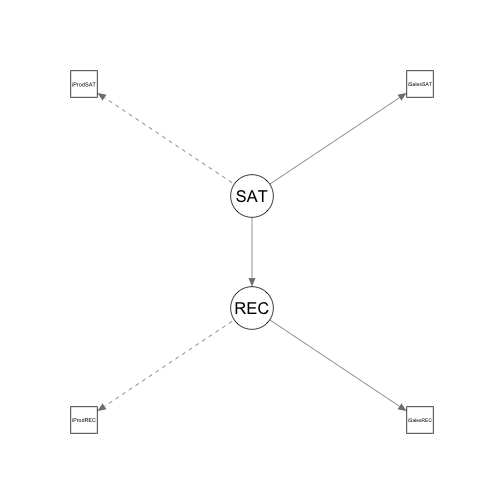
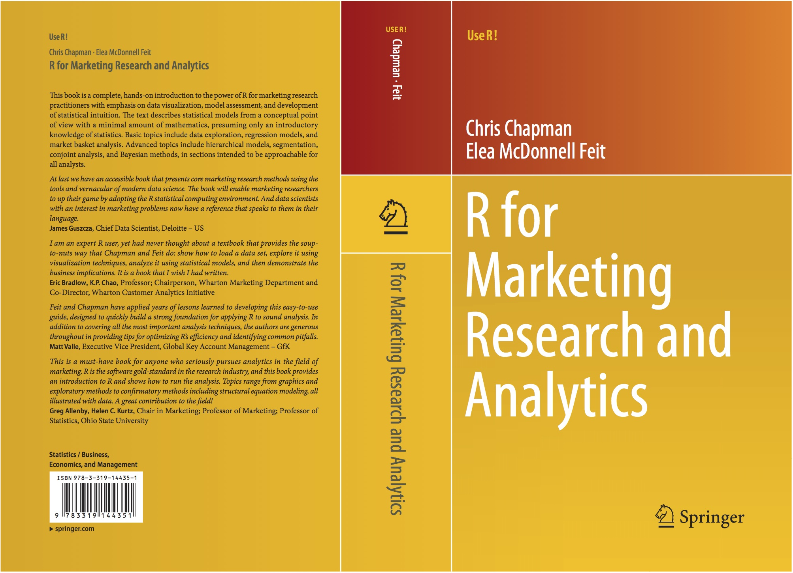

R Quick Tour
========================================================
author: Chris Chapman, Google
date: February 2016
css: ../chapman-feit-slides.css

**Analytics with Purpose Conference**  
Scottsdale, AZ


Basics of R
========================================================
Key Points

- It's where new methods are developed first
- Over 8000 add on packages and tools
- It is open source and free to use (except occasional packages)
- Don't think of R as a ``statistics program.''
- R is primarily a *programming language*


Reasons to Use R
======================
- For the latest statistics methods
- For maximum power to develop your own analyses
- It excels for iteration and automation
- Large community support for advanced analytics
- It's free
- Includes integrating reporting capabilities (such as these slides)


Reasons not to Use R
======================
- It requires programming to do most analyses
- Routine analyses are more difficult at first
- Charting and plotting are not easy, and tend to be rather basic unless they are tweaked substantially


GUI Tour
======================
- R base
- R Studio

Switch to RStudio and look at the elements of the R IDE 
(integrated development environment)


Customer Satisfaction Data (simulated)
========================================================
We'll use a data set from Chapman & Feit (2015).

- CSat survey with 4 items
- 2 Satisfaction items: with Product & Sales
- 2 Likelihood to recommend items: Product & Sales
- Each item assessed on 7 point Likert scale


Customer Satisfaction Model
========================================================



Code
========================================================
Let's switch to R and walk through some typical code ...


```r
satData <- read.csv("http://r-marketing.r-forge.r-project.org/data/rintro-chapter2.csv")

# examine the data
head(satData)
str(satData)
summary(satData)

# convert Segment to a factor variable
satData$Segment <- factor(satData$Segment)
summary(satData)

# Satisfaction by segment
library(ggplot2)
by(satData$iProdSAT, satData$Segment, mean_se, mult=1.96)


###### EXAMPLE OF PLOTTING

### first aggregate the data we want to plot
# ... there are other ways to do this, but this illustrates data frame manipulation

# get the mean and standard errors
prod.sat.seg <- aggregate(satData$iProdSAT, list(satData$Segment), mean_se, mult=1.96)
str(prod.sat.seg)

# coerce those to a nice data frame
prod.sat.seg <- data.frame(prod.sat.seg$Group.1, lapply(data.frame(prod.sat.seg$x), unlist))
prod.sat.seg

# and label the columns to be more readable
names(prod.sat.seg) <- c("Segment", "average", "lowerCI", "upperCI")
prod.sat.seg

### the plot itself ...

# now plot the interquartile range
p <- ggplot(data=prod.sat.seg, 
            aes(x=Segment, y=average, ymax=upperCI, ymin=lowerCI)) +
     geom_point() +
     geom_errorbar()

p

# color the points and make them larger
p <- ggplot(data=prod.sat.seg, 
            aes(x=Segment, y=average, ymax=upperCI, ymin=lowerCI)) +
     geom_point(aes(color=Segment), size=3) +      # <=======
     geom_errorbar() 

p

# color the error bars and make them narrower
p <- ggplot(data=prod.sat.seg, 
            aes(x=Segment, y=average, ymax=upperCI, ymin=lowerCI)) +
     geom_point(aes(color=Segment), size=3) +
     geom_errorbar(aes(color=Segment), width=0.3)      # <=======

p

# adjust the Y axis range
p <- ggplot(data=prod.sat.seg, 
            aes(x=Segment, y=average, ymax=upperCI, ymin=lowerCI)) +
     geom_point(aes(color=Segment), size=3) +
     geom_errorbar(aes(color=Segment), width=0.3) +
     coord_cartesian(ylim=c(1, 5))    # <========

p

# add some titles to be more readable
p <- ggplot(data=prod.sat.seg, 
            aes(x=Segment, y=average, ymax=upperCI, ymin=lowerCI)) +
     geom_point(aes(color=Segment), size=3) +
     geom_errorbar(aes(color=Segment), width=0.3) +
     coord_cartesian(ylim=c(1, 5)) +
     ggtitle("Average Sat and Confidence Interval by Segment") +    # <=====
     ylab("Mean satisfaction and 95% CI")

p


########## CORRELATIONS

# correlation matrix
library(corrplot)
corrplot(cor(satData[ , -3]))

# tinker with the plot
corrplot.mixed(cor(satData[ , -3]))


#### ADVANCED MODELING. EXAMPLE: SAT/REC STRUCTURAL MODEL

# define a structural model for Satisfaction and Recommendation
satModel <- "SAT =~ iProdSAT + iSalesSAT
             REC =~ iProdREC + iSalesREC
             REC ~  SAT "

# fit the structural model
library(lavaan)
sat.fit <- cfa(satModel, data=satData)

# look at the fit
summary(sat.fit, fit.measures=TRUE)

# plot the structural model
library(semPlot)
semPaths(sat.fit, what="est", nCharNodes=9, residuals=FALSE)
```


Pros and Cons
========================================================
**Pro**  
1. Extreme power and precision. It does exactly what you want.  
2. Complete flexibility at every step  
3. Once script is done it is reusable and re-runnable   

**Con**   
1. It only does exactly what you tell it. Defaults are missing or ugly.  
2. You have to write code.  
3. Everything takes longer ... the *first* time.  


Next Steps
========================================================
1. Get R from [r-project.org](https://www.r-project.org) & RStudio from [rstudio.com](https://www.rstudio.com/). 
2. See starting points at [CRAN Task Views](https://cran.r-project.org/web/views/)
3. Find a class or hands-on tutorial (maybe this book?)




The Most Important Things
========================================================
To learn R, you will need:
- Skill or genuine interest in learning to **program**
- A **real data problem** that you need to solve
- Routine **methods that you understand** well (e.g., ANOVA, lm)
- **Time** to work through the steep learning curve
- **Discipline** to force yourself to finish the project!
- Ability to **iterate** on successive projects, as it gets easier and easier

Only try advanced/new methods after you are fluent in the basics.


Q&A
========================================================
Thank you!

Chris Chapman
cchapman@google.com
