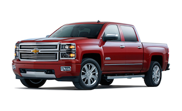
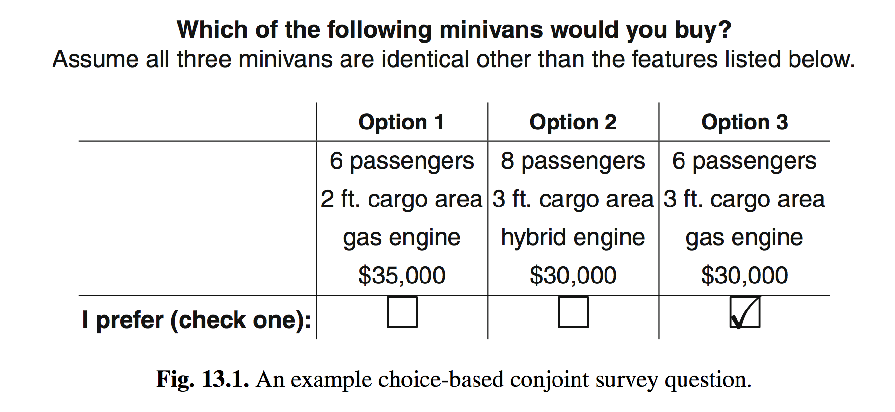
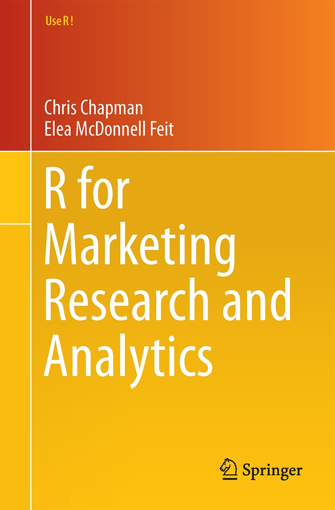

Choice Models for Product Optimization and Pricing
========================================================
author: Chris Chapman and Elea McDonnell Feit
date: 14 September 2017
**Enterprise Applications of the R Language**  
**London 2017**

Code for this talk:
[http://r-marketing.r-forge.r-project.org/](http://r-marketing.r-forge.r-project.org/)


Designing new products
========================================================
incremental: true

***
When creating a new product like this Chevrolet Silverado, designers often face tough decisions.
- Should the truck have a smaller bed so that we can give more leg room to the passengers?
- Should we make the truck larger, even though the fuel economy will go down?


Finding the voice of the customer
========================================================

***
Better designers spend time talking to potential customers about what they want and that is *sort-of* helpful.
***
But customers typically want "everything" and if you listen to them you end up with **The Homer**.

<small>
[https://www.wired.com/2014/07/homer-simpson-car/](https://www.wired.com/2014/07/homer-simpson-car/)
</small>


Key idea
=======================================================
type: prompt
incremental: true
1. Ask customers to **choose** among alternative products ... something consumers do every day!
2. Fit a **model** to infer feature and price tradeoffs from observed choices.
3. **Predict** preference among alternative product designs using the model.


Example choice question
========================================================

Respondents might answer 8-12 of these types of questions (sometimes more!), which gives us lots of data to infer preferences.


The models & software
========================================================
Respondents' choices are modeled as **multinomial** responses (choice among alternatives), where likelihood to choose a product is a *function of its features and price*. We'll see details in a moment.

Data collection --- the survey itself --- is commonly done using **Sawtooth Software**, a survey platform used to design a questionnaire, field it online, and analyze results.

Given the data, simple modeling can be done in Sawtooth Software, while more advanced modeling can be done with packages in **R**.


Let's get started...
=======================================================
type: prompt
**Hands-on available!**

A more extensive version of the code is at the website for Chapman and Feit (2015), *R for Marketing Research and Analytics*:  

[goo.gl/j8oUez](goo.gl/j8oUez) == [http://r-marketing.r-forge.r-project.org/](http://r-marketing.r-forge.r-project.org/)


Load some choice data
=======================================================
Data comes from Chapman & Feit (2015):

```r
cbc.df <-
  read.csv("http://goo.gl/5xQObB",
           colClasses = c(seat = "factor",
                          price = "factor"))
head(cbc.df[ , c(-4, -5)])
```

```
  resp.id ques alt cargo  eng price choice
1       1    1   1   2ft  gas    35      0
2       1    1   2   3ft  hyb    30      0
3       1    1   3   3ft  gas    30      1
4       1    2   1   2ft  gas    30      0
5       1    2   2   3ft  gas    35      1
6       1    2   3   2ft elec    35      0
```
Outcome variable "choice" is *multinomial* ... choice among options.


We could do simple counts of preference ...
=======================================================

```r
xtabs(choice ~ seat, data=cbc.df)
```

```
seat
   6    7    8 
1164  854  982 
```

```r
xtabs(choice ~ eng, data=cbc.df)
```

```
eng
elec  gas  hyb 
 608 1444  948 
```


... but a model is better
======================================================
type: prompt
* Univariate summaries only tell part of the story.
* Although counts show that customers prefer *6-seat* minivans and *gas* engines, it is hard to say whether seats or engines have a stronger influence.
    + What if the 6-seat minivan options tended to have gas engines in the survey?
* As with many multivariate problems, the solution is a regression model (of a special type).


Use a multinomial regression package
=======================================================

```r
library(mlogit)
```
Tell `mlogit` which column is which in our choice data:

```r
cbc.mlogit <-
  mlogit.data(data    = cbc.df, 
              choice  = "choice",
              shape   = "long",   
              varying = 3:6,
              id.var  = "resp.id",
              alt.levels = paste("pos", 1:3))
```


Estimate a choice model (1)
=======================================================
Choice as a function of the minivan features:
<small>

```r
m1 <- mlogit(choice ~ 0 + seat + cargo + eng + price, data = cbc.mlogit)
summary(m1)
```

```

Call:
mlogit(formula = choice ~ 0 + seat + cargo + eng + price, data = cbc.mlogit, 
    method = "nr", print.level = 0)

Frequencies of alternatives:
  pos 1   pos 2   pos 3 
0.32700 0.33467 0.33833 

nr method
5 iterations, 0h:0m:0s 
g'(-H)^-1g = 7.84E-05 
successive function values within tolerance limits 

Coefficients :
          Estimate Std. Error  t-value  Pr(>|t|)    
seat7    -0.535280   0.062360  -8.5837 < 2.2e-16 ***
seat8    -0.305840   0.061129  -5.0032 5.638e-07 ***
cargo3ft  0.477449   0.050888   9.3824 < 2.2e-16 ***
enggas    1.530762   0.067456  22.6926 < 2.2e-16 ***
enghyb    0.719479   0.065529  10.9796 < 2.2e-16 ***
price35  -0.913656   0.060601 -15.0765 < 2.2e-16 ***
price40  -1.725851   0.069631 -24.7856 < 2.2e-16 ***
---
Signif. codes:  0 '***' 0.001 '**' 0.01 '*' 0.05 '.' 0.1 ' ' 1

Log-Likelihood: -2581.6
```
</small>


Estimate a choice model (2)
======================================================
We get estimates of choice by feature level:
<small>

```r
Coefficients :
          Estimate Std. Error  t-value  Pr(>|t|)
seat7    -0.535280   0.062360  -8.5837 < 2.2e-16 ***
seat8    -0.305840   0.061129  -5.0032 5.638e-07 ***
cargo3ft  0.477449   0.050888   9.3824 < 2.2e-16 ***
enghyb   -0.811282   0.060130 -13.4921 < 2.2e-16 ***
engelec  -1.530762   0.067456 -22.6926 < 2.2e-16 ***
price35  -0.913656   0.060601 -15.0765 < 2.2e-16 ***
price40  -1.725851   0.069631 -24.7856 < 2.2e-16 ***
---
Signif. codes:  0 ‘***’ 0.001 ‘**’ 0.01 ‘*’ 0.05 ‘.’ 0.1 ‘ ’ 1
```
</small>
.. and then what?


The multinomial logit model (MNL)
======================================================
As a conceptual model:

*Choice likelihood* = $\frac{utilityOneProduct}{utilityAllProducts}=\frac{e^{oneProductCoefs}}{\sum_{\textrm{all products in set}}{e^{productCoefs}}}$


The multinomial logit model (MNL)
======================================================
As a conceptual model:

*Choice likelihood* = $\frac{utilityOneProduct}{utilityAllProducts}=\frac{e^{oneProductCoefs}}{\sum_{\textrm{all products in set}}{e^{productCoefs}}}$

*Formally*: If $X_{tj}$ is a vector of attributes of alternative $j$ in choice task $t$, the probability of choosing option $j$ in choice task $t$ is

$P(y_t=j) = \frac{exp(\beta X_{tj})}{\sum_{\textrm{all }j'}{exp(\beta X_{tj'})}}$

where $\beta$ is the vector of estimated coefficients. 

Coefficients may be estimated by maximum likelihood estimation (MLE) or Bayesian methods (MCMC sampling).  `mlogit` uses MLE.


Simulating choice shares: helper function
======================================================
This uses a design matrix for feature combinations, plus model coefficients, to estimate share via MNL model:

```r
predict.mnl <- function(model, data) {
  data.model <-
    model.matrix(
      update(model$formula, 0 ~ .),
      data = data)[ , -1]
  utility <- data.model %*% model$coef
  share <- exp(utility) / sum(exp(utility))
  cbind(share, data)
}
```


Simulating choice shares: output
======================================================
Given some defined products (rows 8, 1, 3, etc., in design matrix):


```r
predict.mnl(m1, new.data)
```

```
        share seat cargo  eng price
8  0.44643895    7   2ft  hyb    30
1  0.16497955    6   2ft  gas    30
3  0.12150814    8   2ft  gas    30
41 0.02771959    7   3ft  gas    40
49 0.06030713    6   2ft elec    40
26 0.17904663    7   2ft  hyb    35
```
Suppose you are designing minivan #8 to compete against the other five. Looks like you have a pretty good design, with estimated **44.6% share of preference**.


Sensitivity plot
====================================================

***
Vary the attributes one at a time and see what effect they have on preference.

This chart shows what would happen to share for the first product in our simulation if we were to change its design.


Willingness-to-pay
======================================================
If we estimate a linear parameter for price, we can compute the average willingness-to-pay for a particular level of an attribute by dividing the coefficient for that level by the price coefficient.
<small>


```r
coef(m3)["cargo3ft"] / 
  (-coef(m3)["as.numeric(as.character(price))"] / 1000)
```

```
cargo3ft 
2750.601 
```
</small>
On average, customers are willing to pay $2750 more for 3ft of cargo space versus 2ft in these data.


Adding consumer heterogeneity
=======================================================
We know that different customers have different preferences. I might prefer 6-seats for my 3-person family, while you prefer the 8-seats.

We do this this using a **hierarchical** model.

$P(y_t=j) = \frac{exp(\beta_i X_{tj})}{\sum_{\textrm{all }j'}{exp(\beta_i X_{tj'})}}$

where $\beta_i$ is the coefficient vector for each customer, $i$. We assume customers are drawn from a multivariate normal population:

$\beta_i \sim N_k(\mu_\beta, \Sigma_\beta)$

This can also be estimated by MLE or Bayesian methods.


Estimating a hierarchical model
========================================================
Define which parameters are heterogeneous for respondents:
<small>

```r
m1.rpar <- rep("n", length=length(m1$coef))
names(m1.rpar) <- names(m1$coef)
m1.rpar
```

```
   seat7    seat8 cargo3ft   enggas   enghyb  price35  price40 
     "n"      "n"      "n"      "n"      "n"      "n"      "n" 
```

```r
m2.hier <-
  mlogit(choice ~ 0 + seat + eng + cargo + price,
                  data = cbc.mlogit,
                  panel=TRUE, rpar = m1.rpar,
                  correlation = TRUE)
```
</small>


Hierarchical estimates per respondent
=========================================================
<small>

```r
summary(m2.hier)
```

```r
random coefficients
         Min.    1st Qu.     Median       Mean    3rd Qu. Max.
seat7    -Inf -1.1178106 -0.6571127 -0.6571127 -0.1964148  Inf
seat8    -Inf -1.3122975 -0.4336405 -0.4336405  0.4450165  Inf
cargo3ft -Inf  0.2248912  0.6021314  0.6021314  0.9793717  Inf
enghyb   -Inf -1.7490588 -0.9913358 -0.9913358 -0.2336129  Inf
engelec  -Inf -2.1301308 -1.8613750 -1.8613750 -1.5926192  Inf
price35  -Inf -1.5468038 -1.1819210 -1.1819210 -0.8170383  Inf
price40  -Inf -2.6912308 -2.1749326 -2.1749326 -1.6586344  Inf
```
</small>


Predicting shares
==================================================================
We predict at individual level and aggregate those:
<small>

```r
library(MASS)
predict.hier.mnl <- function(model, data, nresp=1000) {
  data.model <-
    model.matrix(update(model$formula, 0 ~ .),
                 data = data)[,-1]
  coef.Sigma <- cov.mlogit(model)
  coef.mu <- m2.hier$coef[1:dim(coef.Sigma)[1]]
  draws <- mvrnorm(n=nresp, coef.mu, coef.Sigma)
  shares <- matrix(NA, nrow=nresp, 
                   ncol=nrow(data))
  for (i in 1:nresp) {
    utility <- data.model %*% draws[i, ]
    share = exp(utility) / sum(exp(utility))
    shares[i, ] <- share
  }
  cbind(colMeans(shares), data)
}
```
</small>


Predicted shares
================================================================

```r
predict.hier.mnl(m2.hier, data=new.data)
```

```
   colMeans(shares) seat cargo  eng price
8        0.45369314    7   2ft  hyb    30
1        0.18472196    6   2ft  gas    30
3        0.13321905    8   2ft  gas    30
41       0.01794268    7   3ft  gas    40
49       0.05410889    6   2ft elec    40
26       0.15631428    7   2ft  hyb    35
```
After individual level estimation, the answers are slightly different. We could further examine prediction by individual.


Going Bayesian
=======================================================
type: prompt
* These models can be estimated by Bayesian MCMC using the `ChoiceModelR` package, which builds on the `bayesm` package.
* In the Bayesian framework, you can also introduce characteristics of the decision makers as covariates to $\beta_i$ in the hierarchy.
   + For instance, you can allow preference for seats to be a function of whether the respondent uses their minivan for carpooling.
* The data formatting for `ChoiceModelR` is a little bit fussy and doesn't follow other hierarchial modeling packages like `lme4`.


Using observational choice data
=====================================================
incremental: TRUE
Everything we've talked about can be used with any observed choices -- not just choices from a survey.
* Selection of a subscription plan from a menu
* Purchases of televisions from a website
* Actual car purchases (good luck getting the data!)

You can also combine survey data with observational data (Feit, Beltramo and Feinberg, 2010)


Examples of choice modeling at Google
=======================================================
* Feature preference for consumers, B2B customers, developers
* Product prioritization: preferred areas to work on
* Understanding civic engagement (Krontiris, Webb, Chapman:  https://research.google.com/pubs/pub44180.html)
* Assessing response to design elements
* Product pricing
* Quantitative attitudinal profiles (Chapman, Webb, Krontiris, forthcoming)


Chapman & Feit
=====================================================
title: false

***
- Applied tutorials on R and statistics for industrial problems.
- Covers basic R topics (data structures, graphing, linear models, ANOVA) using marketing examples.
- Tackles many marketing-specific topics including marketing mix modeling, segmentation, perceptual maps, structural equation modeling, choice modeling, hierarchical models.
- Integrates Bayesian estimation.


Thank you!
======================================================
type: prompt
**Chris Chapman**   
Principal Quantitative Experience Researcher, Google  
cnchapman+r@gmail.com
@cnchapman

**Elea McDonnell Feit**  
Assistant Professor of Marketing, Drexel University  
efeit@drexel.edu
@eleafeit

Notes
=====================================================
<small>
This presentation is based on Chapter 13 of Chapman and Feit, *R for Marketing Research and Analytics* &copy; 2015 Springer.

All code in the presentation is licensed under the Apache License, Version 2.0 (the "License"); you may not use this file except in compliance with the License.  You may obtain a copy of the License at http://www.apache.org/licenses/LICENSE-2.0\ Unless required by applicable law or agreed to in writing, software distributed under the License is distributed on an "AS IS" BASIS, WITHOUT WARRANTIES OR CONDITIONS OF ANY KIND, either express or implied. See the License for the specific language governing permissions and limitations under the License.
</small>
